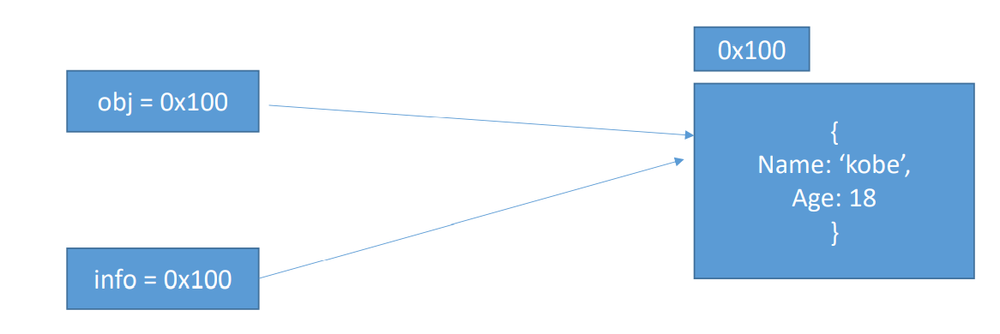
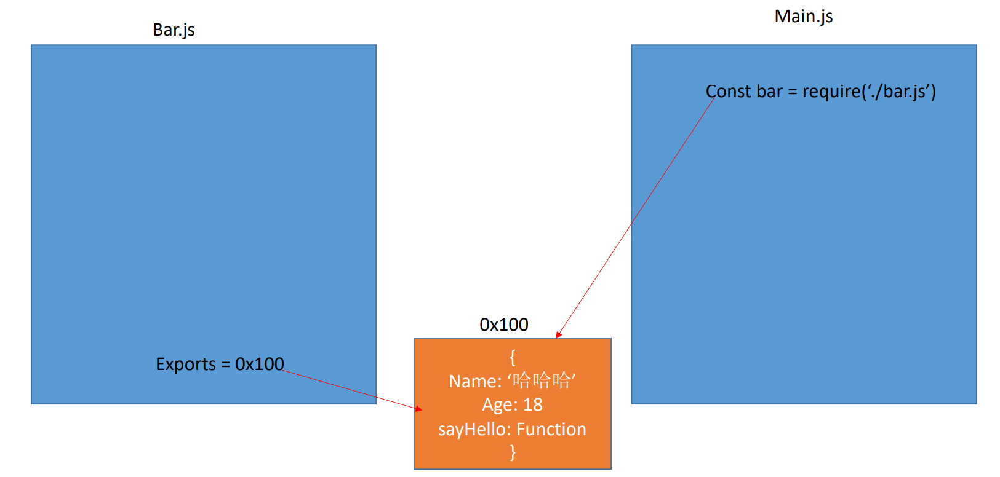
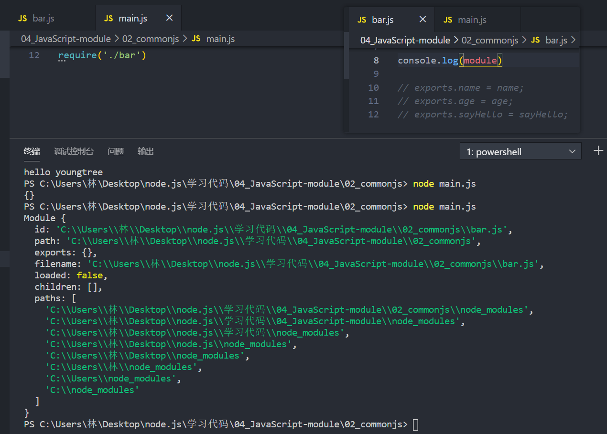
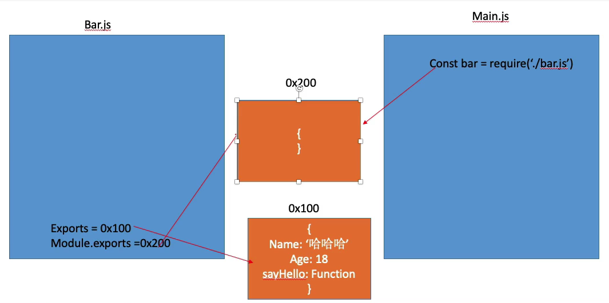

### 1.什么是模块化？

- 到底什么是模块化？
  - 模块化开发最终的目的是将程序划分成一个个小的结构
  - 在每一个结构中写属于自己的代码，有自己的作用域（不会污染变量），不会影响到其他的结构
  - 每个结构可以将自己的变量、函数、对象导出，暴露给其他结构使用
  - 也可以通过某种方式导入其他结构中的变量、函数、对象等
- 上面所提到的结构就是模块
  - 按照这种结构划分开发程序的过程，就是模块化开发的过程。

- JavaScript的缺陷
  - 比如var定义的变量作用域的问题
  - 比如JavaScript的面向对象并不能像常规面向对象语言一样使用class的问题
  - 比如JavaScript没有模块化的问题
  - 比如没有静态类型检测的问题
  - 前三个问题都解决了，最后一个问题没有解决

### 2.JavaScript的发展

- 网页开发的早期
  - Brendan Eich开发JavaScript仅仅作为一种脚本语言，做一些简单的表单验证或动画实现等
  - 那个时候代码还是很少的，我们只需要将JavaScript代码写到`<script>`标签中即可
  - 并没有必要放到多个文件中来编写
  - 甚至流行“通常来说 JavaScript 程序的长度只有一行”的说法
- 前端和JavaScript的快速发展
  - JavaScript代码变得越来越复杂了
  - ajax的出现，前后端开发分离
    - 意味着后端返回数据后，需要通过JavaScript进行前端页面的渲染
  - SPA的出现，前端页面变得更加复杂
    - 包括前端路由、状态管理等等一系列复杂的需求需要通过avaScript来实现
  - Node的实现
    - 需要JavaScript编写复杂的后端程序，没有模块化是致命的硬伤
- 模块化是JavaScript的一个迫切需求
  - 但是JavaScript本身，直到ES6（2015）才推出了自己的模块化方案
  - 在此之前，为了让JavaScript支持模块化，涌现出了很多不同的模块化规范
    - AMD
    - CMD
    - CommonJS

### 3.没有模块化带来很多问题

- 命名冲突的问题

  ```js
  // bar.js 定义name = 'bar'
  name = 'bar';
  
  // foo.js 定义name = 'foo'
  name = 'foo';
  
  // baz.js 使用name
  console.log(name)
  // 打印的结果决定于foo和bar两个文件的引入顺序，谁后引入就打印谁
  ```

- 解决：在bar文件写一个自执行函数，这样就有了作用域再将其导出

  - 立即函数调用表达式（IIFE）IIFE (Immediately Invoked Function Expression)

    ```js
    // bar.js文件
    var moduleBar = (function() {
      var name = "bar";
      return {
        name
      }
    })();
    
    // baz.js文件
    console.log(moduleBar.name);
    // 输出 bar
    ```

- IIFE带来的问题
  - 第一，必须记得每一个模块中返回对象的命名，才能在其他模块使用过程中正确的使用
  - 第二，代码写起来混乱不堪，每个文件中的代码都需要包裹在一个匿名函数中编写
  - 第三，在没有合适的规范情况下，每个人、每个公司都可能会任意命名、甚至出现模块名称相同的情况

- 我们会发现，虽然实现了模块化，但是我们的实现过于简单，并且是没有规范
  - 我们需要制定一定的规范来约束每个人都按照这个规范去编写模块化的代码
  - 这个规范中应该包括核心功能：
    - 模块本身拥有可以导出暴露的属性，模块又可以导入自己需要的属性
  - JavaScript社区为了解决上面的问题，涌现出一系列好用的规范

### 4.CommonJS和Node

- 我们需要明确CommonJS是一个规范

  - 就是用白纸黑字写的一些规则
  - 最初提出来是在浏览器以外的地方使用，并且当时被命名为ServerJS
  - 后来为了体现它的广泛性，修改为CommonJS，平时我们也会简称为CJS
  - Node是CommonJS在服务器端一个具有代表性的实现
  - Browserify是CommonJS在浏览器中的一种实现
  - webpack打包工具具备对CommonJS的支持和转换

- Node对CommonJS进行了支持和实现

  - 在Node中每一个js文件都是一个单独的模块
  - 这个模块中包括CommonJS规范的核心变量：exports、module.exports、require
  - 我们可以使用这些变量来方便的进行模块化开发

- 模块化的核心是导出和导入，Node对其进行了实现

  - exports和module.exports可以负责对模块中的内容进行导出

  - require函数可以帮助我们导入其他模块（自定义模块、系统模块、第三方库模块）中的内容

    ```js
    // bar.js文件
    const name = "youngtree";
    const age = 18;
    let message = "My name is tree";
    function sayHello(name) {
      console.log("hello " + name);
    }
    
    exports.name = name;
    exports.age = age;
    exports.sayHello = sayHello;
    
    // main.js文件
    const bar = require('./bar')  // 返回值是对象。
    const {name, age, sayHello} = require('./bar') // 因为返回值是对象，ES6可以对其做解构。
    
    console.log(bar.name)
    console.log(bar.age)
    bar.sayHello(bar.name)
    
    console.log(name)
    console.log(age)
    sayHello(name)
    ```

    - 意味着main中的bar变量等于exports对象
    - 也就是require通过各种查找方式，最终找到了exports这个对象
    - 并且将这个exports对象赋值给了bar变量
    - bar变量就是exports对象了

### 5.理解对象的引用赋值

```js
const name = "yt";

const obj = {
	name = "why",
  age = 18
}

const info = obj;
```

- 首先我们要明白假如 `const name = "yt"` 这个是一个基本类型，会在栈里开辟一个空间存储自己的东西


- 对象是一个引用类型，引用类型会在堆中开辟一块空间，这块空间中有以下两个属性

  ```js
  {
  	name: "why",
    age: 18
  }
  ```

- 这块空间是拥有自己的内存地址的：假如是0x100

- 当我们把这个对象赋值给obj的时候，就相当于 `const obj = 0x100`

  - 这时我们可以说obj指向这块内存

- `const info = obj` obj是一个内存地址这时就相当于 `const info = 0x100`

  - 本质是一种内存地址的赋值（对象的引用赋值）。

```js
const obj = {
	name = "why",
  age = 18
}

const info = obj;

obj.name = 'koby';
console.log(info.name)
// 这里一定输出koby
```



### 6.赋值过程

- exports默认情况下指向的是空对象 `exports = {}` ，这里就意味着它会在内存中开辟一块空间
  - 只是这块空间中什么都没有，但是有内存地址也就是说 `exports = 0x110`

```js
// 在另一个文件中写的代码
const bar = require('./bar')
```

- 这里就意味着 `const bar = 0x110`。


- 这俩指向的都是同一个对象，无论里面如何变化他俩都是一模一样的




- 注意：不要把引用赋值理解为浅拷贝


### 7.module.exports又是什么？

- 但是在Node开发中我们经常通过module.exports导出东西

- module.exports和exports有什么关系或者区别呢？

- 我们追根溯源，通过维基百科中对CommonJS规范的解析可以发现：

  - CommonJS中是没有module.exports这个概念的

- 但是为了实现模块的导出，Node中使用的是Module类

  - 每一个模块都是Module的一个实例，也就是 module

  - 既然是一个类就可以 new Module() ，一个js文件就是一个Module实例，这个实例就是module

- 任何一个文件都会有一个module对象

  

  - 这里面有一个exports属性，看到了吗？
  - 在Node中真正进行导出的是：module.exports
  - 但是为啥呢？因为Node源码中有这样一句话：exports = module.exports
  - 相当于`module.exports = 0x100`
  - 所以在Node中真正用于导出的其实根本不是exports，而是module.exports
  - 因为module才是导出的真正实现者

- 但是，为什么exports也可以导出呢？
  
- 因为：exports = module.exports
  
- 假如我们给module.exports赋值一个空对象：`module.exports = {}`

  - 这个时候内存中发生了天翻地覆的变化

    ```js
    const bar = require('./bar')
    ```

  - 这里的bar其实是等于{}，也就是说module.exports才是导出的重点

  - 之前的exports仅仅只是被这两个人带着玩而已

    

    ```js
    // bar.js代码
    module.exports = {
      name: "youngtree123",
      age: 19,
      sayHello: function(name) {
        console.log("hello " + name);
      }
    }
    
    // main.js代码
    const {name, age, sayHello} = require('./bar')  // 因为返回值是对象，所以可以对其做解构。
    
    console.log(name)
    console.log(age)
    sayHello(name)
    ```

- exports和module.exports之间是什么关系呢？

  - Node中默认给我们做了一件事情
  - module.exports = exports
  - 一旦有一天module.exports有了新导出的东西两者就没有关系了

### 8.值引用

```js
// bar.js文件
let name = "why";

setTimeout(() => {
	name = '1111'
}, 1000)

module.exports = {
  name
}

// main.js文件
const bar = require("./bar")
console.log(bar.name)
// why
setTimeout(() => {
	console.log(bar.name)
}, 2000)
// why
```

- 值你随便改，跟我对象存储的值有啥关系
  - 打印的不是1111