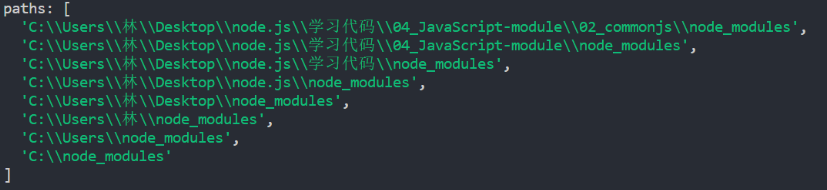
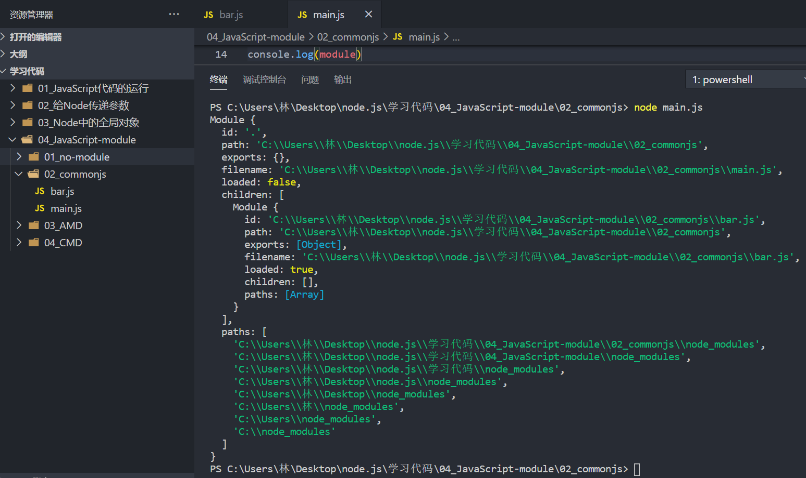
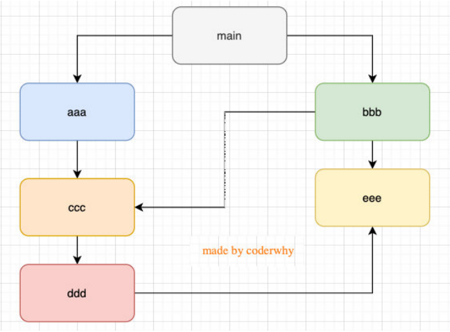

### 1.require细节

- 我们现在已经知道，require是一个函数，可以帮助我们引入一个文件（模块）中导出的对象
- 那么，require的查找规则是怎么样的呢？
  - https://nodejs.org/dist/latest-v14.x/docs/api/modules.html#modules_all_together

### 2.require的查找规则

- 这里总结比较常见的查找规则：导入格式：require(X)

### 3.情况一

X是一个核心模块，比如path、http

- 直接返回核心模块，并且停止查找

### 4.情况二

X是以 ./ 或 ../ 或 /（根目录）开头的

- 第一步：将X当做一个文件在对应的目录下查找
  - 如果有后缀名，按照后缀名的格式查找对应的文件
  - 如果没有后缀名，会按照如下顺序：
    1. 直接查找文件X
    2. 查找X.js文件
    3. 查找X.json文件
    4. 查找X.node文件
- 第二步：没有找到对应的文件，将X作为一个目录
  - 查找目录下面的index文件
    1. 查找X/index.js文件
    2. 查找X/index.json文件
    3. 查找X/index.node文件

- 第三步：都没有找到，报错：not found

### 4.情况三

直接是一个X（没有路径），并且X不是一个核心模块

- C:\Users\林\Desktop\node.js\学习代码\04_JavaScript-module\02_commonjs\main.js中编写require('why’)

  
  - 这里有个东西我们很熟悉，叫node_modules文件夹
  - 这个文件夹是npm管理第三方包的时候安装第三方包的文件夹
  - 进到每一个node_modules文件夹中寻找why文件夹，再在why文件夹中查找index.js文件
  - 如果上面的路径中都没有找到，那么报错：not found
  - 我们打印一下module



- id：当前执行文件的位置，就在这个文件中所以是`.` 如果是在其它地方引入就是一个路径
- path：文件所在的路径
- exports：就是那个module.exports
- filename：文件的路径
- loaded：false表示这个模块还没加载完，因为是在没加载完打印的所以为false
  - 加载完了就为true
- children：我们引入过bar.js文件
- 这里的path就是我们刚才截图的地方

### 5.模块的加载过程

- 结论一：模块在被第一次引入的时候，模块中的js代码会被运行一次

  - 比如你在main.js文件中写

    ```js
    require("./bar")
    ```

  - 在控制台输入node main.js那么bar.js文件中的任何代码都会被执行一次

  - 如果我们在 `require("./bar")` 代码之后写 `console.log(123)` 谁会先执行？

    - 先执行bar.js中的代码，再往后执行

- 结论二：Node中CommonJS的加载过程是同步的

  - 即执行完一个再执行下一个，前一个不执行完是不会继续往下执行的

  - 也相当于加载 `require("./bar")` 代码的时候阻塞了
    - 但并不会浪费很多性能
  - Node最主要是来开发服务器的，开发服务器一般来说所有的文件都是部署在同一个服务器上的
    - 文件在本地，所以读取效率是非常非常高的
  - 由于你是同步的，假如你把它应用在浏览器中就会出现很大的问题了
    - 因为同步就意味着每个代码都需要加载完或者每个文件都得下载下来才能出现页面
    - 会导致用户体验变差，首页可能出现长时间的白屏状态

- 结论三：模块被多次引入时，会缓存，最终只加载运行一次

  ```js
  // bar.js文件
  console.log(123)
  
  // foo.js文件
  require('./bar')
  
  // main.js文件
  require('./bar')
  require('./foo')
  
  // 用Node执行main.js文件
  node main.js
  
  // 123只打印一次
  ```

  - 我们在第四部分打印module的时候有一个loaded属性
  - 这个属性就表示模块是否加载过，如果加载过loaded就会变成true
  - 发现你这个模块的loaded是true就不会再加载了

- 结论四：如果有循环引用，那么加载方式是深度优先搜索

  
  - 主入口是main

  - main加载了aaa然后加载了bbb

  - aaa加载了ccc

  - bbb加载了ccc然后加载了eee

  - ccc加载了ddd

  - ddd加载了eee

    ```js
    // main.js
    console.log('main');
    require("./aaa");
    require("./bbb");
    
    // aaa.js
    console.log('aaa');
    require("./ccc");
    
    // bbb.js
    console.log("bbb");
    require("./ccc")
    require("./eee")
    
    // ccc.js
    console.log("ccc")
    require("./ddd")
    
    // ddd.js
    console.log("ddd")
    require("./eee")
    
    // eee.js
    console.log("eee")
    ```

    - 执行顺序为：main->aaa->ccc->ddd->eee->bbb
    - 首先main中先执行自己的代码，然后引入aaa就开始执行aaa的代码然后aaa中引入了ccc所以执行ccc的代码以此往下推直到最底层。执行完毕回到main发现还有一个bbb被引入了就执行bbb，执行bbb的时候发现ccc和eee的loaded都是true所以不再执行，结束整个过程

- 这种数据结构是一种图结构，我们除了图结构还有很多种数据结构（数组，链表，树结构，哈希表）
- 互联网相互连接的话其实也是一种图结构（引用还是非常多的），把每个节点都访问到我们叫它图的遍历
- 图的遍历有两种方式
  - 深度优先搜索（DFS, depth first search）
    - 按照顺序走到底
  - 广度优先搜索（BFS, breadth first search）
    - 遍历完aaa我接着遍历这一层的，即遍历bbb，这一层遍历完再去找下一层以此类推
  - Node采用的是深度优先搜索算法，所以你会看到
    - main -> aaa -> ccc -> ddd -> eee -> bbb这样的一个执行顺序

### 6.Node模块的实现

- Node将每一个模块的代码放到一个`compiledWrapper`即沙河中进行执行
- 就相当于放到了一个自执行函数中进行执行，因为函数是有自己的作用域
- 每个模块中的代码不会影响其他模块中的代码

### 7.CommonJS的缺点

- CommonJS加载模块是同步的：
  - 同步意味着只有等到对应的模块加载完毕，当前模块中的内容才能被运行
  - 这个在服务器不会有什么问题，因为服务器加载的js文件都是本地文件，加载速度非常快
- 如果将它应用于浏览器呢？
  - 浏览器加载js文件需要先从服务器将文件下载下来，之后再来加载运行
  - 那么采用同步就意味着后续的js代码都无法正常运行，即使是一些简单的DOM操作
  - 所以在浏览器中，我们通常不使用CommonJS规范
    - 当然在webpack中使用CommonJS是另外一回事
    - 因为它会将我们的代码转成浏览器可以直接执行的代码

- 在早期为了可以在浏览器中使用模块化，通常会采用AMD或CMD
  - 但是现代的浏览器已经支持ES Modules
  - 而且借助于webpack等工具可以实现对CommonJS或者ES Module代码的转换
  - AMD和CMD已经使用的非常少了

- Vite编译速度非常快，因为它根本就不编译
  - 它是直接将js文件给到浏览器去识别ES Modules的
- 如果我们把项目发布到服务器上一些用户的浏览器不支持ES Modules怎么办呢？
  - 在打包的同时会对ES Modules进行转化，转化成ES5