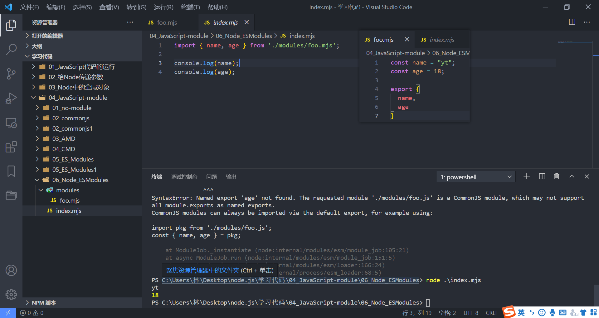
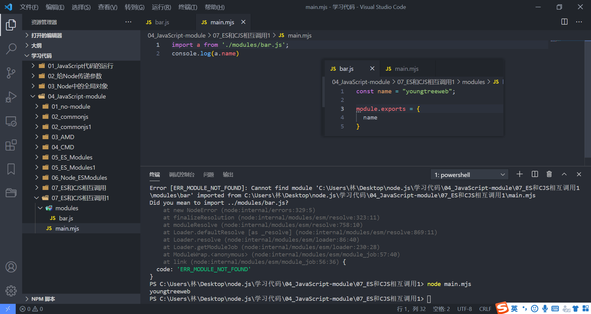

### 1.认识 ES Module

JavaScript没有模块化一直是它的痛点，所以才会产生前面的社区规范：CommonJS、AMD、CMD等

所以在ES推出自己的模块化系统时，大家也是兴奋异常

- ES Module就是JavaScript本身的模块化，从ES6出现的，ES6是在2015年出现，所以又叫做ES2015

ES Module和CommonJS的模块化有一些不同之处：

- 一方面它使用了import和export关键字；用的不是对象也不是函数
- 另一方面它采用编译器的静态分析，并且也加入了动态引用的方式；

ES Module模块采用export和import关键字来实现模块化：

- export负责将模块内的内容导出
- import负责从其他模块导入内容
- 关键字意味着export和import要交给js引擎进行解析，解析完才知道这个语句是什么意思

了解：ES Module将自动采用严格模式：use strict

- 如果你不熟悉严格模式可以简单看一下MDN上的解析；
- https://developer.mozilla.org/zh-CN/docs/Web/JavaScript/Reference/Strict_mode
- MDN网站准确严谨

### 2.案例代码结构组件

在浏览器中演示ES6的模块化开发，Node里面如何实现ES6模块化后续会说

```html
<!DOCTYPE html>
<html lang="en">
<head>
  <meta charset="UTF-8">
  <meta http-equiv="X-UA-Compatible" content="IE=edge">
  <meta name="viewport" content="width=device-width, initial-scale=1.0">
  <title>Document</title>
</head>
<body>
  <!-- <script src="./index.js"></script>  现在不会有模块化，是普通的js文件 -->
  <script src="./index.js" type="module"></script>  <!-- 现在就是了  -->
</body>
</html>
```

这个时候如果你直接打开此html文件就会报错，或者 Alt + b 直接运行


这个在MDN上面有给出解释：

- https://developer.mozilla.org/zh-CN/docs/Web/JavaScript/Guide/Modules 在最下面
- 你需要注意本地测试 — 如果你通过本地加载html 文件 (比如一个 file:// 路径的文件), 你将会遇到 CORS（跨域请求） 错误，因为 JavaScript 模块安全性的需要
- 你需要通过一个服务器来测试

VSCode中有一个插件：Live Server

- 安装一下之后点击：Open with Live Server即可

  

  
- 现在就是一个模块了

### 3.导出和导入

foo.js文件

```js
// 导出方式一共有三种
// 1.方式一
export const name = "yt";
export const age = 18;
export const sayHello = function(name) {
  console.log("你好，" + name)
}

// 2.方式二：在大括号中统一导出
const name = "yt";
const age = 18;
const sayHello = function(name) {
  console.log("你好，" + name)
}

// {}是一个大括号，但是，不是一个对象，是一个语法，export是关键字，后面跟大括号
// {放置要导出的变量的引用列表}
export {
  name,
  age,
  sayHello
}

// 3.方式三：{} 导出时可以给我们的变量起别名
export {
  name as fName,
  age as fAge,
  sayHello as fSayHello
}
```

index.js文件

```js
// 常见的导入方式也是有三种
// 1.普通的导入方式
import { name, age, sayHello } from "./modules/foo.js";
// .js必须加，之前不用加是因为在脚手架里，webpack帮助我们做了，我们这里没有webpack
// 导出时写什么名字，{}里就写什么名字

// 2.导入的时候可以起别名
import { name as yName, age as yage, sayHello as ySayHello } from "./modules/foo.js";
// 如果导出的时候就已经起过别名，导入时就必须用改过的名字
import { fName as yName, fAge as yage, fAayHello as ySayHello } from "./modules/foo.js";

// 3.方式三：通过 * as foo
import * as foo from "./modules/foo.js";
console.log(foo.name);
console.log(foo.age);
foo.sayHello("李焕英");
```

### 4.export和import结合使用

需求

- 有的时候我们想有一个独立的文件专门用来导出变量。
- 第八部分有foo.js这个文件，我们想通过同目录下的bar文件做一个统一的导出，再在index.js中进行导入

传统的方式

```js
import { name, age, sayHello } from './foo.js';

export {
  name,
  age,
  sayHello
}
```

结合的方式

- bar.js文件

  ```js
  export {name, age, sayHello} from './foo.js';
  ```

- index.js文件

  ```js
  import {name, age, sayHello} from './modules/bar.js';
  console.log(name);
  console.log(age);
  sayHello()
  ```

多此一举？

- 在开发和封装一个功能库时，通常我们希望将暴露的所有接口放到一个文件中
- 这样方便指定统一的接口规范，也方便阅读
- 这个时候，我们就可以export和import结合使用
- 假如我们有一个大的目录专门放一些封装好的工具函数的文件，这些文件有不同的名字和不同的工具函数
- 由于其他人开发时可能不知道你的各个文件和函数名，所以这个大目录下有一个index.js文件
  - 这个文件就是用来专门导出函数的
- 也方便查找

### 5.default用法

前面我们学习的导出功能都是有名字的导出（named exports）

- 在导出export时指定了名字
- 在导入import时需要知道具体的名字

还有一种导出叫做默认导出（default export）

- 默认导出export时可以不需要指定名字
- 在导入时不需要使用 {}，并且可以自己来指定名字
- 它也方便我们和现有的CommonJS等规范相互操作

注意：在一个模块中，只能有一个默认导出（default export）

演练：

- foo.js

  ```js
  export default function() {
    console.log("对某一个东西进行格式化");
  }
  ```

- index.js

  ```js
  import format from './modules/foo.js';  // 名字随便取
  format()
  ```

### 6.import函数

通过import加载一个模块，是不可以将其放到逻辑代码中的，比如：

```js
let flag = true;
if (flag) {
  import format from './modules/foo.js';
} 
// 这种代码是不允许的
```

为什么会出现这个情况呢？

- 这是因为ES Module在被JS引擎解析时，就必须知道它的依赖关系

- 由于这个时候js代码没有任何的运行，所以无法在进行类似于if判断中获取代码的执行情况

- 甚至下面的这种写法也是错误的：因为我们必须要到运行时才能确定path的值

- 类似于下面的代码是谁来解析的？

  ```js
  export default function() {
    console.log("对某一个东西进行格式化");
  }
  
  import format from './modules/foo.js';
  ```

  - 是由js引擎来执行和解析的，还记得在之前的这张图吧

    

  - Parse模块是对js代码进行解析的（解析是对我们的代码进行词法分析和语法分析）

  - 解析是不会执行代码的。在运行结果那里才会执行代码，这里的字节码还要转换成二进制代码

    

  - 这个错误是在解析的时候就分析出来了，Parse解析时就确立了依赖关系了

  - 所以下面这段代码还没解析呢，就执行了，必然会出现语法错误

    ```js
    let flag = true;
    if (flag) {
      import format from './modules/foo.js';
    } 
    ```

- 下面这种代码是可以的，因为require的本质是一个函数

  ```js
  let flag = true;
  if (flag) {
    // require的本质是一个函数
    require()
  } 
  ```

但是某些情况下，我们的的确确希望动态的来加载某一个模块

- 如果是webpack的环境下，webpack叫模块化打包工具：ES Modules和CommonJS都是支持的

  - 在webpack环境下使用require()是没有问题的。

    ```js
    let flag = true;
    if (flag) {
      require()
    } 
    ```

- 但是在浏览器中是没有require()函数的

  - 这个时候我们需要使用 import() 函数来动态加载；

    ```js
    let flag = true;
    if (flag) {
      import('./modules/foo.js')
    } 
    ```

  - import()函数是异步加载的

  - 异步意味着即使你这个东西没有加载也没有关系

    - 浏览器会去下载引入的文件，下载完再交再给js引擎进行解析就可以了

  - import('./modules/foo.js')是有返回值的，返回的是一个Promise对象

  - Promise执行成功之后会有一个回调.then()，执行失败会回调.catch()

    ```js
    // foo.js文件
    const name = "yt";
    const age = 18;
    const sayHello = function(name) {
      console.log("你好，" + name)
    }
    
    export {
      name,
      age,
      sayHello
    }
    
    export default function() {
      console.log("对某一个东西进行格式化");
    }
    
    // index.js文件
    let flag = true;
    if (flag) {
      import('./modules/foo.js').then(res => {
        res.default()
        console.log(res.age);
        console.log(res.name);
        res.sayHello("李焕英");
      }).catch(err => {});
    }
    // 这里的res就是模块
    ```

- 大部分的脚手架中的import()

  - 大部分的脚手架是基于webpack的，webpack会将foo.js文件进行单独的打包

### 7.ES Module加载过程

ES Module加载js文件的过程是编译（解析）时加载的，并且是异步的

- 编译时（解析）时加载，意味着import不能和运行时相关的内容放在一起使用
- 比如from后面的路径需要动态获取
- 比如不能将import放到if等语句的代码块中
- 所以我们有时候也称ES Module是静态解析的，而不是动态或者运行时解析的

异步意味着：JS引擎在遇到import时会去获取这个js文件，但是这个获取的过程是异步的

- 不会阻塞主线程继续执行

- 也就是说设置了 type=module 的代码，相当于在script标签上加了 async 属性
- 如果我们后面有普通的script标签以及对应的代码
  - 那么ES Module对应的js文件和代码不会阻塞它们的执行；

ES Module通过export导出的是变量本身的引用

- export在导出一个变量时

  - js引擎会解析这个语法，并且创建模块环境记录（module environment record）

- 模块环境记录会和变量进行绑定（binding），并且这个绑定是实时的

- 而在导入的地方，我们是可以实时的获取到绑定的最新值

- foo.js文件

  ```js
  let name = "why";
  
  export { name }
  ```

  - 写了这两行代码之后，开辟一个新的内存空间
    - 官方叫做模块环境记录（module environment record）
    - 在这里相当于重新创建了一个常量 `const name = name`

  ```js
  let name = "why";
  
  setTimeout(() => {
    name = "aaa";
  }, 1000)
  
  export { name }
  ```

  - 由于你是绑定的，所以模块环境记录中的值也会发生变化，因为永远引用的是最新值

  - 如果一个值发生了变化，我们是在操作空间中，它会在空间中新生成一个 `const name = name`

    - 并且获取的时候是动态获取的，所以一直是新的。

    

- index.js文件

  ```js
  import { name } from './modules/foo.js';
  // 这里的name是从模块环境记录中的常量name中拿到的
  
  setTimeout(() => {
    console.log(name);  // aaa
  }, 2000)
  ```

在导出的模块中修改了变量，那么导入的地方就可以实时获取最新的变量

注意：在导入的地方不可以修改变量，因为它只是被绑定到了这个变量上（其实是一个常量）

- 这里如果逆思维往回改就不是操作空间了，而是操作变量
  - 即操作 `const name = name` 给 `const name = name` 直接赋值是会报错的

思考：如果bar.js中导出的是一个对象，那么main.js中是否可以逆向修改对象中的属性呢？

- 答案是可以的，因为他们指向同一块内存空间；

假如我们把 `let name = 'why'` 改成 `let name = {name: 'why'}` 会怎样？

- 首先涉及到对象我们一定会开辟一块新的内存空间来存储对象，在模块环境记录中赋值只是内存地址。
- 这个时候我们逆向思维更改name的值是可以的，因为不会改常量
- 只是改了相同指向的对象里的name值而已，所以不会报错

### 8.Node对ES Module的支持

之前演练ES Module的代码是在浏览器中，谷歌浏览器在默认情况下已经支持了ES Module

在最新的Current版本（v14.13.1）中，支持es module我们需要进行如下操作：

- 方式一：在package.json中配置 type: module（后续学习，我们现在还没有讲到package.json文件的作用）
- 方式二：文件以 .mjs 结尾，表示使用的是ES Module
- 这里我们暂时选择以 .mjs 结尾的方式来演练：

  

老版本需要在 node index.mjs 后面加上 --experimental-modules 这个选项 

- `node index.mjs --experimental-modules` 

### 9.ES和CJS相互调用

结论一：通常情况下，CommonJS不能加载ES Module

就是CommonJS不能通过require引入ES Module的export导出的变量

- 因为CommonJS是同步加载的，但是ES Module必须经过静态分析等，无法在这个时候执行JavaScript代码；

- 先执行index.js文件中的require()代码，这段代码已经进入执行状态了

  - 怎么可能会允许存在编译状态的代码呢，所以不行。

- 但是这个并非绝对的，某些平台在实现的时候可以对代码进行针对性的解析，也可能会支持

- Node当中是不支持的

  

结论二：多数情况下，ES Module可以加载CommonJS

ES Module可以通过import引入CommonJS通过module.exports导出的对象

- ES Module在加载CommonJS时，会将module.exports导出的内容作为default导出方式来使用

  
- 这个依然需要看具体的实现，比如webpack中是支持的、Node最新的Current版本也是支持的
- 但是在老版本中就不支持，或者报警告
