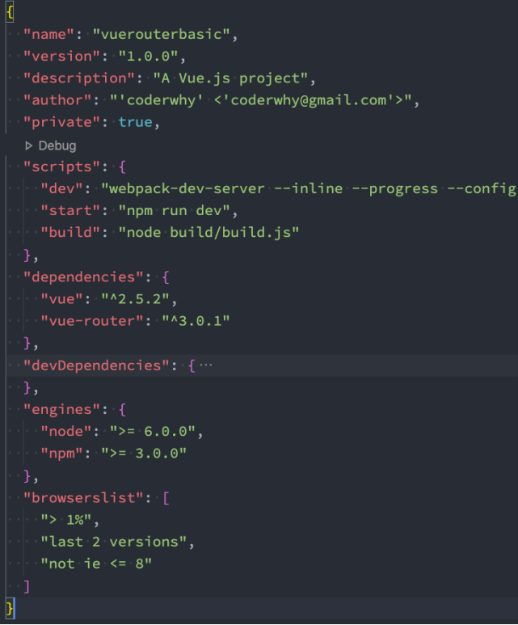
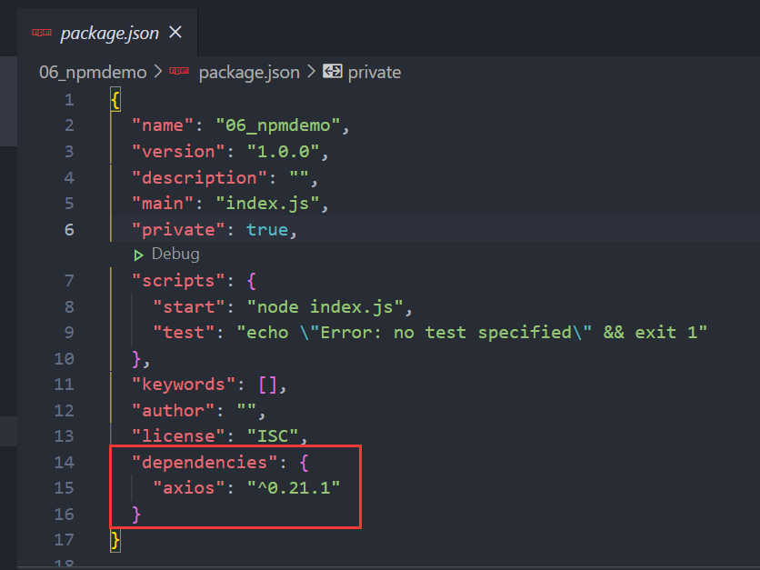

### 1.共享你的代码

我们已经学习了在JavaScript中可以通过模块化的方式将代码划分成一个个小的结构：

- 在以后的开发中我们就可以通过模块化的方式来封装自己的代码，并且封装成一个工具
- 这个工具我们可以让同事通过导入的方式来使用，甚至你可以分享给世界各地的程序员来使用

如果我们分享给世界上所有的程序员使用，有哪些方式呢？

1. 方式一：上传到GitHub上、其他程序员通过GitHub下载我们的代码，然后手动的引用
   - 缺点是大家必须知道你代码的GitHub地址，并且从GitHub上手动下载
   - 需要在自己的项目中手动引用，并且管理相关的依赖
   - 不需要使用的时候，需要手动来删除相关的依赖
   - 当遇到版本升级或者切换时，需要重复上面的操作
   - 显然，上面的方式是有效的，但是这种传统的方式非常麻烦，并且容易出错
2. 方式二：使用一个专业的工具来管理我们的代码
   - 我们通过工具将代码发布到特定的位置
   - 其他程序员直接通过工具来安装、升级、删除我们的工具代码

### 2.包管理工具npm

显然，通过第二种方式我们可以更好的管理自己的工具包，其他人也可以更好的使用我们的工具包

包管理工具npm：

- Node Package Manager，也就是Node包管理器
- 但是目前已经不仅仅是Node包管理器了，在前端项目中我们也在使用它来管理依赖的包
- 比如express、koa、react、react-dom、axios、babel、webpack等等

npm管理的包可以在哪里查看、搜索呢？

- https://www.npmjs.com/
- 这是我们安装相关的npm包的官网

npm管理的包存放在哪里呢？

- 我们发布自己的包其实是发布到registry上面的
- 当我们安装一个包时其实是从registry [ˈredʒɪstri] 上面下载的包

### 3.项目配置文件

事实上，我们每一个项目都会有一个对应的配置文件，无论是前端项目还是后端项目：

- 这个配置文件会记录着你项目的名称、版本号、项目描述等；
- 也会记录着你项目所依赖的其他库的信息和依赖库的版本号；

这个配置文件在Node环境下面（无论是前端还是后端）就是package.json

我们这里来看几个例子：

- Vue cli4创建的项目

  
- Vue cli2创建的项目

  
- npm init –y 创建的 package.json 这里要保证文件夹名全是英文

  

### 4.常见的属性

必须填写的属性：name、version

- name是项目的名称；
- version是当前项目的版本号；
- description是描述信息，很多时候是作为项目的基本描述；
- author是作者相关信息（发布时用到）；
- license是开源协议（发布时用到）；

private属性：

- private属性记录当前的项目是否是私有的；
- 当值为true时，npm是不能发布它的，这是为了防止私有项目或模块被不小心的发布出去；
- npm publish：是发布不出去的

main属性：设置程序的入口

- 很多人会有疑惑，webpack不是会自动找到程序的入口吗？

- 这个入口和webpack打包的入口并不冲突；

- 它是在你发布一个模块的时候会用到的；

- 比如我们使用axios模块 const axios = require('axios')；

- 实际上是找到对应的main属性查找文件的；

  

scripts属性

- scripts属性用于配置一些脚本命令，以键值对的形式存在；
- 配置后我们可以通过 npm run 命令的key来执行这个命令；

  
- npm start和npm run start的区别是什么？
  - 它们是等价的；
  - 对于常用的 start、 test、stop、restart 可以省略掉run直接通过 npm start 等方式运行；

dependencies属性

- dependencies属性是指定无论开发环境还是生产环境都需要依赖的包；

- 通常是我们项目实际开发用到的一些库模块；
- 与之对应的是devDependencies；
- 我们安装一个axios （npm install axios）

  

devDependencies属性（安装一些开发时依赖 => 开发阶段的时候可能会使用这么一个工具）

- 一些包在生产环境是不需要的，比如webpack、babel等；

- 这个时候我们会通过 npm install webpack --save-dev，将它安装到devDependencies属性中；

- 开发阶段的时候可能会使用这么一个工具，等到我们打包之后的那个项目，是不需要用到这些个工具的。

- 那么在生产环境如何保证不安装这些包呢？
  
  - 下面这两个不常用，最好看都不要看，以免混淆视听
  
  
  
  - 生产环境不需要安装时，我们需要通过 npm install --production 来安装文件的依赖；
  - 执行这个命令就不会安装devDependencies下面的依赖了；

### 5.版本管理的问题

我们会发现安装的依赖版本出现：^2.0.3或~2.0.3，这是什么意思呢？

npm的包通常需要遵从semver版本规范：

- semver：https://semver.org/lang/zh-CN/
- npm semver：https://docs.npmjs.com/misc/semver

semver版本规范是X.Y.Z：

- X主版本号（major）：当你做了不兼容的 API 修改（可能不兼容之前的版本）；
- Y次版本号（minor）：当你做了向下兼容的功能性新增（新功能增加，但是兼容之前的版本）；
- Z修订号（patch）：当你做了向下兼容的问题修正（没有新功能，修复了之前版本的bug）；

我们这里解释一下^和~的区别：

- ^x.y.z：表示x是保持不变的，y和z永远安装最新的版本；
- ~x.y.z：表示x和y保持不变的，z永远安装最新的版本；

### 6.不常见的属性

engines属性

- engines属性用于指定Node和NPM的版本号；
- 在安装的过程中，会先检查对应的引擎版本，如果不符合就会报错；
- 事实上也可以指定所在的操作系统 "os" : [ "darwin", "linux" ]，只是很少用到；

browserslist属性

- 用于配置打包后的JavaScript浏览器的兼容情况，参考；
- 否则我们需要手动的添加polyfills来让其支持某些语法；
- 也就是说它是为webpack等打包工具服务的一个属性

### 7.npm install 命令

安装npm包分两种情况：

- 全局安装（global install）：（`npm install <package> -g`） npm install yarn -g；
- 项目（局部）安装（local install）：（`npm install <package>`） npm install axios

全局安装

- 全局安装是直接将某个包安装到全局：
- 比如 webpack 的全局安装：
- npm install webpack -g

但是很多人对全局安装有一些误会：

- 通常使用npm全局安装的包都是一些工具包：yarn、webpack，gulp等；
- 并不是类似于 axios、express、koa 等库文件；
- 所以全局安装了之后并不能让我们在所有的项目中使用 axios 等库；

### 8.项目安装

项目安装会在当前目录下产生一个 node_modules 文件夹

我们之前讲解require查找顺序时有讲解过这个包在什么情况下会被查找

局部安装分为开发时依赖和生产时依赖：

- 安装开发和生产依赖 （就是放到dependencies中的）
  - npm install axios --save
  - npm install axios
  - npm i axios
- 开发时依赖（就是放到devDependencies中的）
  - npm install webpack --save-dev
  - npm install webpack -D
  - npm i webpack –D
- 根据package.json中的依赖包
  - npm install

### 9.npm install 原理

很多同学之前应该已经会了 npm install ，但是你是否思考过它的内部原理呢？

- 执行 npm install 它背后帮助我们完成了什么操作？
- 我们会发现还有一个称为 package-lock.json 的文件，它的作用是什么？
- 从npm5开始，npm支持缓存策略（来自yarn的压力），缓存有什么作用呢？

这是一幅coderwhy画出的根据 npm install 的原理图：


- 如果你只有package.json这个文件，然后执行npm install，此时它会查找是否有package-lock.json这个文件
  - 因为是第一次，所以没有这个文件
  - 然后它会根据依赖dependencies和devDependencies构建一个依赖关系
    - 以前是这样的，比如安装多个包，可能会有重复的依赖
    - 现在是扁平化的
  - axios/express/vue/react这些库都在registry中，然后会在仓库中找到需要的包的位置
  - 在仓库里的东西是压缩包，然后将压缩包下载到本地
  - 从npm5开始会做一个缓存，获取压缩包然后添加到缓存中
  - 之后将包里的代码解压到node_modules中，并且帮助我们生成一个package-lock.json文件
    - 从而完成安装
- 如果有package-lock.json文件，
  - 会检查依赖的一致性
  
    
  
  - 如果不符合就会重新构建依赖关系，然后再往后走，最后重新更新package-lock.json文件
  
  - 如果符合就会去缓存的文件夹里面查找有没有缓存，没有缓存就又走上面的流程了
  
    - 只能去registry里下载了
  
  - 如果有缓存会在缓存文件中拿到安装包，然后进行解压等操作

### 10.npm install 原理图解析

- npm install会检测是否有package-lock.json文件：
  - 没有lock文件
    - 分析依赖关系，这是因为我们可能会依赖其他的包，并且多个包之间会产生相同依赖的情况；
    - 从registry仓库中下载压缩包（如果我们设置了镜像，那么会从镜像服务器下载压缩包）；
    - 获取到压缩包后会对压缩包进行缓存（从npm5开始有的）；
    - 将压缩包解压到项目的node_modules文件夹中
  - 有lock文件
    - 检测lock文件中包的版本是否和package.json中一致（会按照semver版本规范进行检测）
      - 不一致，那么会重新构建依赖关系，直接会走顶层的流程；
    - 一致的情况下，会去优先查找缓存 
      - 没有找到，会从registry仓库下载，直接走顶层流程；
    - 查找到，会获取缓存中的压缩文件，并且将压缩文件解压到node_modules文件夹中；

### 11.我们拿安装axios举例子

npm install axios的时候会发现它安装了两个包，一个叫axios一个叫follow-redirects，为什么？

我们找到axios中的package.json文件会发现在devDependencies中会有好多好多依赖，但是你还会找到dependencies中有一个依赖是 `"follow-redirects": "^1.10.0"` 因为在生产环境下会用到，所以会跟着一起安装

### 12.package-lock.json文件解析

暂时先不管packages属性

name：项目的名称；

version：项目的版本；

lockfileVersion：lock文件的版本；

requires：使用requires来跟踪模块的依赖关系；

dependencies：项目的依赖

- 当前项目依赖axios，但是axios依赖follow-redireacts；
- axios中的属性如下：
  - version表示实际安装的axios的版本；
  - resolved用来记录下载的地址，registry仓库中的位置；
  - requires记录当前模块的依赖；
  - integrity用来从缓存中获取索引，再通过索引去获取压缩包文件；


### 13.npm其他命令

卸载某个依赖包：

- npm uninstall package
- npm uninstall package --save-dev
- npm uninstall package -D

强制重新build

- npm rebuild：比如说我们把axios的版本改变了就可以使用此命令

清除缓存

- npm cache clean

npm的命令其实是非常多的：

- https://docs.npmjs.com/cli-documentation/cli
- 更多的命令，可以根据需要查阅官方文档

### 14.yarn工具

另一个node包管理工具yarn：

- yarn是由Facebook、Google、Exponent 和 Tilde 联合推出的一个新的 JS 包管理工具；
- yarn 是为了弥补 npm 的一些缺陷而出现的；
- 早期的npm存在很多的缺陷，比如安装依赖速度很慢、版本依赖混乱等等一系列的问题；
- 虽然从npm5版本开始，进行了很多的升级和改进，但是依然有很多人喜欢使用yarn；

npm和yarn命令对比


### 15.cnpm工具

由于一些特殊的原因，某些情况下我们没办法很好的从https://registry.npmjs.org下载一些需要的包

查看npm镜像：

- npm config get registry
  - 打印：https://registry.npmjs.org/

我们可以直接设置npm的镜像：

- npm config set registry https://registry.npm.taobao.org

但是对于大多数人来说（比如我），并不希望将npm镜像修改了：

- 第一，不太希望随意修改npm原本从官方下载包的渠道；
- 第二，担心某天淘宝的镜像挂了或者不维护了，又要改来改去；

这个时候，我们可以使用cnpm，并且将cnpm设置为淘宝的镜像：

- npm install -g cnpm --registry=https://registry.npm.taobao.org
- cnpm config get registry
  - 打印：https://r.npm.taobao.org/

### 16.npx工具

npx是npm5.2之后自带的一个命令。

- npx的作用非常多，但是比较常见的是使用它来调用项目中的某个模块的指令。

我们以webpack为例：

- 全局安装的是webpack5.1.3
- 项目安装的是webpack3.6.0

如果我在终端执行 webpack --version 使用的是哪一个webpack呢？

- 显示结果会是 webpack 5.1.3，事实上使用的是全局的，为什么呢？
- 原因非常简单，在当前目录下找不到webpack时，就会去全局找，并且执行命令；

如何解决这个问题呢？

- 那么如何使用项目（局部）的webpack，常见的是两种方式：
  - 方式一：明确查找到node_module下面的webpack
  - 方式二：在 scripts 定义脚本，来执行webpack；

方式一：在终端中使用如下命令（在项目根目录下）

- ./node_modules/.bin/webpack --version

方式二：修改package.json中的scripts

```json
"scripts": {
	"webpack": "webpack --version"
}
```

方式三：使用npx

- npx webpack --version

- npx的原理非常简单，它会到当前目录的node_modules/.bin目录下查找对应的命令；