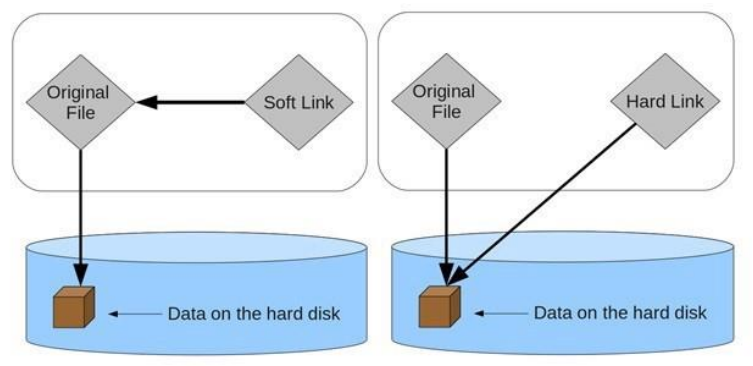
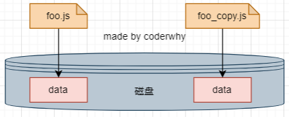
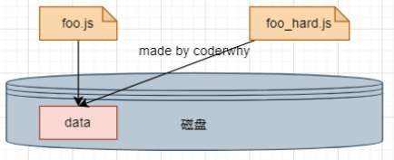
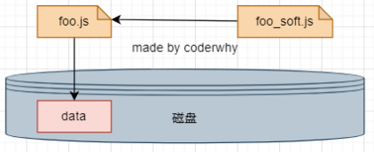

### 1.什么是pnpm?

- pnpm的特点
  - 快速
    - pnpm比其他包管理工具快两倍
  - 高效
  - 节省磁盘空间
  - 支持monorepos
    - pnpm内置支持单仓多包
  - 严格
    - pnpm默认创建非平铺的node_modules
    - 代码无法访问任意包

- 哪些公司在使用?

  

### 2.硬连接和软连接

- 硬链接（hard link）
  - 电脑文件系统中的多个文件平等地共享同一个文件存储单元
  - 删除一个文件名字后，还可以用其它名字继续访问该文件
- 软连接（符号链接）
  - Soft link、Symbolic link
  - 软链接文件是一类特殊的文件
  - 其包含有一条以绝对路径或者相对路径的形式指向其它文件或者目录的引用



### 3.文件的拷贝和软硬连接

- 文件的拷贝：在硬盘中复制出来一份新的文件数据

  

  ```
  window: copy foo.js foo_copy.js
  macos : cp foo.js foo_copy.js
  ```

- 文件的硬链接

  

  ```
  window: mklink /H aaa_hard.js aaa.js
  macos : ln foo.js foo_hard.js
  ```

- 文件的软连接

  

  ```
  window: mklink aaa_soft.js aaa.js
  macos : ln -s foo.js foo_copy.js
  ```

### 4.pnpm到底在做什么?

- 使用npm或yarn时，如果你有100个项目，并且所有项目都有一个相同的依赖包，那么， 你在硬盘上就需要保存100份该相同依赖包的副本
- 如果是使用pnpm，依赖包将被存放在一个统一的位置
  - 如果你对同一依赖包使用相同的版本，那么磁盘上只有这个依赖包的一份文件
  - 如果你对同一依赖包需要使用不同的版本，则仅有版本之间不同的文件会被存储起来
  - 所有文件都保存在硬盘上的统一的位置
    - 当安装软件包时，其包含的所有文件都会硬链接到此位置，而不会占用额外的硬盘空间
    - 这让你可以在项目之间方便地共享相同版本的依赖包


### 5.非扁平化

- pnpm创建非扁平化的node_modules目录
- 当使用npm或yarn安装依赖包时，所有软件包都将被提升到node_modules的根目录下
  - 其结果是，自己的项目可以访问本不属于当前项目所设定的依赖包


### 6.pnpm的安装和使用

- 那么我们应该如何安装pnpm呢？

  - 官网提供了很多种方式来安装pnpm：https://pnpm.io/
  - 通过npm安装即可
    - npm install pnpm -g

- 以下是一个与npm等价命令的对照表

  | npm命令               | pnpm 等价命令       |
  | --------------------- | ------------------- |
  | npm install           | pnpm install        |
  | npm install `<pkg>`   | pnpm add `<pkg>`    |
  | npm uninstall `<pkg>` | pnpm remove `<pkg>` |
  | npm run `<cmd>`       | pnpm `<cmd>`        |

### 7.pnpm的存储store

- 在pnpm7.0之前，统一的存储位置是 ~/.pnpm-score
- 在pnpm7.0之后，统一的存储位置进行了更改：`<pnpm home directory>/store`
  - 在 Linux 上，默认是 ~/.local/share/pnpm/store
  - 在 Windows 上： %LOCALAPPDATA%/pnpm/store
  - 在 macOS 上： ~/Library/pnpm/store
- 我们可以通过一些终端命令获取这个目录：获取当前活跃的store目录
  - pnpm store path
- 另外一个非常重要的store命令是prune（修剪）：从store中删除当前未被引用的包来释放store的空间
  - pnpm store prune [pruːn] 修剪

