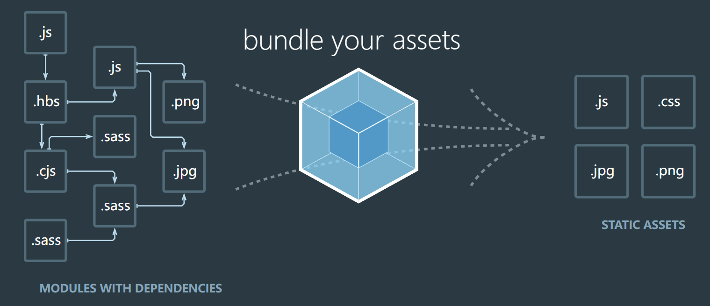
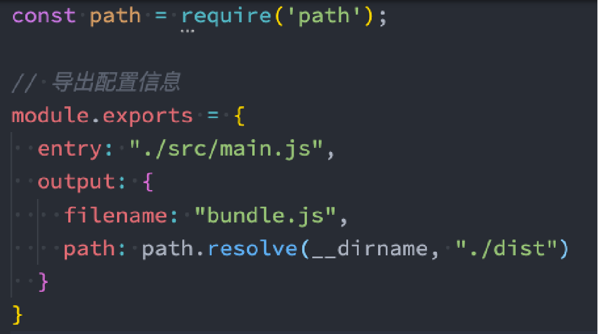
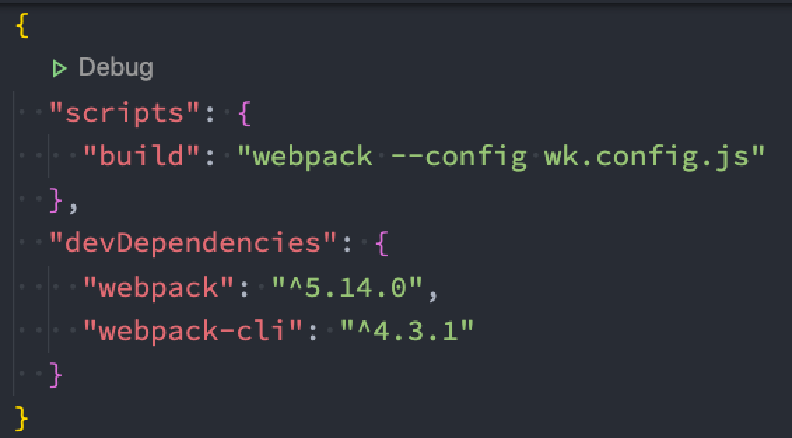

### 1.Webpack是什么?

- Webpack的作用是打包
- 比如我们开发一个vue项目，可能会用到以.vue结尾的vue文件
- 除此之外还可能会用到less以及其他的文件资源比如图片或者字体
- webpack就会把这些东西进行打包压缩，生成一个build文件
- 这个build文件就会存储压缩好的文件
- 把这些压缩好的文件引入index.html就可以使用了
- webpack主要运行在node环境中
- 通过运行js代码对文件进行打包

### 2.webpack

- webpack is a static module bundler for modern JavaScript applications.
- webpack是一个静态的模块化打包工具
  - 打包bundler：webpack可以帮助我们进行打包，所以它是一个打包工具
  - 静态的static：这样表述的原因是我们最终可以将代码打包成最终的静态资源（部署到静态服务器）
  - 模块化module：webpack默认支持各种模块化开发，ES Module、CommonJS、AMD等

### 3.Vue项目需要打包的文件

- 对JavaScript进行打包
  - 将ES6转换成ES5的语法
  - TypeScript的处理，将其转换成JavaScript
- 对css进行打包
  - CSS文件模块的加载、提取
  - Less、Sass等预处理器的处理
- 对资源文件img、font进行打包
  - 图片img文件的加载
  - 字体font文件的加载
- 对HTML文件进行打包
  - 打包HTML资源文件
- 对vue项目的SFC文件.vue文件进行打包

### 4.局部安装webpack

- npm install webpack webpack-cli -D
- 为什么不使用全局安装的webpack
  - 因为不同的项目可能依赖不同版本的webpack

### 5.webpack的默认打包

- 我们可以通过webpack进行打包，之后运行打包之后的代码
  - 在目录下直接执行 webpack 命令
  - webpack
- 生成一个dist文件夹，里面存放一个main.js的文件，这就是我们打包之后的文件：
  - 这个文件中的代码被压缩和丑化了
  - 另外我们发现代码中依然存在ES6的语法，比如箭头函数、const等，这是因为默认情况下webpack并不清楚我们打包后的文件是否需要转成ES5之前的语法，后续我们需要通过babel来进行转换和设置
- 我们发现是可以正常进行打包的，但是有一个问题，webpack是如何确定我们的入口的呢？
  - 事实上，当我们运行webpack时，webpack会查找当前目录下的 src/index.js作为入口
  - 所以，如果当前项目中没有存在src/index.js文件，那么会报错
- 当然，我们也可以通过配置来指定入口和出口
  - npx webpack --entry ./src/main.js --output-path ./build

### 6.Webpack配置文件

- 在通常情况下，webpack需要打包的项目是非常复杂的，并且我们需要一系列的配置来满足要求，默认配置必然是不可以的

- 我们可以在根目录下创建一个webpack.config.js文件，来作为webpack的配置文件

  

- 继续执行webpack命令，依然可以正常打包

### 7.指定配置文件

- 但是如果我们的配置文件并不是webpack.config.js的名字，而是其他的名字呢？

  - 比如我们将webpack.config.js修改成了 wk.config.js
  - 这个时候我们可以通过 --config 来指定对应的配置文件
    - webpack --config wk.config.js

- 但是每次这样执行命令来对源码进行编译，会非常繁琐，所以我们可以在package.json中增加一个新的脚本

  

  - 之后我们执行 npm run build来打包即可

### 8.Webpack的依赖图

- webpack到底是如何对我们的项目进行打包的呢？
  - 事实上webpack在处理应用程序时，它会根据命令或者配置文件找到入口文件
  - 从入口开始，生成一个 依赖关系图，这个依赖关系图会包含应用程序中所需的所有模块（比如.js文件、css文件、图片、字体等）
  - 然后遍历图结构，打包一个个模块（根据不同的文件使用不同的loader进行解析）

