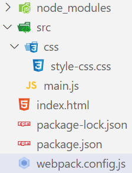

### 1.编写代码

- 目录结构：

- 编写css代码

  ```css
  .div-style {
    color: red;
    font-size: 60px;
  }
  ```

- 编写js代码

  ```js
  import "./css/style-css.css";
  
  const divEl = document.createElement("div");
  
  divEl.textContent = "我是div";
  divEl.classList.add("div-style");
  
  document.body.append(divEl);
  ```

- 编写webpack.config.js文件

  ```js
  const path = require("path")
  
  module.exports = {
    mode: "development",  // 模式为开发模式
    entry: "./src/main.js",  // 指定入口文件
    output: {  // 出口
      path: path.resolve(__dirname, "./build"),  // 指定打包的目录
      filename: "bundle.js"  // 指定打包的文件
      clean: true,  // 重新打包时, 删除之前打包过的文件
    },
    module: {  // 加载模块
      rules: [  // 规则
        {
          test: /\.css$/ig,  // 匹配以.css结尾的文件
          use: ["style-loader", "css-loader"]  // 从后往前使用loader处理我们编写的代码
        }
      ]
    }
  }
  ```

### 2.安装loader

- npm install css-loader style-loader

### 3.分析

- css-loader：处理css文件
  - css-loader只是负责将.css文件进行解析，并不会将解析之后的css插入到页面中
- style-loader：将处理好的css代码内嵌到style元素中

