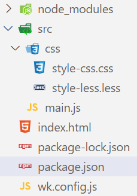

### 1.编写代码

- 目录结构：

- 编写less代码

  ```less
  @fontColor: #ff0;
  @fontSize: "50px";
  
  .h2-style {
    color: @fontColor;
    font-size: @fontSize;
    background-color: green;
    border: 1px solid #000;
  }
  ```

- 编写js代码

  ```js
  import "./css/style-less.less";
  
  const h2El = document.createElement("h2");
  
  h2El.textContent = "我是h2";
  h2El.classList.add("h2-style");
  
  document.body.append(h2El);
  ```

- 编写wk.config.js文件

  ```js
  module.exports = {
    module: {
      rules: [
        {
          test: /\.less$/ig,
          use: ["style-loader", "css-loader", "less-loader"]
        }
      ]
    }
  }
  ```

  - 之前写过的东西不再写入

- 编写脚本

  ```json
  {
    "scripts": {
      "build": "webpack --config ./wk.config.js"
    }
  }
  ```

### 2.安装loader

- npm install less-loader -D
- 安装less-loader它自动安装了less
- emmm，如果没有自动安装less，是需要自己手动安装less的

### 3.分析

- less-loader：将less代码转换成css代码

