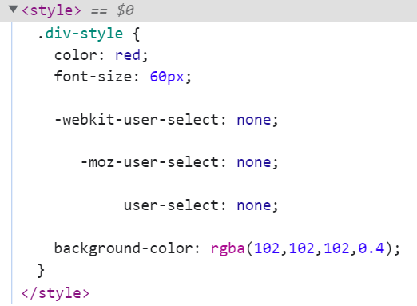
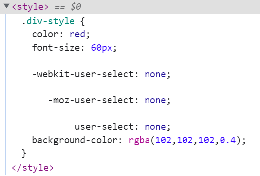

### 1.认识PostCSS工具

- 帮助我们进行一些CSS的转换和适配，比如自动添加浏览器前缀、css样式的重置
- 实现这些功能，需要借助PostCSS对应的插件

### 2.处理浏览器前缀

- 编写需要加浏览器前缀的css

  ```css
  .div-style {
    color: red;
    font-size: 60px;
  
    user-select: none;
  }
  ```

- 编写配置文件：在原css配置的位置上更改代码

  ```js
  module.exports = {
    module: {
      rules: [
        {
          test: /\.css$/ig,
          use: ["style-loader", "css-loader", {
            loader: "postcss-loader",
            options: {
              postcssOptions: {
                plugins: ["autoprefixer"]
              }
            }
          }]
        }
      ]
    }
  }
  ```

- 将配置文件抽出来

  - 抽取到postcss.config.js中，文件位置与webpack配置文件在同一级
  
    ```js
    module.exports = {
      plugins: ["autoprefixer"]
    }
    ```

### 3.预设

- 我们不仅仅对浏览器前缀进行处理，还要对一些新特性进行转换

  - 比如用十六进制表示颜色时，可以再加两个字符表示透明度，有些浏览器就不支持
  - 这时我们需要安装和配置相关的插件
  - 但是这样一个个安装显得比较笨重和不灵活
  - 所以postcss为我们提供了一个预设
  - 这个预设的意思就是一个预设插件集成了很多的其他插件的功能
  - 帮助我们快速的实现各个功能

- postcss-preset-env这个预设就在为我们做上面所说的事情

  - 卸载autoprefixer
    - npm uninstall autoprefixer
  - 安装postcss-preset-env
    - npm install postcss-preset-env -D

- 在postcss.config.js文件中进行配置

  ```js
  module.exports = {
    plugins: ["postcss-preset-env"]
  }
  ```

### 4.编写一些新特性的css代码

```css
.div-style {
  color: red;
  font-size: 60px;

  user-select: none;
  background-color: #6666;
}
```



### 5.编写一些新特性的less代码

```css
@fontColor: #ff0;
@fontSize: "50px";

.h2-style {
  color: @fontColor;
  font-size: @fontSize;
  border: 1px solid #000;

  user-select: none;
  background-color: #6666;
}
```

```js
module.exports = {
  module: {
    rules: [
      {
        test: /\.less$/ig,
        use: ["style-loader", "css-loader", "postcss-loader", "less-loader"]
      }
    ]
  }
}
```




