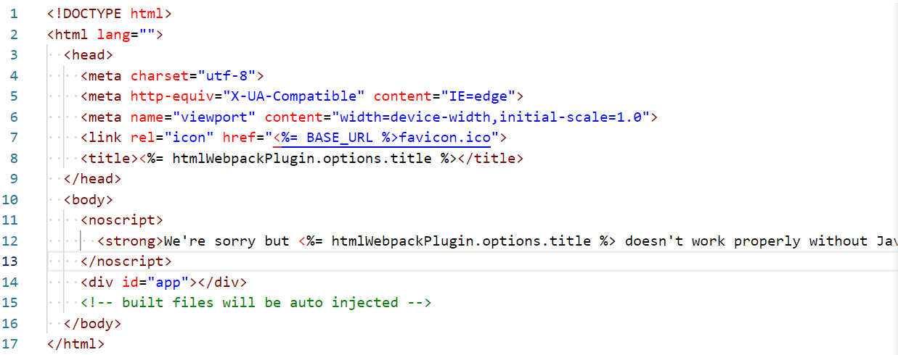

### 1.认识插件

- Webpack的另一个核心是Plugin
- loader主要用来对特定的模块类型进行转换
- 而plugin可以用于执行更加广泛的任务
  - 打包优化、资源管理、环境变量注入

### 2.CleanWebpackPlugin

- 现在改用在配置文件的output中写，但是这个插件还是可以用的

  ```js
  module.exports = {
    output: {
      clean: true
    }
  }
  ```

- 作用是把之前打包的文件给删除掉，再重新建立打包文件

### 3.HtmlWebpackPlugin

- 还有一个不太规范的地方

  - 我们的HTML文件是编写在根目录下的，而最终打包的dist文件夹中是没有index.html文件的
  - 在进行项目部署的时，必然也是需要有对应的入口文件index.html
  - 所以我们也需要对index.html进行打包处理

- 安装

  - npm install html-webpack-plugin -D

- 配置

  ```js
  const HtmlWebpackPlugin = require("html-webpack-plugin");
  
  module.exports = {
    mode: "development",
    output: {
      clean: true
    },
    plugins: [
      new HtmlWebpackPlugin({
        title: "webpack打包html文件"
      })
    ]
  }
  ```

  

- 这个文件是如何生成的呢？
  - 默认情况下是根据ejs的一个模板来生成的
  - 在html-webpack-plugin的源码中，有一个default_index.ejs模块

### 4.自定义html模板

- 如果我们想在自己的模块中加入一些比较特别的内容呢?

  - 比如添加一个noscript标签，在用户的JavaScript被关闭时，给予响应的提示

  - 比如在开发vue或者react项目时，我们需要一个可以挂载后续组件的根标签

    `<div id="app"></div>`

- 这个时候我们需要一个属于自己的index.html模块

  - 与配置文件同层级

    

  - 配置

    ```js
    const HtmlWebpackPlugin = require("html-webpack-plugin");
    
    module.exports = {
      plugins: [
        new HtmlWebpackPlugin({
          title: "webpack打包html文件",
          template: "./index.html"
        })
      ]
    }
    ```

### 5.自定义模板数据填充

- 上面的代码中，会有一些类似这样的语法：<%= 变量 %>，这个是EJS模块填充数据的方式
- 在配置HtmlWebpackPlugin时，我们可以添加如下配置：
  - template：指定我们要使用的模块所在的路径
  - title：在进行htmlWebpackPlugin.options.title读取时，就会读到该信息

### 6.DefinePlugin

- 但是，这个时候进行打包还是会报错，因为在我们的模块中还会使用到一个BASE_URL的常量

  

- 这是因为在编译template模块时，有一个BASE_URL：

  - `<link rel="icon" href="<%= BASE_URL %>favicon.ico">`
  - 但是我们并没有设置过这个常量值，所以会出现没有定义的错误
  - 这个时候我们可以使用DefinePlugin插件去解决这个问题

- 安装

  - 不需要单独安装
  - DefinePlugin允许在编译时创建配置的全局常量，是一个webpack内置的插件

- 配置

  ```js
  const HtmlWebpackPlugin = require("html-webpack-plugin");
  const { DefinePlugin } = require("webpack");
  
  module.exports = {
    plugins: [
      new HtmlWebpackPlugin({
        title: "webpack打包html文件",
        template: "./index.html"
      }),
      new DefinePlugin({
        BASE_URL: "'./'"
      })
    ]
  }
  ```
  - 要注意BASE_URL所对应的值虽然是一个字符串，但是里面所写的东西会被当做表达式运行
  - 所以要加单引号，以保证是一个字符串

### 7.mode

- Mode配置选项，可以告知webpack使用相应模式的内置优化：
  
  - 默认值是production（什么都不设置的情况下）
  - 可选值有：'none' | 'development' | 'production'
  
- 这几个选项有什么样的区别呢?

  

- development和production分别代表什么?

  


