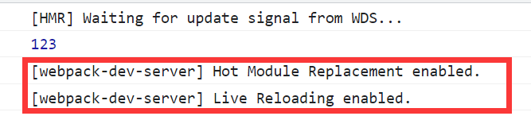
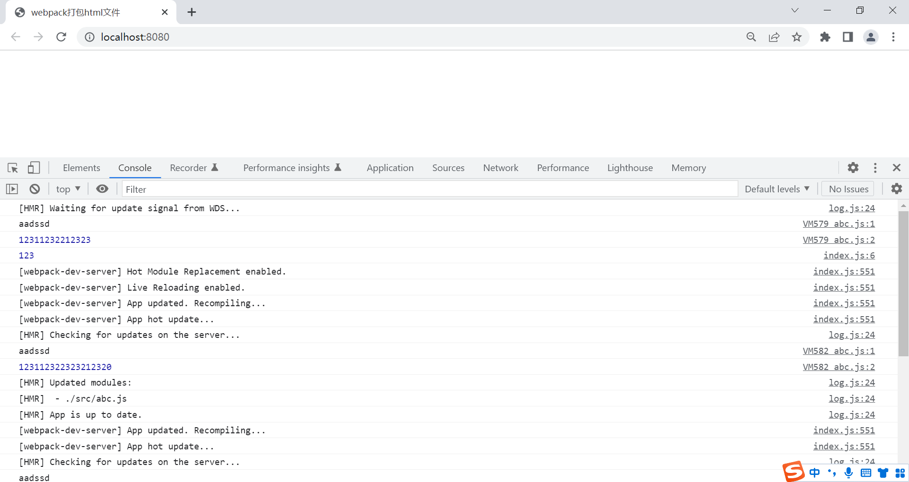
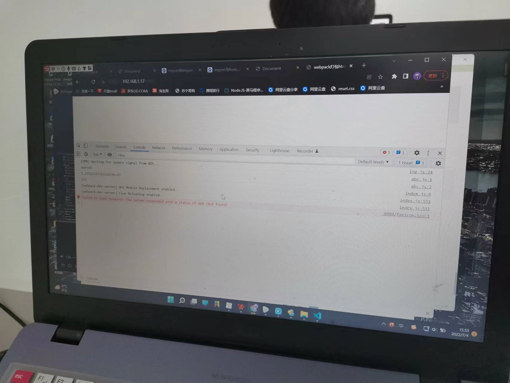
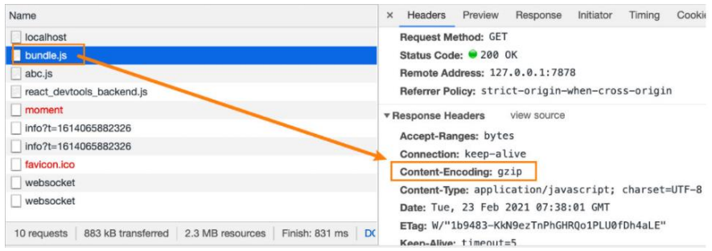

### 1.为什么要搭建本地服务器？

- 目前我们开发的代码，为了运行需要有两步操作：
  - 操作一：npm run build，编译相关的代码
  - 操作二：通过live server或者直接通过浏览器，打开index.html代码，查看效果
- 这个过程经常操作会影响我们的开发效率
  - 我们希望可以做到，当文件发生变化时，可以自动的完成编译和展示
- 为了完成自动编译，webpack提供了几种可选的方式：
  - webpack watch mode
  - webpack-dev-server（常用）
  - webpack-dev-middleware

### 2.webpack-dev-server

- 上面的方式可以监听到文件的变化，但是事实上它本身是没有自动刷新浏览器的功能的：

  - 当然，目前我们可以在VSCode中使用live-server来完成这样的功能
  - 但是，我们希望在不使用live-server的情况下，可以具备live reloading（实时重新加载）的功能

- 安装

  - npm install webpack-dev-server -D

- 修改脚本

  ```json
  "scripts": {
    "serve": "webpack serve"
  }
  ```

- webpack-dev-server 在编译之后不会写入到任何输出文件中，而是将 bundle 文件保留在内存中

  - 事实上webpack-dev-server使用了一个库叫memfs（memory-fs这个库是webpack自己写的）

### 3.认识HMR

- 什么是HMR呢？
  - HMR的全称是Hot Module Replacement，翻译为模块热替换
  - 模块热替换是指在应用程序运行过程中，替换、添加、删除模块，而无需重新刷新整个页面
  - 其实可以理解为热更新
- HMR通过如下几种方式，来提高开发的速度
  - 不重新加载整个页面，这样可以保留某些应用程序的状态不丢失
  - 只更新需要变化的内容，节省开发的时间
  - 修改了css、js源代码，会立即在浏览器更新，相当于在浏览器的devtools中直接修改样式
- 如何使用HMR呢？
  - 默认情况下，webpack-dev-server已经支持HMR，我们只需要开启即可（默认已经开启）
  - 在不开启HMR的情况下，当我们修改了源代码之后，整个页面会自动刷新，使用的是live reloading

### 4.开启HMR

- 修改webpack的配置

  ```js
  module.exports = {
    devServer: {
      hot: true,  // 默认就是true, 可以不写
    }
  }
  ```

  

- 虽然我们已经开启了HMR

  - 但是你会发现，当我们修改了某一个模块的代码时，依然在刷新整个页面
  - 这是因为我们需要去指定在哪些模块发生更新时，进行HMR

- 演示

  ```js
  import "./abc"
  
  console.log(123)
  
  if(module.hot) module.hot.accept("./abc.js");
  ```

  - 再修改abc.js文件中的代码就可以进行热更新了

    

### 5.框架的HMR

- 有一个问题：在开发其他项目时，我们是否需要经常手动去写入module.hot.accpet相关的API呢?
  - 比如开发Vue、React项目，我们修改了组件，希望进行热更新，这个时候应该如何去操作呢？
- 事实上社区已经针对这些有很成熟的解决方案了：
  - 比如vue开发中，我们使用vue-loader，此loader支持vue组件的HMR，提供开箱即用的体验
  - 比如在react开发中，有React Hot Loader，实时调整react组件
    - 目前React官方已经弃用了，改成使用react-refresh

### 6.host配置

- host设置主机地址：

  - 默认值是localhost
  - 如果希望其他地方也可以访问，可以设置为 0.0.0.0
  - 这里的0.0.0.0表示，我开启一个服务后，同局域网的其他设备可以通过我的ip访问我开启的服务

  

  - 同网段的其他电脑可以通过本电脑ip访问到自己的项目

- 解释

  - localhost：本质上是一个域名，通常情况下会被解析成127.0.0.1
  - 127.0.0.1：回环地址(Loop Back Address)，表达的意思是我们主机自己发出去的包，直接被自己接收;
    - 正常的数据需要经过：应用层 - 传输层 - 网络层 - 数据链路层 - 物理层 ;
    - 而回环地址，是在网络层直接就被获取到了，是不会经过数据链路层和物理层的
    - 比如我们监听 127.0.0.1时，在同一个网段下的主机中，通过ip地址是不能访问的
  - 0.0.0.0：监听IPV4上所有的地址，再根据端口找到不同的应用程序
    - 比如我们监听 0.0.0.0时，在同一个网段下的主机中，通过ip地址是可以访问的

- 配置

  ```js
  module.exports = {
    devServer: {
      host: "0.0.0.0"
    }
  }
  ```

### 7.devServer的其他配置

- port设置监听的端口，默认情况下是8080

- open是否打开浏览器

  - 默认值是false，设置为true会自动打开浏览器
  - 也可以设置为类似于 Google Chrome 等值

- compress是否为静态文件开启gzip compression

  - 默认值是false，可以设置为true

    

```js
module.exports = {
  devServer: {
    port: "8000",
    open: true,
  }
}
```

