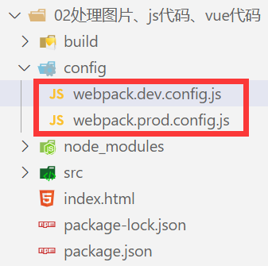

### 1.区分开发环境和生产环境

- 目录结构

- 开发环境

  ```js
  const path = require("path");
  const { VueLoaderPlugin } = require("vue-loader/dist/index");
  const HtmlWebpackPlugin = require("html-webpack-plugin");
  const { DefinePlugin } = require("webpack");
  
  module.exports = {
    mode: "development",
    entry: "./src/main.js",
    resolve: {
      extensions: [".js", ".json", ".vue", ".jsx", ".ts", ".tsx"],
      alias: {
        abc: path.resolve(__dirname, "../src/vue_demo")
      }
    },
    devServer: {
      port: 8000,
      open: true,
    },
    module: {
      rules: [
        {
          test: /\.css$/g,
          use: ["style-loader", "css-loader"]
        },
        {
          test: /\.vue$/,
          loader: "vue-loader"
        }
      ]
    },
    plugins: [
      new VueLoaderPlugin(),
      new HtmlWebpackPlugin({
        title: "webpack打包html文件",
        template: "./index.html"
      }),
      new DefinePlugin({
        BASE_URL: "'./'"
      })
    ]
  }
  ```

- 生产环境

  ```js
  const path = require("path");
  const { VueLoaderPlugin } = require("vue-loader/dist/index");
  const HtmlWebpackPlugin = require("html-webpack-plugin");
  const { DefinePlugin } = require("webpack");
  
  module.exports = {
    mode: "production",
    entry: "./src/main.js",
    output: {
      path: path.resolve(__dirname, "../build"),
      filename: "bundle.js",
      clean: true
    },
    resolve: {
      extensions: [".js", ".json", ".vue", ".jsx", ".ts", ".tsx"],
      alias: {
        abc: path.resolve(__dirname, "../src/vue_demo")
      }
    },
    module: {
      rules: [
        {
          test: /\.css$/g,
          use: ["style-loader", "css-loader"]
        },
        {
          test: /\.vue$/,
          loader: "vue-loader"
        }
      ]
    },
    plugins: [
      new VueLoaderPlugin(),
      new HtmlWebpackPlugin({
        title: "webpack打包html文件",
        template: "./index.html"
      }),
      new DefinePlugin({
        BASE_URL: "'./'"
      })
    ]
  }
  ```

- 配置脚本

  ```json
  "scripts": {
    "build": "webpack --config ./config/webpack.prod.config.js",
    "serve": "webpack serve --config ./config/webpack.dev.config.js"
  }
  ```

### 2.路径问题

- 为什么entry属性和HtmlWebpackPlugin的template属性只需要一个点?
- 为什么output的path属性和别名却要多加一个点
- 这是因为entry属性和另一个属性context有关
- context的作用是用于解析入口（entry point）和加载器（loader）
  - 默认是webpack的启动目录
  - 所以entry才不用多写一个点