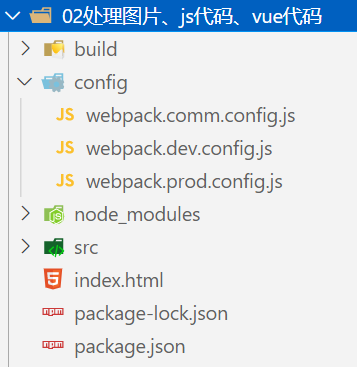

### 1.安装webpack-merge

- npm install webpack-merge -D

### 2.合并公共代码

- 目录结构：

- webpack.comm.config.js

  ```js
  const path = require("path");
  const { VueLoaderPlugin } = require("vue-loader/dist/index");
  const HtmlWebpackPlugin = require("html-webpack-plugin");
  const { DefinePlugin } = require("webpack");
  
  module.exports = {
    entry: "./src/main.js",
    resolve: {
      extensions: [".js", ".json", ".vue", ".jsx", ".ts", ".tsx"],
      alias: {
        abc: path.resolve(__dirname, "../src/vue_demo")
      }
    },
    module: {
      rules: [
        {
          test: /\.css$/g,
          use: ["style-loader", "css-loader"]
        },
        {
          test: /\.vue$/,
          loader: "vue-loader"
        }
      ]
    },
    plugins: [
      new VueLoaderPlugin(),
      new HtmlWebpackPlugin({
        title: "webpack打包html文件",
        template: "./index.html"
      }),
      new DefinePlugin({
        BASE_URL: "'./'"
      })
    ]
  }
  ```

- webpack.dev.config.js

  ```js
  const { merge } = require("webpack-merge");
  const commonConfig = require("./webpack.comm.config");
  
  module.exports = merge(commonConfig, {
    mode: "development",
    devServer: {
      port: 8000,
      open: true
    }
  });
  ```

- webpack.prod.config.js

  ```js
  const path = require("path");
  const { merge } = require("webpack-merge");
  const commonConfig = require("./webpack.comm.config");
  
  module.exports = merge(commonConfig, {
    mode: "production",
    output: {
      path: path.resolve(__dirname, "../build"),
      filename: "bundle.js",
      clean: true
    }
  });
  ```

  

