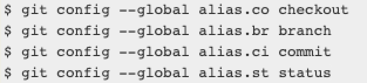

### 1.认识版本控制

- version control，维护工程蓝图的标准做法，追踪工程蓝图从诞生到定案的整个过程
- 版本控制也是一种软件工程技巧
  - 在软件开发的过程中，去确保由不同人所编辑的同一程序文件得到同步
- 版本控制可以帮助程序员对代码进行追踪、维护和控制

### 2.集中式版本控制

- CVS和SVN都属于集中式版本控制系统
- 它们的主要特点是
  - 单一的集中管理的服务器，保存所有文件的修订版本
  - 协同开发人员通过客户端连接到这台服务器，取出最新的文件或者提交更新
- 好处
  - 每个人都可以在一定程度上看到项目中的其他人正在做些什么
- 缺点
  - 中央服务器不能出现故障
  - 如果宕机一小时，那么在这一小时内，谁都无法提交更新，也就无法协同工作
  - 如果中心数据库所在的磁盘发生损坏，又没有做恰当备份，毫无疑问你将丢失所有的数据

### 3.分布式版本控制

- Git属于分布式版本控制系统
  - 客户端不只是提取最新版本的文件快照， 而是把代码仓库完整地镜像保存在本地，包括完整的历史记录
  - 这么一来，任何一处协同工作用的服务器发生故障，事后都可以用任何一个镜像出来的本地仓库恢复
  - 每一次的克隆操作，实际上都是一次对代码仓库的完整备份

### 4.Git的安装

- Git的官网：https://git-scm.com/downloads
- 根据自己的操作系统下载Git即可
- 下载后傻瓜式安装即可
- 注意：安装在C盘

### 5.Bash – CMD – GUI

- 安装完后你会获得三个东西，如标题所示

- Bash：Unix shell 的一种，Linux 与 Mac OS X 都将它作为默认 shell
  - Git Bash 就是一个 shell，是 Windows 下的命令行工具，可以执行 Linux 命令
  - Git Bash 是基于 CMD 的，在 CMD 的基础上增添一些新的命令与功能
  - 所以建议在使用的时候，用 Bash 更加方便
- Git CMD（不推荐）
  - 命令行提示符（CMD）是 Windows 操作系统上的命令行解释程序
  - 当你在 Windows 上安装 git 并且习惯使用命令行时，可以使用 cmd 来运行 git 命令
- Git GUI（不推荐）
  - 基本上针对那些不喜欢黑屏（即命令行）编码的人
  - 它提供了一个图形用户界面来运行 git 命令

### 6.基础配置

- 既然已经在系统上安装了 Git，你需要做几件事来定制你的 Git 环境
  - 每台计算机上只需要配置一次，程序升级时会保留配置信息
  - 你可以在任何时候再次通过命令来修改它们
- 设置你的用户名和邮件地址
  - 这一点很重要，因为每一个 Git 提交都会使用这些信息
    - 它们会写入到你的每一次提交中，不可更改
    - 提交后的信息不可更改，但是自己配置的用户名和邮箱可以更改
  - 如果使用了 --global 选项，那么该命令只需要运行一次
    - 因为之后无论你在该系统上做任何事情， Git 都会使用那些信息

- 值得注意的是，这些东西你写啥都行，只是用于提交记录时仓库记录一些信息，并不会产生任何影响
  - 它不是用来做信息验证的

### 7.别名

- Git 并不会在你输入部分命令时自动推断出你想要的命令

- 如果不想每次都输入完整的 Git 命令，可以通过 git config 文件来轻松地为每一个命令设置一个别名。
  

- 没必要，了解就行

