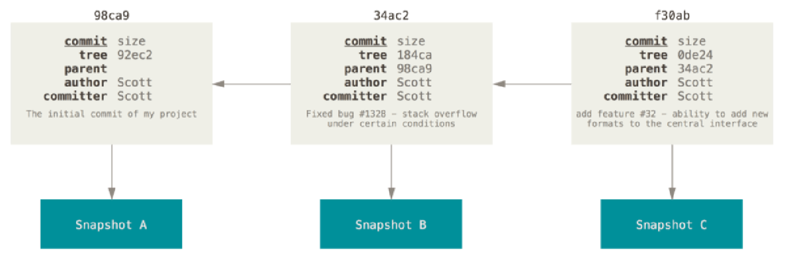

### 1.获取本地Git仓库

- 我们需要Git来管理源代码，那么我们本地需要有一个Git仓库
- 通常有两种获取 Git 项目仓库的方式：
  - 方式一：初始化一个Git仓库，可以将当前项目的文件都添加到Git仓库中
    - 目前很多的脚手架在创建项目时都会默认创建一个Git仓库
  - 方式二：从其它服务器 克隆（clone） 一个已存在的 Git 仓库
    - 到公司我们需要做这个操作
- 方式一：初始化Git仓库
  - git init
  - 该命令将创建一个名为 .git 的子目录，这个子目录含有你初始化的 Git 仓库中所有的必须文件
  - 这些文件是 Git 仓库的核心
  - 但是，在这个时候，我们仅仅是做了一个初始化的操作，你的项目里的文件还没有被跟踪
- 方式二：克隆一个远程仓库
  - git clone https://github.com/coderwhy/hy-react-web-music.git
  - 这里其实要注意一下，克隆一个开源的项目你随便克隆没有限制
  - 但是如果是私有的项目，一般需要身份验证，这个后面会说到

### 2.常用命令

- 初始化仓库后我们可能需要写一些文件，我们需要把这些文件提交到本地仓库中
- git add .
  - 将所有文件添加到暂存区
- git commit -m'描述'
  - 将所有文件提交到仓库
- git status
  - 查看状态

### 3.文件状态的划分

- 未跟踪：untracked
  - 默认情况下，本地的文件并没有添加到Git仓库中进行管理，我们需要通过add命令来操作
- 已跟踪：tracked
  - 添加到Git仓库中的文件处于已跟踪状态，Git可以对其进行各种跟踪管理
  - 已跟踪的文件又可以细分为
    - staged：刚刚进行了跟踪，处在暂缓区中
      - 刚 add 了
    - unmodified：刚刚进行了提交，已经放在了本地Git仓库中
      - 刚 commit 了
    - modified：无论是add过还是commit过的文件只要更改过就是这个状态
      - add后对文件进行了修改
      - commit后对文件进行了修改

### 4.Git的忽略文件

- 一般情况下有些文件无需纳入 Git 的管理，也不希望它们总出现在未跟踪文件列表中
  - 通常都是些自动生成的文件，比如日志文件，或者编译过程中创建的临时文件等
  - 我们可以创建一个名为 .gitignore 的文件，列出要忽略的文件的模式
- 在实际开发中，这个文件通常不需要手动创建，在必须的时候添加自己的忽略内容即可

### 5.Git的校验和

- Git 中所有的数据在存储前都需要计算校验和，然后以 校验和 来引用

- Git 这种计算校验和的机制叫做 SHA-1 散列（hash，哈希）

- 这是一个由 40 个十六进制字符（0-9 和 a-f）组成的字符串，基于 Git 中文件的内容或目录结构计算出来

  

### 6.查看提交历史

- git log
  - 在提交了若干更新，又或者克隆了某个项目之后，有时候我们想要查看一下所有的历史提交记录
  - 这个时候我们可以使用git log命令：
    - 不传入任何参数的默认情况下，git log 会按时间先后顺序列出所有的提交，最近的更新排在最上面
    - 这个命令会列出每个提交的 SHA-1 校验和、作者的名字和电子邮件地址、提交时间以及提交说明
    - 按q退出
- git log --pretty=oneline
  - 简化版
- git log --pretty=oneline --graph
  - 图结构，多个分支可以看的更加直观

### 7.版本回退

- 如果想要进行版本回退，我们需要先知道目前处于哪一个版本：Git通过HEAD指针记录当前版本
  - HEAD 是当前分支引用的指针，它总是指向该分支上的最后一次提交
  - 理解 HEAD 最简单的方式，就是将它看做该分支上最后一次提交的快照
- 我们可以通过HEAD来改变Git目前的版本指向
  - 上一个版本就是HEAD^，上上一个版本就是HEAD^^
  - 如果是上1000个版本，我们可以使用HEAD~1000
  - 我们还可以指定某一个commit id（校验和6到7位能区分即可）
- git reset --hard HEAD^
- git reset --hard HEAD~1000
- git reset --hard 2d44982