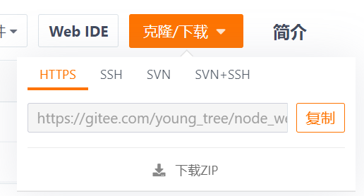
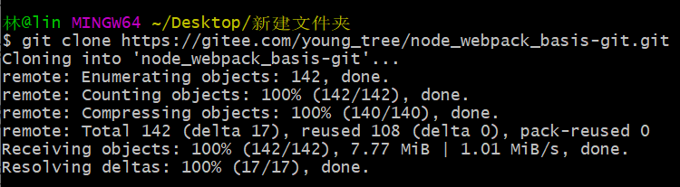
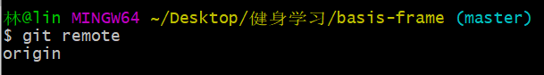
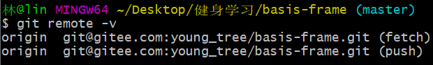
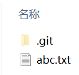
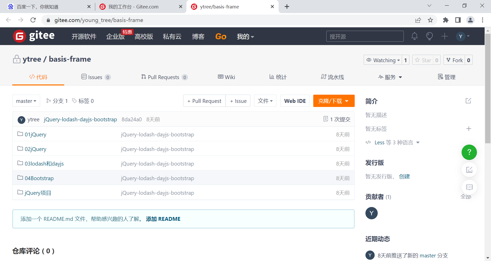
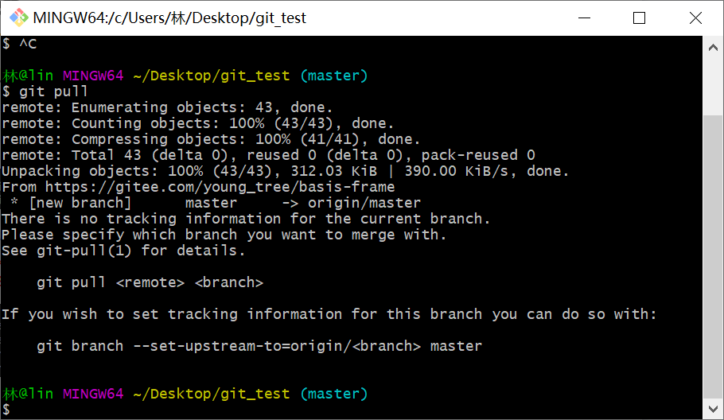
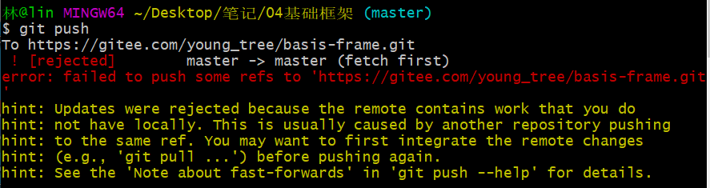

### 1.什么是远程仓库？

- 目前我们的代码是保存在一个本地仓库中，也就意味着我们只是在进行本地操作
- 在真实开发中，我们通常是多人开发的，所以我们会将管理的代码共享到远程仓库中
- 那么如何创建一个远程仓库呢？
  - 远程仓库通常是搭建在某一个服务器上的（当然本地也可以，但是本地很难共享）
  - 所以我们需要在Git服务器上搭建一个远程仓库
- 目前我们有如下方式可以使用Git服务器：
  - 使用第三方的Git服务器：比如GitHub、Gitee、Gitlab等等
  - 在自己服务器搭建一个Git服务

### 2.常见的远程仓库有哪些呢？

- 目前比较流行的是三种：
  - GitHub：https://github.com/
  - Gitee：https://gitee.com/
  - 自己搭建的Gitlab：http://152.136.185.210:7888/
- 对于私有的仓库我们想要进行操作，远程仓库会对我们的身份进行验证
  - 如果没有验证，任何人都可以随意操作仓库是一件非常危险的事情
- 目前Git服务器验证手段主要有两种
  - 方式一：基于HTTP的凭证存储（Credential Storage）
  - 方式二：基于SSH的密钥

### 3.远程仓库验证方式一

- HTTP协议本身是无状态的连接，所以每一个连接都需要用户名和密码

  - 如果每次都输入用户名和密码，会非常麻烦
  - 幸运的是，Git 拥有一个凭证系统来处理这个事情

- 在某个位置通过http协议clone某个远程仓库时

  

  - 需要一些账号密码的验证，如果之前验证过，就不需要再验证了

- 下面有一些 Git Crediential 的选项
  - 选项一：默认所有都不缓存
    - 每一次连接都会询问你的用户名和密码
  - 选项二：“cache” 模式会将凭证存放在内存中一段时间。
    - 密码永远不会被存储在磁盘中，并且在15分钟后从内存中清除
  - 选项三：“store” 模式会将凭证用明文的形式存放在磁盘中，并且永不过期
  - 选项四：如果你使用的是 Mac，Git 还有一种 “osxkeychain” 模式
    - 它会将凭证缓存到你系统用户的钥匙串中（加密的）
  - 选项五：如果你使用的是 Windows，
    - 你可以安装一个叫做 “Git Credential Manager for Windows” 的辅助工具
    - 可以在 https://github.com/Microsoft/Git-Credential-Manager-for-Windows 下载
    - 这个默认安装了
    - git config credential.helper：输入这个命令可以查看你安装的辅助工具
    - 正常应该是manager-core
    - 而我的是manager

### 4.远程仓库验证方式二

- Secure Shell（安全外壳协议，简称SSH）是一种加密的网络传输协议
- 可在不安全的网络中为网络服务提供安全的传输环境
  - SSH以非对称加密实现身份验证
  - 其中一种方法是使用自动生成的 `公钥-私钥对` 进行简单地加密网络连接，随后使用密码认证进行登录
  - 另一种方法是人工生成一对公钥和私钥，通过生成的密钥进行认证
  - 这样就可以在不输入密码的情况下登录
  - 公钥需要放在远程服务器的指定位置，添加时还需要输入密码进行验证
  - 私钥需要由用户自行保管
- 如果我们以SSH的方式访问Git仓库，那么就需要生成对应的公钥和私钥
  - ssh-keygen -t ed25519 -C "your email"
  - ssh-keygen -t rsa -b 2048 -C "your email"
  - ed25519和rsa -b 2048代表两种不同的方式，用哪一个都行

- 生成好之后，找到相应的位置
  - 一般是在 `C盘 -> users -> 用户名 -> .ssh` 目录下
  - 打开公钥复制，放到远程仓库指定的地方
  - 私钥留在那里就好了
  - 当我们clone这个私有仓库时，会携带私钥去到远程仓库，与公钥进行解密，从而验证身份

### 5.查看远程仓库地址

- git remote：
- git remote -v：
  - 这个origin相当于是给那个远程地址起了个名字
- 重命名远程地址：git remote rename origin orin
  - 将origin改名成orin
- 移除远程地址：git remote remove origin

### 6.与远程仓库建立连接

- 我在本地初始化一个仓库，创建了一些文件

- 我还有一个远程仓库

  

- 让这两个仓库建立联系

  - git remote add origin https://gitee.com/young_tree/basis-frame.git

  - 然后git pull

    

  - 遇到问题，应该执行git pull origin master

  - 再把新的文件给push上去：git push --set-upstream origin master

    - 或者写git push -u origin master
    - 这些都是第一次push的时候，用到的
    - 目的是让你下一次push的时候不需要再写git push origin master中的origin master了
    - 而是可以直接写git push

- git push遇到这种问题

  
  - 说明远程仓库发生了变化，需要先pull下来，再push
  - 假如有两个人同时维护一个仓库
  - 有一个人push了内容，当另一个人也push内容时，就会报这个错
  - 后push的人就需要先pull再push

