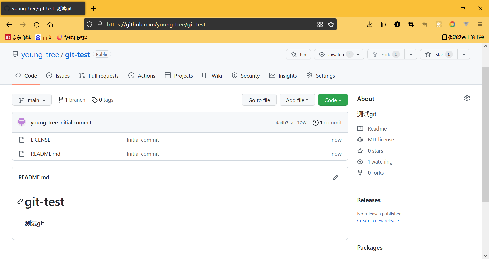
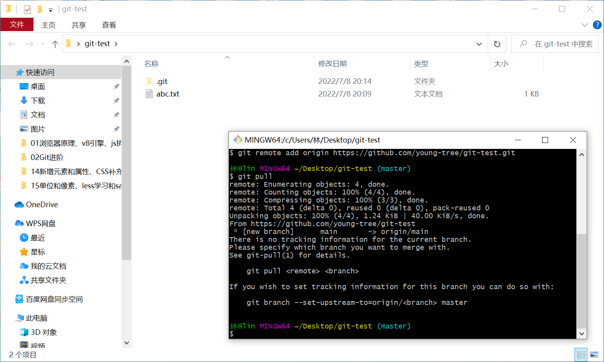
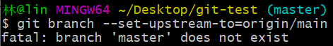
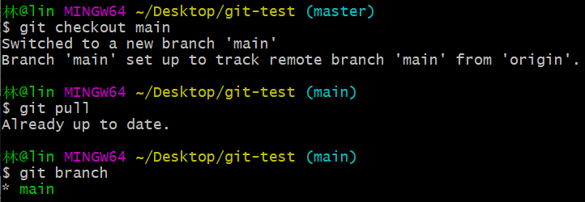
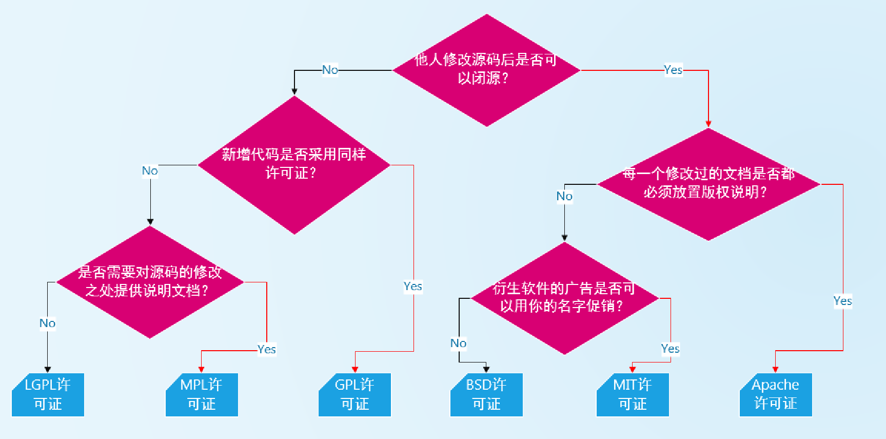

### 1.创建一个github仓库



### 2.问题一

- 初始化项目，与远程仓库建立联系，git pull出现问题

  

- 问题的原因，没有建立上游分支，本地是master分支，远程是main分支

  - 虽然我们已经把本地仓库与远程仓库建立了联系
  - 但是并没有把本地的master分支和远程的main分支建立联系

- 注意我们执行git pull之后已经把远程仓库fetch到了本地仓库中，只是没有合并，即没有git merge

- 解决方案：git branch --set-upstream-to=origin/main

  - 但是依然报错：
  - 本地不存在master这个分支，本地只有main分支
    - 这是因为你根本就没有commit过，所以master分支根本就没有指向第一个提交对象
    - 要先git add .然后再git commit -m'提交信息'才会有commit对象，master分支才会出现
    - 你才能让master分支指向上游分支
  - 切换到main分支：

- 我们最后再git push

### 3.主要逻辑

```shell
# 初始化本地仓库
git init

# 添加远程仓库
git remote add origin xxxx


# 从远程仓库获取内容
git fetch        # 拿代码
git branch --set-upstream-to=origin/main   # 指定上游分支
git merge --allow-unrelated-histories      # 合并不相关的历史

# git push
# simple
git config push.default upstream  # 主要是因为本地分支与远程分支名字不一样, 设置成上游分支

# 换一种做法
git checkout main
```

- 无论如何，随时都会有变化，所以具体情况还得随机应变

### 4.简单做法

- git clone 地址
- 开发
- git add .
- git commit -m'描述'
- git push

### 5.开源协议



- 一般使用MIT许可证


