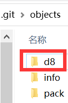
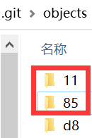
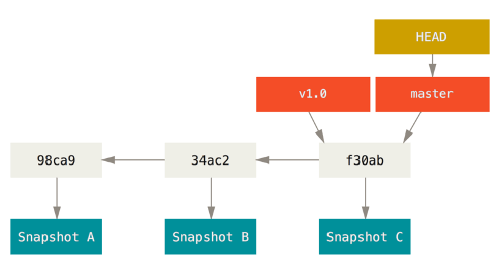
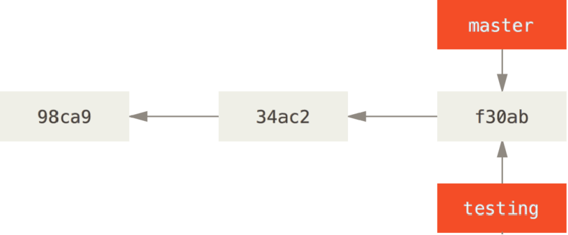
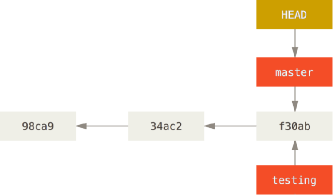
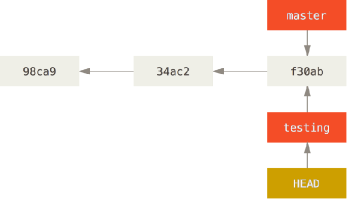
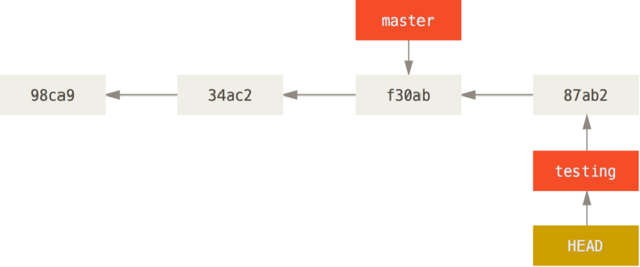
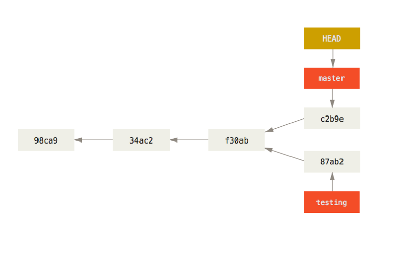

### 1.提交tag

- 对于重大的版本我们常常会打上一个标签，以表示它的重要性：
  - Git 可以给仓库历史中的某一个提交打上标签
  - 比较有代表性的是人们会使用这个功能来标记发布结点（ v1.0 、 v2.0 等等）
- 创建标签
  - Git 支持两种标签：轻量标签（lightweight）与附注标签（annotated）
  - 轻量标签
    - git tag v1.0.0
  - 附注标签：通过-a选项，并且通过-m添加额外信息
    - git tag -a v1.0.0 -m'附注标签'
- 默认情况下，git push 命令并不会传送标签到远程仓库服务器上
  - 在创建完标签后你必须显式地推送标签到共享服务器上
  - 当其他人从仓库中克隆或拉取时，他们也能得到你的那些标签
  - git push origin v1.0.0
  - git push origin --tags

### 2.删除和检出tag

- 删除本地tag：`git tag -d <tagname>`
- 删除远程tag：`git push <remote> --delete <tagname>`
  - --delete可以简写为-d
- 检出tag：
  - 如果你想查看某个标签所指向的文件版本，可以使用 git checkout 命令
  - 通常我们在检出tag的时候还会创建一个对应的分支
  - `git checkout <tagname>`

### 3.Git提交对象

- 几乎所有的版本控制系统都以某种形式支持分支
  - 使用分支意味着你可以把你的工作从开发主线上分离开来，以免影响开发主线
- 在进行提交操作时，Git 会保存一个提交对象（commit object）：
  - 该提交对象会包含一个指向暂存内容快照的指针
  - 该提交对象还包含了作者的姓名和邮箱、提交时输入的信息以及指向它的父对象的指针
    - 首次提交产生的提交对象没有父对象，普通提交操作产生的提交对象有一个父对象
    - 而由多个分支合并产生的提交对象有多个父对象
- 初始化一个仓库，然后创建一个abc.txt文件，在里面写一些内容，然后进行：git add .
  - 进入.git文件夹，再进入objects文件夹，里面会有一个文件夹，文件夹的名字由字母和数字组成
    - 当然也可以只有数字，也可以只有字母，具体是由算法计算出来的，只有两位：
  - 在这个文件夹中有一个文件，名字也是由算法计算出来的，我们并不能打开看这个文件
  - 需要使用命令去看：命令我忘记了
    - 这个文件存放的就是我刚才在abc.txt文件中写的内容
- 现在我们进行提交：git commit -m'测试'
  - 这里面多了两个文件夹：
  - 有一个文件夹中的文件记录着abc.txt暂存快照（d8）的指针
  - 另一个文件夹中的文件记录着作者的姓名和邮箱、提交时输入的信息以及指向它的父对象的指针

### 4.master分支

- Git 的分支，其实本质上仅仅是指向提交对象的可变指针

  - Git 的默认分支名字是 master，在多次提交操作之后
  - 你其实已经有一个指向最后那个提交对象的 master 分支
  - master 分支会在每次提交时自动移动

- Git 的 master 分支并不是一个特殊分支

  - 它就跟其它分支完全没有区别
  - 之所以几乎每一个仓库都有 master 分支，是因为 git init 命令默认创建它

  

### 5.创建和切换分支

- Git 是怎么创建新分支的呢？

  - 很简单，它只是为你创建了一个可以移动的新的指针

- 比如，创建一个 testing 分支， 你需要使用 git branch 命令：git branch testing

  

- 那么，Git 又是怎么知道当前在哪一个分支上呢？

  - 也很简单，通过一个名为 HEAD 的特殊指针：

- 切换到testing分支：git checkout testing：

### 6.在分支上提交

- 如果我们指向某一个分支，并且在这个分支上进行了提交：
- 你也可以切换回到master分支，继续开发：
- 在master开发完成之后继续提交：

- 在创建分支的同时切换到此分支：`git checkout -b <newbranchname>`

