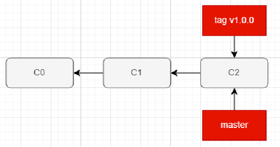
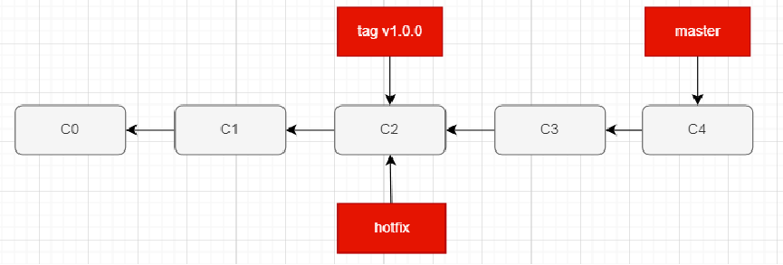
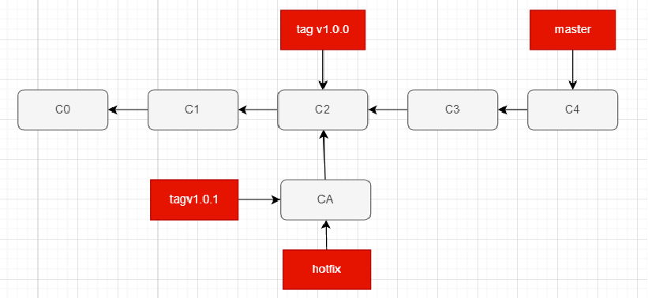
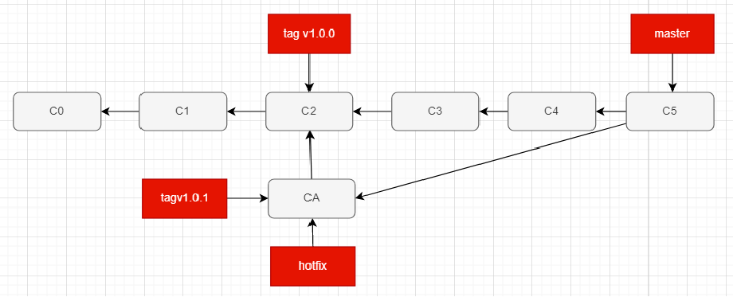
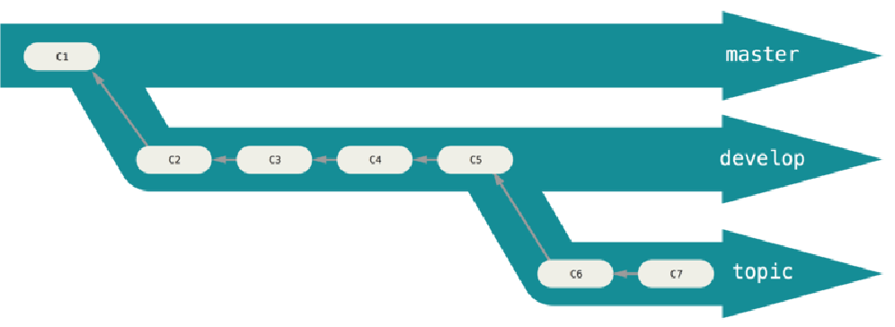
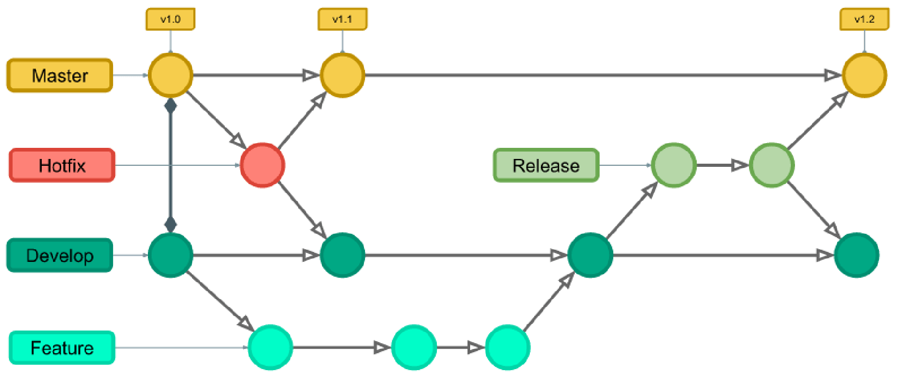
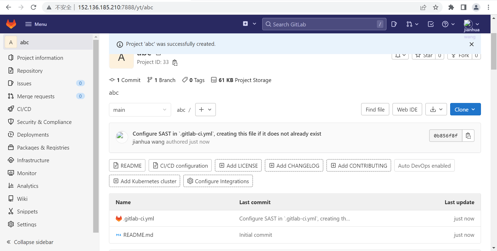

### 1.场景

- 假如我们一直在master上进行开发，开发到一定程度后我们拥有了第一个版本，比如是v1.0.0版本（tag）

- 此时我们发布了此版本，很多用户在使用

  

- 然后我们继续在master上进行开发，开发了几个月后，突然接到一个电话

- 电话另一头焦急的说，我们的v1.0.0有一个巨大的bug，小组决定由你去修复这个bug

- 你来到v1.0.0，在这里建立了一个hotfix分支，进行bug的修复工作

  - git checkout v1.0.0

  - git checkout -b hotfix

    

- 修了好几个版本终于修好了，在修好的commit对象上打上一个v1.0.1的tag，更新即可

  

- 但是既然v1.0.0有bug，那么master分支上也会有同样的bug，所以我们要把hotfix和master分支进行合并

- 合并是可能会出现冲突的，我们可以借助vscode解决冲突，然后产生一个新的commit对象

- 这个commit对象有两个父对象，分别是hotfix和master分支的两个合并的commit对象

  - git checkout master：切换到master分支

  - git merge hotfix：在master分支上合并hotfix分支

    

### 2.查看和删除分支

- 如果我们希望查看当前所有的分支，可以通过以下命令
  - git branch：查看当前所有的分支
  - git branch –v：查看当前所有的分支的同时查看最后一次提交
  - git branch --merged：查看所有合并到当前分支的分支
  - git branch --no-merged：查看所有没有合并到当前分支的分支
- 如果某些已经合并的分支我们不再需要了，那么可以将其移除掉
  - git branch –d hotfix：删除当前分支
  - git branch –D hotfix：强制删除某一个分支

### 3.工作流

- 由于Git上分支使用的便捷性，产生了很多Git的工作流

  - 也就是说，在整个项目开发周期的不同阶段，你可以同时拥有多个开发分支
  - 你可以定期地把某些主题分支合并入其他分支中

- 比如以下的工作流

  - master作为主分支

  - develop作为开发分支，并且有稳定版本时，合并到master分支中

  - topic作为某一个主题或者功能或者特性的分支进行开发，开发完成后合并到develop分支中

    

- 常见的git flow

  
  - master分支：主要放一些大的版本更新
  - hotfix分支：修复bug，修复完成后合并到主分支和开发分支
  - develop分支：开发分支
  - featcure分支：主要是开发一些新特性或者新功能
  - release分支：主要用于测试

### 4.远程分支

- 我们有一个远程仓库，这个远程仓库是老师自己搭建的gitlab

  

- 我们在本地初始化一个仓库，然后与远程仓库建立连接，最后git pull

  - 我们建立连接的时候，其实本地已经有一个分支了，名字叫origin/main

- 但是有问题，有问题很正常，我们之前多次说过怎么解决，建立上游分支嘛

- 但是建立上游分支时，告诉我们，我们没有master分支，那怎么办？

- 我们建立上游分支，而是执行git pull origin main

  - 这样我们就可以把远程仓库main分支的内容拉到本地的master分支上了
  - 这里不会遇到什么历史的问题，因为我们根本就没有commit对象

- 这个时候我们就拥有两个分支了

  - 分别是master分支和origin/mian分支

- 我们现在有两种做法

  - 第一种是把本地的master分支和origin/main建立联系：git branch --set-upstream-to=origin/main
  - 第二种是直接跟踪origin/main这个远程分支：git checkout --track origin/main
    - 这种做法还会在本地创建一个main分支，这个main分支与origin/main建立了联系
    - 而且会自动切换到这个main分支
  - 第一种做法我们在git push的时候会遇到问题
    - 主要是git config push.default simple
    - 这个默认值simple意味着，我们在master执行 git push 的时候，它会把当前分支，也就是master分支看作是远程分支，也就是说，它会把本地的master分支推送到远程的master分支上
    - 但是远程只有一个main分支，所以会报错
    - 需要修改配置为上游分支：git config push.default upstream
    - 这样再git push就没啥问题了
    - 当然你也可以直接git push origin main也是可以成功的
    - 甚至直接git push -u orgin main下一次git push也是不需要写origin main的
  - 第二种做法是不会遇到这种问题的，因为就是要把本地的main分支推送到远程的main分支

- 删除远程分支：git push origin --delete main
  
  - 把远程仓库的main分支给删了，本地的main分支并没有删除

### 5.遗漏

- 如何创建一个远程分支
- 在本地创建并切换到此分支：git checkout -b develop
- 再git push origin develop即可
- 也可以看老师总结的