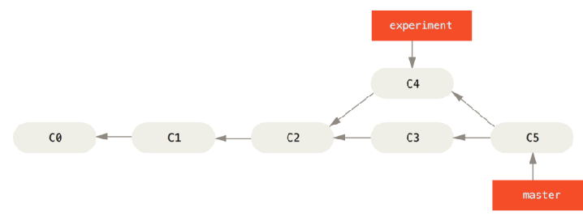
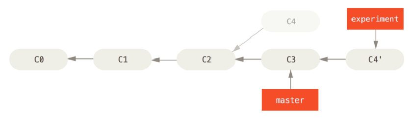
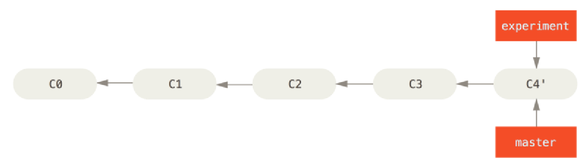
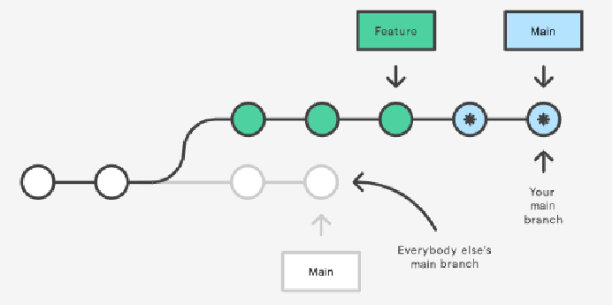
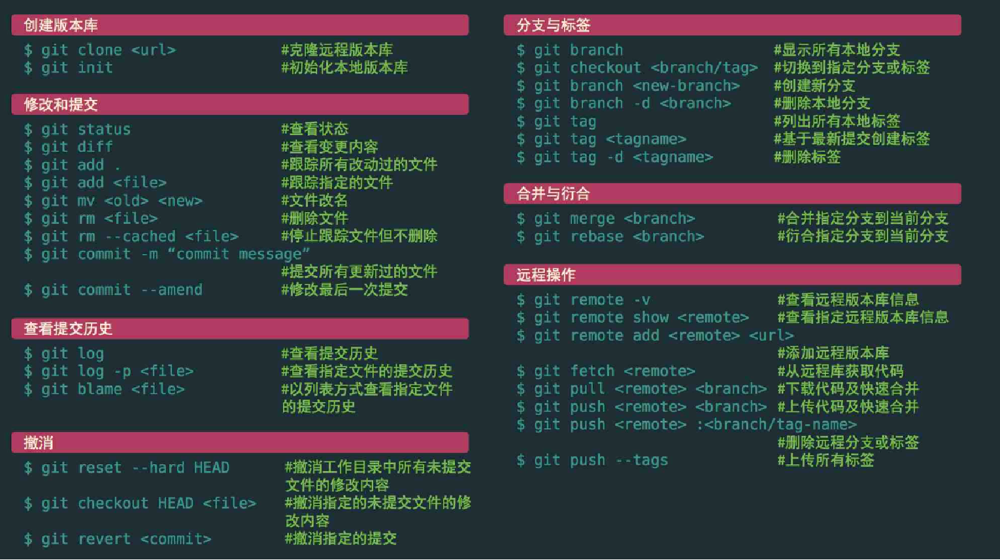

### 1.什么是rebase？

- 在 Git 中整合来自不同分支的修改主要有两种方法：merge 以及 rebase
  - merge：
  - rebase：
- 什么是rebase呢？
  - 在上面的图例中，你可以提取在 C4 中引入的补丁和修改，然后在 C3 的基础上应用一次
  - 在 Git 中，这种操作就叫做 变基（rebase）
  - 你可以使用 rebase 命令将提交到某一分支上的所有修改都移至另一分支上，就好像“重新播放”一样
  - rebase这个单词如何理解呢？
    - 我们可以将其理解成改变当前分支的base
    - 比如在分支experiment上执行rebase master，那么可以将experiment的base改为master
      - git checkout experiment
      - git rebase master

### 2.rebase原理

- 它的原理是首先找到这两个分支（即当前分支 experiment、变基操作的目标基底分支 master） 的最近共同祖先 C2
  - 然后对比当前分支相对于该祖先的历次提交，提取相应的修改并存为临时文件
  - 然后将当前分支指向目标基底 C3
  - 最后以此将之前另存为临时文件的修改依序应用；

- 我们可以再次执行master上的合并操作：

  - git checkout master

  - git merge experiment

  - 将master调整到experiment的位置

    

### 3.rebase和merge的选择

- 开发中对于rebase和merge应该如何选择呢？
- 事实上，rebase和merge是对Git历史的不同处理方法：
  - merge用于记录git的所有历史，无论分支的历史多么错综复杂，也全部记录下来
  - rebase用于简化历史记录，将两个分支的历史简化，整个历史更加简洁
- 了解了rebase的底层原理，就可以根据自己的特定场景选择merge或者rebase
- 注意：rebase有一条黄金法则：永远不要在主分支上使用rebase
  - 如果在main上面使用rebase，会造成大量的提交历史在main分支中不同
  - 而多人开发时，其他人依然在原来的main中，对于提交历史来说会有很大的变化

- 错误做法：

### 4.速查表

