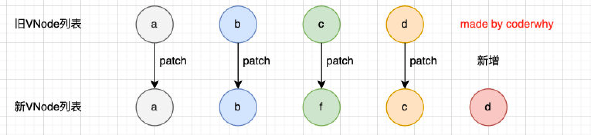

### 1.基本使用

```html
<!-- 遍历数组 -->
<ul><li v-for="(movie, index) in movies">{{index + 1}}.{{movie}}</li></ul>

<!-- 遍历对象 -->
<ul><li v-for="(value, key, index) in info">{{index}}.{{key}}.{{value}}</li></ul>

<!-- 遍历数字 -->
<ul><li v-for="(num, index) in 10">{{index}}.{{num}}</li></ul>

<!-- 遍历字符串 -->
<ul><li v-for="(str, index) in message">{{index}}.{{str}}</li></ul>
```

- v-for结合template，不推荐，感觉很鸡肋
- 其实挺好用的，template中写v-for的逻辑，标签中写各种绑定，逻辑分离，挺好的

### 2.数组更新检测

- Vue 侦听了变更数组的方法，所以它们会触发视图更新
  - push
  - pop
  - shift
  - unshift
  - splice
  - sort
  - reverse
- 替换数组的方法
  - 上面的方法最大的特点是会直接修改原来的数组
  - 但是某些方法不会替换原来的数组，而是会生成新的数组，比如filter()、concat()、slice()
  - 这些方法不会触发视图更新

### 3.key的作用

- key属性主要用于Vue中对虚拟DOM进行diff算法，在新旧VNodes中对比辨识VNodes
- 不使用key
  - Vue会使用一种最大限度减少动态元素并且尽可能的尝试就地修改/复用相同类型元素的算法
- 使用key
  - Vue会尽可能的复用旧VNodes

### 4.VNode和VDOM

- VNode
  - VNode的全称是Virtual Node，虚拟节点
  - 事实上，无论是组件还是元素，它们最终在Vue中表示出来的都是一个个的VNode
  - VNode的本质是一个JavaScript对象

- 如果我们不只是一个简单的div，而是一大堆的元素，那么它们会形成一个VNode Tree

  
  
- 虚拟DOM的作用

  - 利于跨平台
  - 利于diff算法

### 5.没有key

- 对于a和b来说它们并不需要有任何的改动
- 但是因为c被f所使用了，所以后续的所有内容都要进行改动，并且最后还进行了新增



### 6.有key

- 第一步：从头开始遍历和比较

  - a和b的key是一致的，会复用a和b的旧VNode，而不是重新创建两个新的VNode

  - c和f因为key不一致，所以就会跳出循环（break）

    

- 第二步：从尾部开始遍历和比较

  - 重复第一步

    

- 第三步：如果旧节点已经遍历完毕，但是依然有新的节点，那么就新增节点：

  

- 第四步：如果新的节点遍历完毕，但是依然有旧的节点，那么就移除旧节点：

  

- 第五步：最特殊的情况，中间还有很多未知的或者乱序的节点：

  

- Vue在进行diff算法的时候，会利用key来进行优化操作：
  - 在没有key的时候我们的效率是非常低效的
  - 在进行插入或者重置顺序的时候，保持相同的key可以让diff算法更加的高效

### 7.不能使用index作为key

- 假如对于旧c的VNode对象中的key为1
- 假如对于新f的VNode对象中的key也为1
- vue发现你们的key一样，它就想复用旧c的VNode对象，这样做就不用重新创建VNode等等耗费性能的操作了
- 但是vue为了保证一定不会出错，所以它会进一步进行判断，值是否相等
- 如果Vue发现这两个东西根本不相等，还是会走耗费性能的那条路
- 而且新的c的key是2了，d为3了，而旧的c为1，旧的d为2，所以这么做，导致后续本该可以进行复用的东西，也无法复用了
- 所以key是index，Vue所做的diff算法努力就不复存在了

### 8.再描述一下key的作用

- Vue通过key来复用旧Vnode
- Vue会对比新的VNode的key和旧的VNode的key
- 如果一样，就会复用旧的VNode，如果key不一样才会进行那些耗费性能的操作（比如创建新的VNode）
- 所以保障key的唯一性和前后的不可变性是非常有必要的

