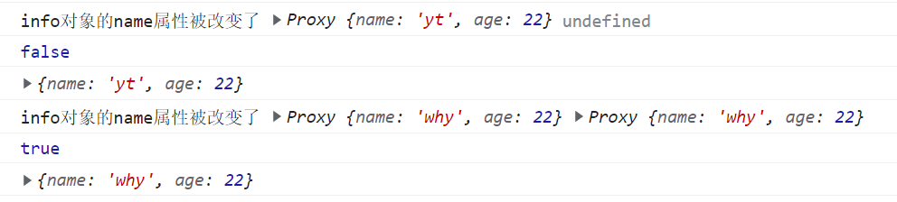

### 1.computed基本使用 

```html
<div id="app">
  <h2>{{name}}</h2>
  <h2>{{scoreF}}</h2>
  <h2>{{messageF}}</h2>
</div>

<script src="../js/vue.js"></script>
<script>
  const app = {
    data: function() {
      return {
        firstName: "Xiaolong",
        lastName: "Li",
        score: 80,
        message: "Hello World!",
      };
    },
    computed: {
      name() {
        return this.firstName + " " + this.lastName;
      },
      scoreF() {
        return this.score >= 60 ? "及格": "不及格";
      },
      messageF() {
        return this.message.split(" ").reverse().join(" ");
      }
    }
  };
  Vue.createApp(app).mount("#app");
</script>
```

### 2.methods和computed对比

- 计算属性有缓存，多次使用时，计算属性中的运算只会执行一次
- data数据不发生变化，计算属性是不需要重新计算的
  - 只有data数据发生了改变，计算属性才会重新计算，而且只会计算一次

### 3.setter和getter

```html
<div id="app">
  <button @click="changeFirstName">改变name</button>
  <h2>{{name}}</h2>
</div>

<script>
  const app = {
    template: "#yt",
    data() {
      return {
        firstName: "Xiaolong",
        lastName: "Li",
      };
    },
    computed: {
      name: {
        set: function(newValue) {
          console.log(newValue);
          this.firstName = newValue;
        },
        get: function() {
          return this.firstName + " " + this.lastName;
        },
      },
    },
    methods: {
      changeFirstName() {
        this.name = "Fala"
      },
    },
  };
  Vue.createApp(app).mount("#app");
</script>
```

- 了解就行，很少使用

### 4.watch的基本使用

```html
<div id="app"><button @click="changeInfo">改变info</button></div>

<script>
  Vue.createApp({
    data() {
      return {
        info: {name: "yt", age: 22}
      }
    },
    methods: {
      changeInfo() {
        this.info = {name: "why", age: 18}
      }
    },
    watch: {
      info(newVal, oldVal) {
        console.log("info被改变了", newVal, oldVal)
      }
    }
  }).mount("#app")
</script>
```

### 5.深度侦听

- 我们对整个info进行改变，是可以通过默认的方式进行侦听

- 但是如果只改变info中的某个属性，默认的方式就侦听不到了

- 应该开启深度侦听

  ```html
  <div id="app"><button @click="changeInfo">改变info.name</button></div>
  
  <script>
    Vue.createApp({
      data() {
        return {
          info: {name: "yt", age: 22}
        }
      },
      methods: {
        changeInfo() {
          this.info.name = "why"
        }
      },
      watch: {
        info: {
          handler(newVal, oldVal) {
            console.log("info对象的name属性被改变了", newVal, oldVal)
            console.log(newVal === oldVal)
            console.log(Vue.toRaw(newVal))
          },
          deep: true,
          immediate: true,
        },
      }
    }).mount("#app")
  </script>
  ```

  
  - 立即执行
  - 侦听到的是代理对象，新值和旧值是一样的，都是改变之后的，所以获取新值和旧值没有意义
  - 通过Vue.toRaw方法拿到info的原始对象

### 6.其他侦听方式

```js
const app = {
  watch: {
    "info.name": function(newInfo, oldInfo) {
      console.log("新值", newInfo, "旧值", oldInfo);
    },
  }
};
Vue.createApp(app).mount("#app");
```

- 这种方式可以获取到旧值和新值

```js
const app = {
  created() {
    const unwatch = this.$watch("info", (newInfo, oldInfo) => {
      console.log("新值", newInfo, "旧值", oldInfo);
    }, {deep: true, immediate: true});

    // 被调用可以取消侦听，但是立即执行不会被取消掉
    unwatch();
  },
};
Vue.createApp(app).mount("#app");
```

- 这种方式也无法获取旧值，新值和旧值都是改变之后的

仅了解：

- 侦听data中的b属性和f属性
- someMethod和handle1都是在methods中定义的方法