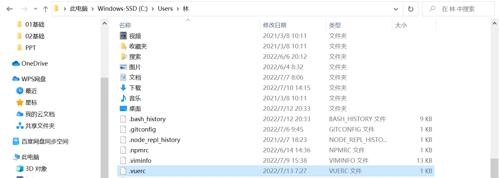
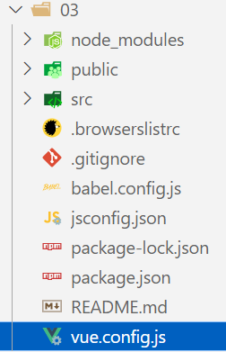

### 1.注册全局组件

```html
<div id="app">
	<component-a></component-a>
</div>

<template id="component-a">
  <h2>{{title}}</h2>
  <p>{{content}}</p>
  <button @click="btnClick">按钮</button>
</template>
```

```js
const ytApp = {};
const app = Vue.createApp(ytApp);
app.component("ComponentA", {
  template: "#component-a",
  data() {
    return {
      title: "我是标题",
      content: "我是内容：哈哈哈哈",
    };
  },
  methods: {
    btnClick() {
      console.log("按钮被点击");
    },
  },
});
```

### 2.注册局部组件

- 全局组件的缺点
  - 某些全局组件没有被用到，也会一起被注册
  - 假如我们注册了三个全局组件：component-a、component-b、component-c
    - 在开发中只使用了component-a和component-b
    - 但是component-c没有被用到，webpack打包工具依然会对其进行打包
    - 用户在下载时，会增加总包的体积

```html
<div id="app">
	<component-a></component-a>
</div>

<template id="component-a">
  <h2>{{message}}</h2>
</template>
```

```js
const ComponentA = {
  template: "#component-a",
  data() {
    return {
      message: "你好啊！"
    };
  },
};

const app = { components: { ComponentA } }
```

### 3.安装升级创建

- npm install @vue/cli -g
  - 查看版本号：vue --version
- npm update @vue/cli -g
  - 不行的话可以重新安装脚手架：npm install @vue/cli -g
- vue create 项目名称
  - 名字不能有中文或大写字母

### 4.步骤

- vue create 03
- 选择：Manually select features
  - 手动选择特性
- 只选择一个babel即可
- 选择：3.x
- 选择：In dedicated config files
  - 把一些独立的配置放在专用的文件中
- 可以选择把这些保存为一个预设，然后给它起个名字
  - 也可以选择no，我这里选择No
- 开始构建

### 5.解决默认选择yarn的问题

- 你会发现我所做的这一切，并没有选择包管理工具的步骤，而是默认选择了yarn

- 这是因为我之前选择过yarn，然后vue-cli默认在.vuerc文件中给我配置好了

  

- 把这个文件删了重新构建即可，变化如下

  - 第一个问你是否使用镜像
    - 选择：no
  - 最后一个问你选择yarn、npm还是pnpm
    - 由于我没有全局安装pnpm，就没有这个提示，如果你安装了pnpm，就会多一个pnpm的提示
    - 选择：npm

### 6.目录分析



- 这里面只有一个我不知道：jsconfig.json
  - 这个文件是给vscode使用的
  - 目的在于：拥有更好的提示

