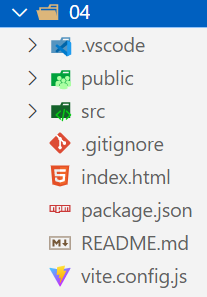
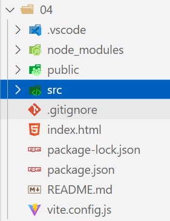

### 1.jsconfig.json

- 在vue.config.js文件中配置别名

  ```js
  const { defineConfig } = require('@vue/cli-service')
  
  module.exports = defineConfig({
    transpileDependencies: true,
    configureWebpack: {
      resolve: {
        alias: {
          ccc: "@/utils"
        }
      }
    }
  })
  ```

  - @表示：./src
  - 原来我们都是用path模块进行路径的拼接，现在用@就可以了

- 在jsconfig.json文件中配置提示

  ```json
  {
    "compilerOptions": {
      "baseUrl": ".",
      "paths": {
        "@/*": [
          "src/*"
        ],
        "ccc/*": [
          "src/utils/*"
        ]
      }
    }
  }
  ```

### 2.vue文件的区别

- vue.runtime.esm-bundler.js
  - 默认引入的vue是上面这个版本，这个版本并没有编译template模板的代码
    - 编译template模板的工作交给vue-loader来完成
- vue.esm-bundler.js
  - 这个文件就包含编译模板的代码
  - 主要的工作是将我们编写的template代码转换成createVNode函数
  - 再调用这个函数，生成一个个VNode，再把VNodes组合成虚拟DOM，最后渲染成真实的DOM

### 3.通过vite创建vue项目

- npm init vue@latest

- 是否安装vue@latest

- 起名字

- ts、jsx、router、pinia、单元测试、端对端测试、eslint

  - 全部选No

  这是一个没有安装依赖的项目，需要npm install后才能运行：


