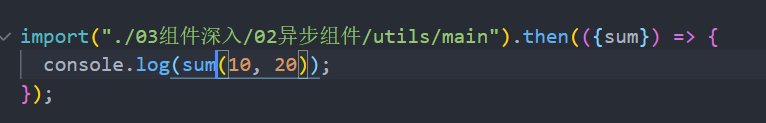

### 1.component

```html
<template>
  <div>
    <button v-for="item in tabs" 
            :key="item" 
            @click="btnClick(item)"
            :class="{active: currentTab === item}">
      {{item}}
    </button>
    <!-- 动态组件 -->
    <component :is='currentTab' 
               name="young" 
               :age="18"
               @homeToApp="homeToApp">
    </component>
  </div>
</template>
```

### 2.keep-alive

```html
<keep-alive>
  <component :is='currentTab'></component>
</keep-alive>

<keep-alive include="home,about">
  <component :is='currentTab'></component>
</keep-alive>

<!-- 需要给home和about组件指定name选项, include才会起作用 -->
```

- include：string | RegExp | Array
  - 只有名称匹配的组件会被缓存
- exclude：string | RegExp | Array

  - 任何名称匹配的组件都不会被缓存

- max：number | string

  - 最多可以缓存多少组件实例，一旦达到这个数字，那么缓存组件中最近没有被访问的实例会被销毁

### 3.webpack代码分包

- 默认情况下，webpack所打包后的js文件只有两个

  - app和chunk-vendors
  - app是打包的逻辑代码，chunk-vendors是打包的第三方库代码

- 随着项目的不断扩大，app这个文件会变得越来越庞大，从而造成首屏渲染速度慢的问题

- 打包时对代码进行分包

  - 对于一些暂时用不到的组件，可以单独的对他们进行拆分，拆分成一些小的模块chunk.js
  - 这些chunk.js会在需要时从服务器上下载下来，进而运行代码，显示内容

- 如何对代码进行分包

  

  - 这种代码只能对一些工具函数类js代码进行分包处理
  - 我们想要让某个组件进行分包处理，这种形式是做不到的

### 4.defineAsyncComponent

```html
<template>
  <div> <async-category></async-category> </div>
</template>

<script>
  import { defineAsyncComponent } from "vue";
  const AsyncCategory = defineAsyncComponent(() => import("./AsyncCategory.vue"));

  export default { components: { AsyncCategory }}
</script>
```

- 这么做就可以将组件代码进行分包处理

### 5.结合suspense

```html
<template>
  <div>
    <suspense>
      <!-- 显示的出来就显示 -->
      <template #default>
        <async-category></async-category>
      </template>
      <!-- 显示不出来就显示loading组件 -->
      <template #fallback>
        <loading></loading>
      </template>
    </suspense>
  </div>
</template>
```

