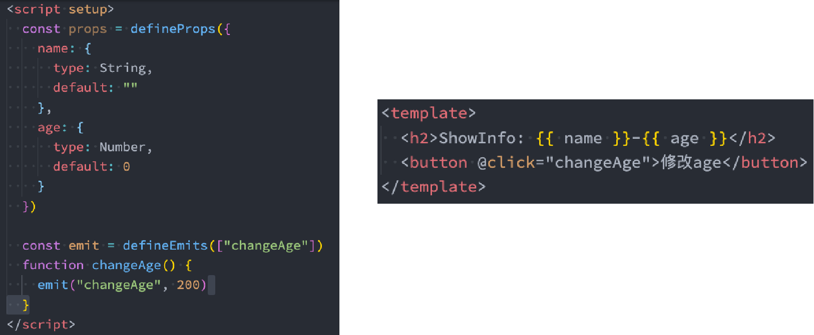
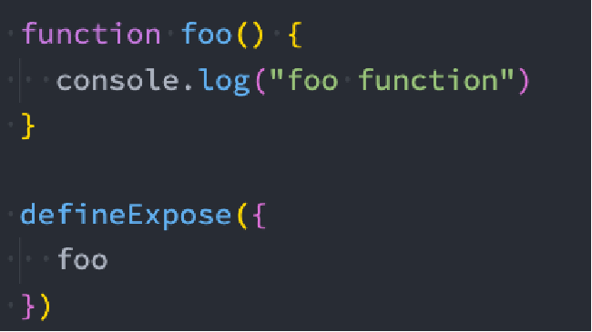
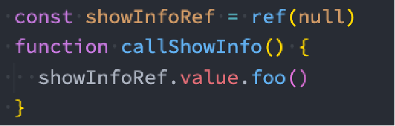

### 1.useCounter

```js
import { ref, computed } from "vue"

export default function() {
  const counter = ref(0)

  const doubleCounter = computed(() => counter.value * 2)

  const addCounter = () => counter.value++

  return { doubleCounter, addCounter }
}
```

### 2.useTitle

```js
import { ref, watch } from "vue"

export default function(title = "默认值") {
  const titleRef = ref(title)

  watch(titleRef, (newValue) => {
    document.title = newValue;
  }, {
    immediate: true
  })

  return titleRef
}
```

### 3.useScrollPosition

```js
import { ref } from "vue"

export default function() {
  const scrollX = ref(0)
  const scrollY = ref(0)

  window.addEventListener("scroll", () => {
    scrollX.value = window.scrollX.toFixed()
    scrollY.value = window.scrollY.toFixed()
  })

  return { scrollX, scrollY }
}
```

### 4.useLocalStorage

```js
import { ref, watch } from "vue";

export default function(key, value) {
  const data = ref(value);

  if (value) localStorage.setItem(key, JSON.stringify(value))
  
  data.value = JSON.parse(localStorage.getItem(key));

  watch(data, (newValue) => localStorage.setItem(key, JSON.stringify(newValue)))

  return data;
}
```

### 5.script setup

- 当使用  script setup  的时候，任何在  script setup  声明的顶层绑定都能在模板中直接使用
  - 声明的顶层绑定：包括变量，函数声明，以及 import 引入的内容
- 响应式数据需要通过ref、reactive来创建
- 在script setup中导入的组件可以直接使用

### 6.defineProps和defineEmits



- 使用的时候不是props.name，这个props另有它用，这里直接使用即可
- 这个props是在script中拿里面的值时使用

### 7.defineExpose

- 我们通过ref获取到组件，这个组件是一个ref的对象，还要通过value拿到组件实例

- 拿到组件实例后我们可以访问这个组件中的方法

- 之所以可以访问这个组件中的方法，是因为我们给他返回了

- 但是在script setup中我们无法进行返回，所以访问不到

- 这个时候就需要将我们想要访问的方法或者变量使用defineExpose进行暴露即可

- 在子组件中暴露方法：

- 在父组件中访问子组件暴露的方法：

- defineProps、defineEmits、defineExpose不需要导入，直接使用即可


