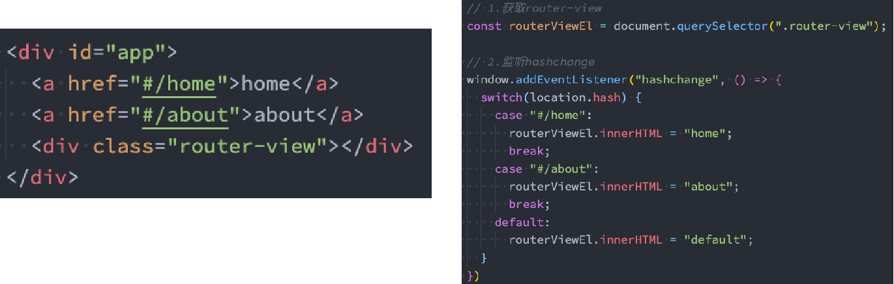
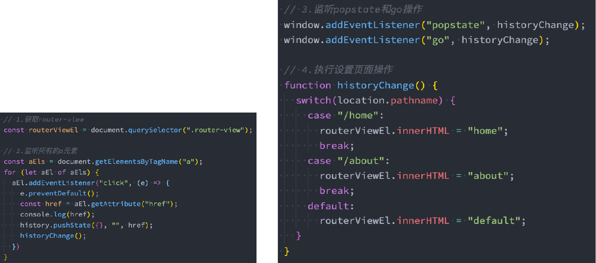

### 1.路由

- 路由器
  - 运营商给我们一个公网地址，路由器会为每个电脑分发一个ip地址
  - 路由器怎么知道哪个ip对应哪个电脑呢？因为每个电脑都有一个对应的mac地址
  - ip地址 -> mac地址
  - 路由器就在维护着这么一个映射关系
- 后端路由
  - 在后端也维护着一些映射关系
  - 用户会请求不同的地址，不同的地址对应不同的html文件
  - 地址 -> html文件
  - 后端路由就是在维护这些映射关系
- 前端路由
  - 前端维护着一些映射关系
  - 地址 -> 组件
  - 前端路由就是在维护这些映射关系

### 2.前端路由原理

- hash

  

  - 这种通过锚点来定义的a元素，被点击的时候是不会刷新页面的，只会改变路径

- history

  - history是HTML5新增的, 它有六种模式来改变URL，但是不刷新页面
    - replaceState：替换原来的路径
    - pushState：使用新的路径
    - popState：路径的回退
    - go：向前或向后改变路径
    - forward：向前改变路径
    - back：向后改变路径

  

  - 这种方式需要取消a元素的默认行为

### 3.vue-router基本使用

- 定义映射关系（routes）
  - 数组中维护着很多的对象
  - 每个对象都有path和component两个基本属性
  - 一个用来指定地址，一个用来指定这个地址对应的组件
- 创建路由（router）
  - 调用createRouter方法
    - 传入一个对象，对象有两个属性
  - 指定使用的模式（属性名为history）
    - 值有两个分别是createWebHistory和createWebHashHistory
    - 调用createWebHistory：使用history模式
    - 调用createWebHashHistory：使用hash模式
  - 使用定义的映射关系
    - 属性为routes，值为刚才定义的映射关系
- 导出router
- main.js中导入router，通过use使用导入的router
- 假如我们的根组件是APP.vue
  - 使用router-link元素和to属性指定要跳转的地址
  - 使用router-view元素进行占位，展示跳转到的组件

### 4.router-link元素属性

- to属性：
  - 是一个字符串，或者是一个对象
- replace属性：
  - 设置 replace 属性的话，当点击时，会调用 router.replace()，而不是 router.push()
- active-class属性：
  - 设置激活a元素后应用的class，默认是router-link-active
- exact-active-class属性：
  - 链接精准激活时，应用于渲染的 `<a>` 的 class，默认是router-link-exact-active
  - 如果有嵌套路由，假如主路由是/home，home下有一个/list路由
  - 当我们点击了这个/list路由，地址就变成了/home/list
  - 无论是/home元素还是/list元素都会有一个router-link-active类
  - 但是只有/list元素会多一个router-link-exact-active类
  - 用这些类可以改变class进行精准定位

### 5.路由懒加载

```js
const Home = () => import(/* webpackChunkName: "home" */ "../src/components/Home.vue")
const About = () => import(/* webpackChunkName: "about" */ "../src/components/About.vue")
```

- 魔法注释用来指定打包后的文件名字
- 懒加载的作用
  - 对代码进行分包
  - 当用户点击某个路由时再下载和执行相应的js代码

### 6.路由的其他属性

- name属性：为路由记录独一无二的名称
- meta属性：自定义数据，这个属性的值是一个对象，对象里面存键值对
- redirect属性：重定向，值为字符串，当为目前地址时，跳转到重定向的这个地址
