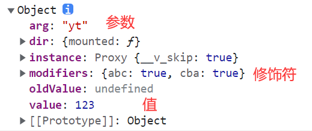

### 1.局部自定义指令

```ts
// options API
export default {
  directives: {
    focus: {
      mounted(el) {
        el.focus()
      }
    }
  }
}
```

```ts
// composition API
const vFocus = {  // 名字必须这么写
  mounted(el) {
    el.focus()
  }
}
```

### 2.全局自定义指令

```ts
// focus.ts
export default function(app: any) {
  app.directive("focus", {
    mounted(el: any) {
      el.focus()
    }
  })
}
```

```ts
// index.ts
import useFocus from "./focus"

export default function(app: any) {
  useFocus(app)
}
```

```ts
// main.ts
import directives from "./views/01home/hooks"

const app = createApp(App)
directives(app)
app.mount('#app')
```

### 3.其他

- 生命周期
  
  - created、beforeMount、mounted、beforeUpdate、updated、beforeUnmount、unmounted
  
- 参数、修饰符、值

  ```html
  <input type="text" v-focus:yt.abc.cba="123">
  ```

  ```js
  export default function(app: any) {
    app.directive("focus", {
      mounted(el: any, bindings: any) {
        el.focus()
        console.log(bindings)
      }
    })
  }
  ```

  

### 4.插件

```js
app.use({ install: app => app.config.globalProperties.$name = "yt" })
```

```js
app.use(app => app.config.globalProperties.$name = "yt")
```

### 5.插件结合自定义指令

- 以前是这么使用

  ```js
  import directives from "./views/01home/hooks"
  
  directives(app)
  ```

- 现在这么使用

  ```js
  app.use(directives)
  ```

### 6.内置组件：teleport

```html
<teleport to='#young'>
  <span>123</span>
</teleport>
<teleport to='body'>
  <span>456</span>
</teleport>
```

- 将123放在模板文件中id为young的元素里
- 将456放在模板文件中的body元素里