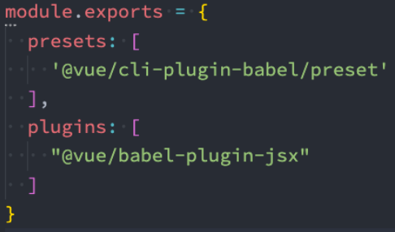
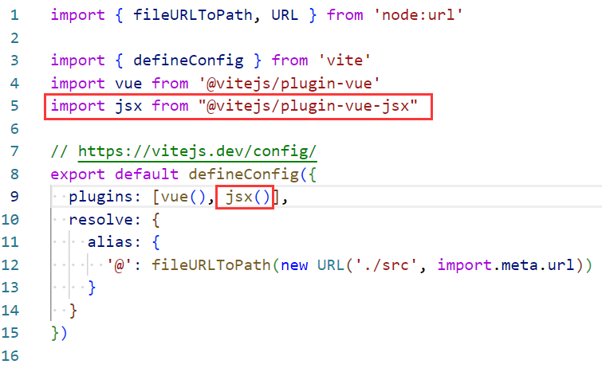

### 1.h、render、jsx

- h函数是createVNode函数的简写
- 调用h函数后会返回对应的VNode
- render函数拿到h函数返回的VNode，vue内部会主动执行render函数，将VNode渲染成真实DOM

- 其实jsx的作用与h函数的作用差不多

### 2.h函数

```js
import {h} from "vue"

export default {
  data() { return { counter: 0 } },
  render() {
    return h("div", {className: "home"}, [
      h("h2", null, this.counter),
      h("button", { onClick: this.increment }, "+1"),
      h("button", { onClick: this.decrement }, "-1")
    ])
  },
  methods: {
    increment() { this.counter++  },
    decrement() { this.counter--  }
  },
}
```

```html
<script setup lang="ts">
import {h} from "vue"
const render = () => h("div", null, "123")
</script>
<template><render/></template>
```

### 3.jsx语法

- webpack
  - npm install @vue/babel-plugin-jsx -D
  - 在babel.config.js文件中进行如右配置：

- vite

  - npm install @vitejs/plugin-vue-jsx -D
  - 在vite.config.js进行如右配置：

- 语法

  ```jsx
  <script lang="jsx">
  export default {
    data() { return { counter: 0 } },
    render() { return <div>{this.counter}</div> }
  }
  </script>
  ```

  ```jsx
  <script setup lang="jsx">
  import { ref } from "vue"
  const counter = ref(0)
  
  const increment = () => counter.value++
  const decrement = () => counter.value--
  
  const render = () => (
    <div class="home">
      <div>{counter.value}</div>
      <button onClick={increment}>+1</button>
      <button onClick={decrement}>+2</button>
    </div>
  )
  </script>
  <template><render/></template>
  ```

  

