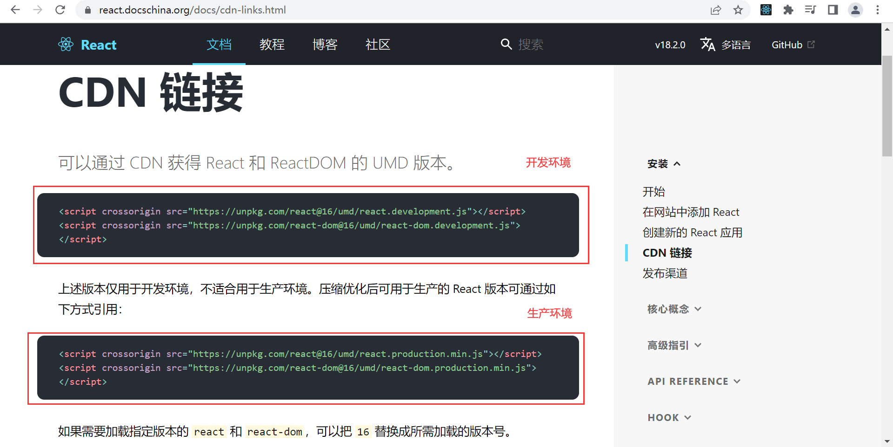

### 1.React依赖

- react：react所必须的核心代码
- react-dom：react渲染在不同平台所需要的核心代码
  - 把你的react项目渲染到web端或者移动端
  - 渲染过程相关代码
- babel：将jsx转换成React代码
  - 浏览器不识别jsx语法，你必须把它变成一个普通的JavaScript代码
  - babel帮你编译
- 这三个库，各司其职，让每一个库只做自己该做的事情

### 2.为什么要拆分

- react web和react-native的核心代码都在react这个库中
- react-dom针对web端和native端所完成的事情不同
  - web端：react-dom会将jsx渲染成真实的DOM，然后再显示在浏览器上
  - native端：react-dom会将jsx渲染成原生控件（Android：Button，IOS：UIButton）

### 3.babel

- 编译器：比如把ES6代码编译成ES5的代码
- 默认情况下，开发React是可以不使用babel的，但是就得用React.createElement函数来编写源代码
- 这种编写模式复杂繁琐，可读性差
- 我们为了消除这些弊端，可以直接编写jsx代码，方便简单
- 但是需要由babel帮助我们把jsx转换成React.createElement

### 4.引入依赖




```html
<script crossorigin src="https://unpkg.com/react@16/umd/react.development.js"></script>
<script crossorigin src="https://unpkg.com/react-dom@16/umd/react-dom.development.js"></script>
<script src="https://unpkg.com/babel-standalone@6/babel.min.js"></script>
```

- crossorigin：避免一些跨域问题

### 5.编写Hello World

```jsx
<div id="root"></div>

<!-- 依赖 -->

<script> ReactDOM.render(<h2>Hello World</h2>, document.querySelector("#root")) </script>
```

- 报错，语法错误

  

- 解决方案

  ```jsx
  <script type="text/babel">
    ReactDOM.render(<h2>Hello World</h2>, document.querySelector("#root"))
  </script>
  ```

这是React18之前的写法，React18要求的写法如下

```jsx
<div id="root"></div>
<div id="app"></div>

<script crossorigin src="https://unpkg.com/react@18/umd/react.development.js"></script>
<script crossorigin src="https://unpkg.com/react-dom@18/umd/react-dom.development.js"></script>
<script src="https://unpkg.com/babel-standalone@6/babel.min.js"></script>

<script type="text/babel">
  const root = ReactDOM.createRoot(document.querySelector("#root"))
  root.render(<h2>Hello World</h2>)

  const app = ReactDOM.createRoot(document.querySelector("#app"))
  app.render(<h2>你好 世界</h2>)
</script>
```

- 区别：可以明确的创建多个根
- 但是对我们来说，一般只需要一个根就可以

### 6.修改文本

```jsx
const root = ReactDOM.createRoot(document.querySelector("#root"))

// 1.抽取变量
let message = "Hello World"

// 2.监听按钮的点击
const btnClick = () => {
  // 2.1.修改数据
  message = "你好 世界"

  // 2.2.重新渲染
  rootRender()
}

rootRender()

// 3.封装一个渲染函数
function rootRender() {
  root.render((
    <div>
      <h2>{message}</h2>
      <button onClick={btnClick}>修改文本</button>
    </div>
  ))
}
```

