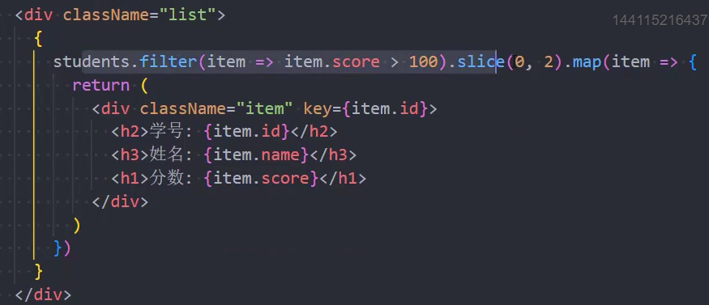

### 1.认识jsx

- 问题：为什么在写js的地方写元素，浏览器就认识呢？
  - 是因为babel把元素转成了类似于：React.createElement("h2", null, "哈哈哈") 这样的代码
  - 这种代码js就认识了，所以原因在于babel
- 注意：在js中写 `<h2>{ message }</h2>` 这种代码，它不是一段字符串，不能使用引号包裹
  - 默认情况下我们是不能在js中写HTML元素的，假如我们把type="text/babel"去掉代码就会报错
- jsx是一种JavaScript语法扩展，用于描述我们的UI界面，并且能够和JavaScript融合在一起
  - 它不同于Vue中的模板语法，不需要专门学习模板语法中的那些指令（v-if，v-for，v-bind，v-on）
  - 我们可以理解为html in js
  - 之后我们还会学css in js和js in js，这种思想我们称其为all in js

### 2.React为什么选择jsx

- React认为渲染逻辑与UI逻辑存在极强烈的内在耦合（html和js中的状态，也就是state，存在很强的关联性）
- 所以干脆就使用html in js也就是jsx
- html和js之间的关系是密不可分的，所以React并没有把html（标记）单独分离到一个文件中，而是将他们组合在一起
- jsx其实是嵌入到JavaScript中的一种结构语法

### 3.jsx的书写规范

- jsx中只能有一个根元素
- 通常会把jsx包裹在一个括号内，将整个jsx作为一个整体，还有就是可以实现换行
  - 当然不加小括号也可以实现换行，只是阅读性较差
- jsx中的元素，既可以是单标签也可以是双标签
  - 注意：如果是单标签，必须以 `/>` 结尾

### 4.jsx的使用

- 在jsx中编写注释：`{ /* 注释内容 */ }`
  - 在.jsx文件中你可以直接：ctrl + / 来快速生成注释
- 在jsx中插入内容注意
  1. 当变量是Number、String、Array类型时，可以直接显示
     - 当为数组类型时，会把数组中的每个元素取出来，再拼接成字符串
  2. 当变量是null、undefined、Boolean类型时，内容为空，不会报错
     - 如果希望将其显示出来，需要转成字符串
  3. 对象类型不能直接放到jsx中
     - 报错：Objects are not valid as a React child
  4. 可以插入表达式（跟vue差不多）
     - 运算表达式、三元运算、执行函数
- 在jsx中绑定属性
  - 绑定基本属性：使用大括号：
  - 绑定class属性：
  - 绑定style属性：

### 5.jsx中的事件绑定

- 绑定this：

- 参数传递：

### 6.jsx中的条件渲染

- 案例：

### 7.jsx中的列表渲染

### 8.jsx的转化

- babel 会将 jsx 代码转化成 React.createElement 函数，React会去执行这个函数

- 这个函数被执行完毕之后就会生成一个对象，这个对象我们一般称其为虚拟DOM，虚拟DOM如下所示

  

- 最后再把这个虚拟DOM渲染成真实DOM

- 整个过程，React有一个专有名词：协调

### 9.为什么需要虚拟DOM

- 如果你对某一个数据进行了变化，React会对新旧虚拟DOM进行diff算法，尽可能的复用旧的虚拟DOM
  - 提高性能
- 我们除了可以把我们编写的React代码渲染在web端，还可以渲染在移动端，虚拟DOM更利于实现跨平台开发
  - web端：div、button
  - IOS、Android：UIView控件、UIButton控件（ReactNative）
- 将命令式编程转换到声明式编程
  - 你只需要告诉React，UI是什么状态
  - React来确保DOM和这些状态是匹配的
  - 你不需要直接进行DOM操作，就可以从手动更改DOM、属性操作、事件处理中解放出来