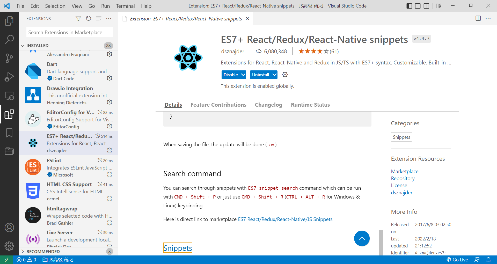

### 1.类组件

- 类组件的定义有如下要求：
  - 组件的名称是大写字母开头（无论是类组件还是函数式组件）
  - 类组件需要继承自 React.Component
  - 类组件必须实现render函数
- 使用class定义组件的结构
  - constructor是可选的，我们通常在constructor中初始化一些数据
    - this.state中维护的就是我们组件内部的数据
  - render方法是 class 组件中唯一必须实现的方法；

### 2.render函数的返回值

- 当 render 被调用时，它会检查 this.props 和 this.state 的变化并返回以下类型之一：

  - React 元素： 

    - 通常通过 JSX 创建
      - 例如 `
` 会被 React 渲染为 DOM 节点
      - `<MyComponent />` 会被 React 渲染为自定义组件
      - 无论是 `
` 还是 `<MyComponent />` 均为 React 元素

  - 数组或 fragments：使得 render 方法可以返回多个元素

  - Portals：可以渲染子节点到不同的 DOM 子树中

    - fragments和Portals后面再讲

  - 字符串或数值类型：它们在 DOM 中会被渲染为文本节点

  - 布尔类型或 null：什么都不渲染。

### 3.函数式组件

- 函数组件是使用function来进行定义的，这个函数也需要有返回值
  - 这个返回值和类组件中render函数的返回值一样
- 函数组件有自己的特点（当然，后面讲到hooks，就不一样了）：
  - 没有生命周期，虽然没有生命周期，它也会被更新和挂载
  - this关键字不能指向组件实例（因为没有组件实例）
  - 没有内部状态（state）

### 4.生命周期

- 挂载组件
  - 创建实例，执行constructor
  - 接着执行render，挂载render方法中返回的东西
  - 挂载完毕就会执行componentDidMount方法
- 更新组件
  - setState或者forceUpdate（forceUpdate强制更新，耗费性能，比较少用）
  - 执行render方法，执行diff算法，更新DOM
  - 更新完DOM就会调用componentDidUpdate
- 卸载组件
  - componentWillUnmount
- 不常用生命周期
  - shouldComponentUpdata
  - 这个函数返回true就会重新渲染整个页面，返回false，就会阻止更新，可以进行性能优化

### 5.查看代码片段

- https://github.com/dsznajder/vscode-es7-javascript-react-snippets/blob/HEAD/docs/Snippets.md
- 目前需要使用的创建组件的快捷输入为：rce

