### 1.父传子

- 父组件：

- 在子组件的constructor函数上，第一个参数就是props，它内部会执行：this.props = props

  - 也就是把props放到了组件实例上，我们不用在constructor函数中写this.props = props
  - 但是我们必须要写：super(props)，把props给到super

  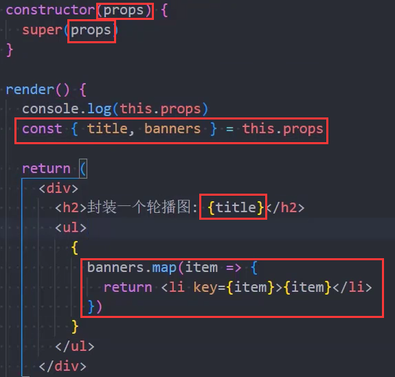

  - 当然你如果没有定义状态，也就是在constructor函数中不写this.state时，但是你依然写了下面的代码

    ```js
    constructor(props) {
    	super(props)
    }
    ```

    - react会报警告，告诉你没必要写，你不写，它内部也是这么实现的，但是如果有状态就必须写全

- 动态数据：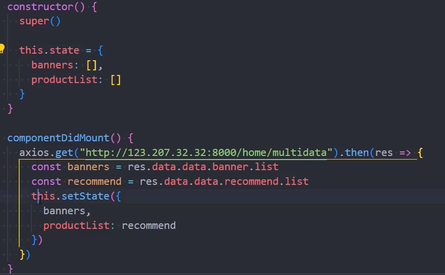

- 子组件参数验证

  - 在顶层引入PropTypes

    ```js
    import PropTypes from "prop-types"
    ```

  - 写规则：

    - banners是数组类型，必传
    - title是字符串类型
    - 这里的MainBanner就是当前这个子组件

  - 默认值：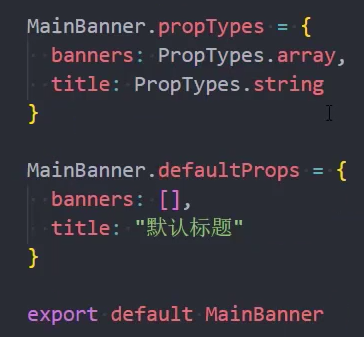
  
  - 补充，如果传过来的是函数，要写PropTypes.func

### 2.子传父

- 在父组件定义一个函数，把这个函数传递给子组件，然后子组件通过props拿到这个函数
- 当我们点击某个按钮时，再触发事件的函数里，回调传过来的这个函数，并把参数传递过去
- 这样父组件中定义的函数就能接收到子组件传递过来的参数，进而使用this.setState修改数值

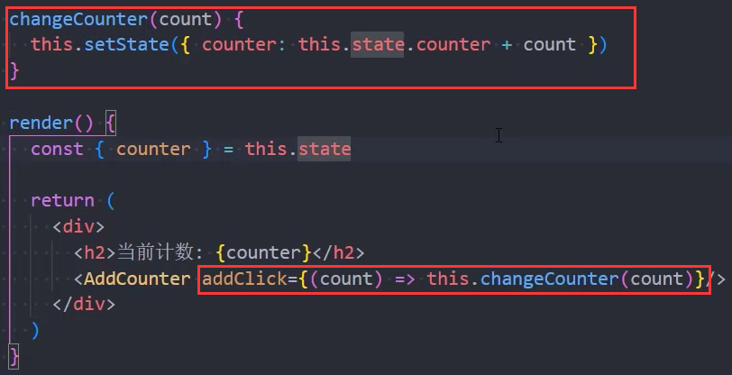

### 3.插槽

- 插槽实现方式一（children）

  - 父组件：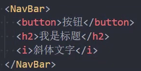
  - 子组件：如果父组件这么写，这些东西会被放到props.children中
    - 这个props.children是一个数组，里面放着一个个element
    - 取出来展示即可：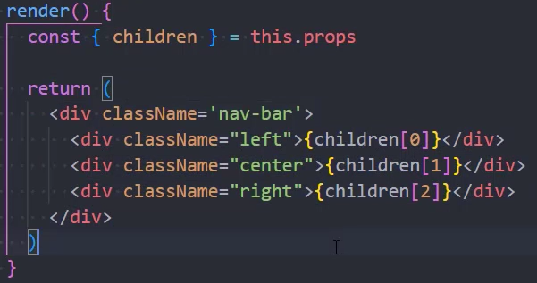
    - 要注意，如果父组件只传了一个元素，比如你只写了button这一个元素，那么children就是button

- 插槽实现方式二（props）：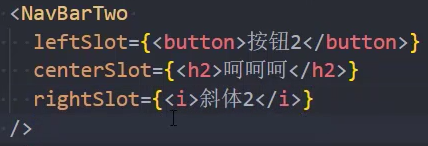

  - 子组件通过props拿就行了，比children的方式更合理

- 作用域插槽

  - 父：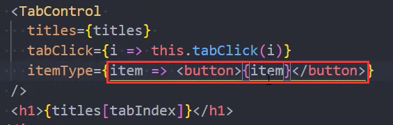

    ​        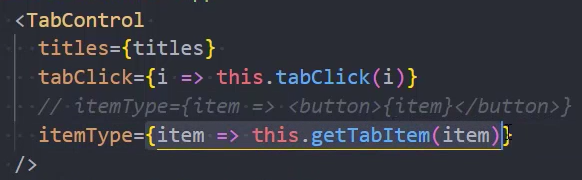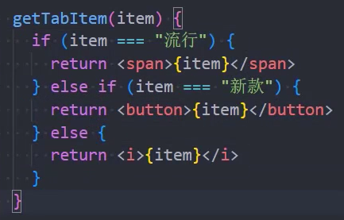

  - 子：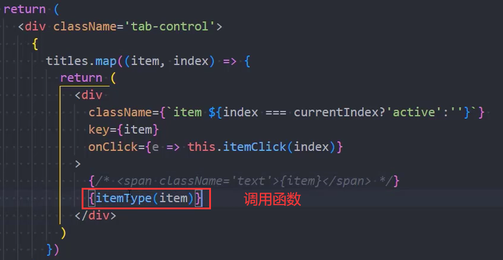

### 4.展开运算

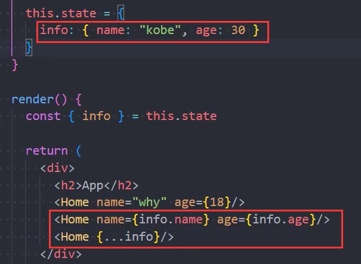

### 5.爷传孙（context）

- 在一个单独的js文件中创建一个context：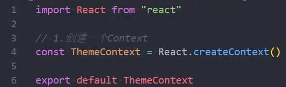
- 在爷组件中导入这个context：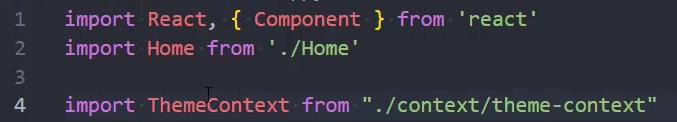
- 在爷组件中使用这个context：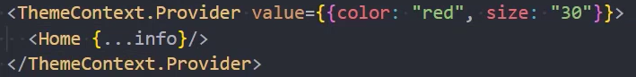
  - 通过引入的context中的Provider的value属性为后代提供数据
- 在孙组件中使用这个context：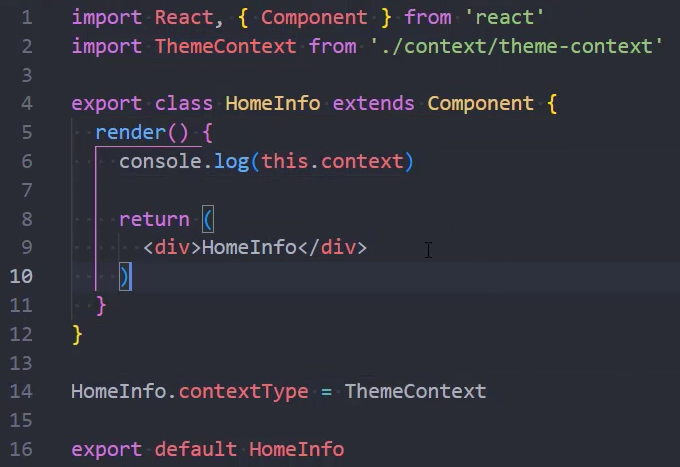
  - 设置组件的contextType为某一个context，之后才能获取到爷的数据，再然后使用数据
- 如果孙子组件是一个函数式组件怎么写呢：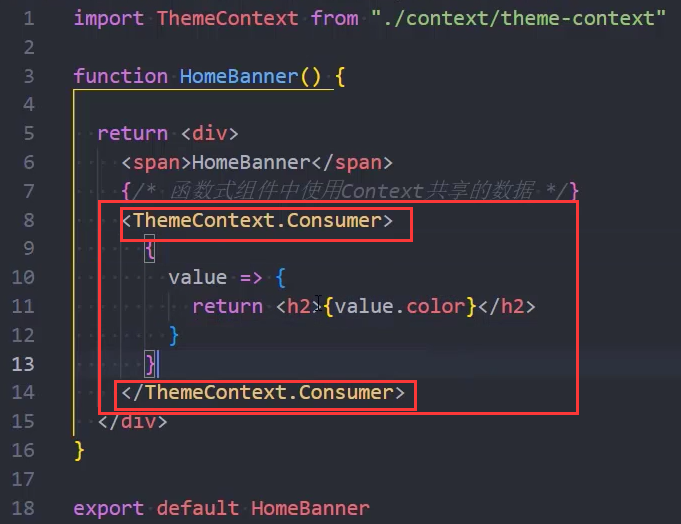

- 如果想要使用多个context怎么办？
  - 再创建一个context，然后进行嵌套：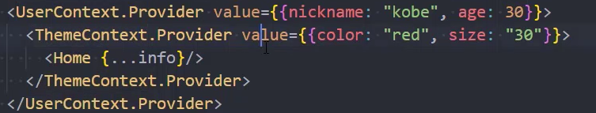
  - 在类组件中只能设置一个contextType
    - 所以要使用Consumer来实现：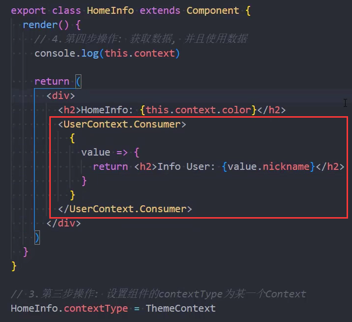


