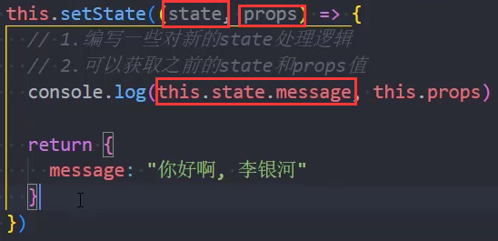
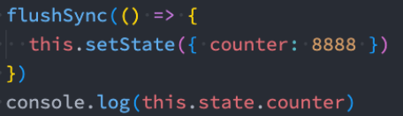

### 1.为什么需要setState

- 我们在this.state中定义了一个message为空字符串

- 然后点击了按钮，执行函数，this.setState({message: ""})

- React依然会重新执行render函数，但是这样的话性能就会出现问题

  - 所以才会出现之前的那个生命周期函数

    ```js
    shouldComponentUpdate() {
      if (prevState.message === this.state.message) return false
      return true
    }
    ```

  - 但是如果我们自己写这些代码也太麻烦了，而且不会那么系统，所以为我们提供了PureComponent

  - PureComponent就可以帮助我们实现shouldComponentUpdate的功能

- Vue是怎么回事呢？Vue发现数据变化会进行劫持的，你赋一个相同的值，是不会进入劫持阶段的

- 但是React是没有进行数据劫持的，所以要使用setState

### 2.setState的参数

1. 传入一个对象

2. 传入一个回调函数，返回一个对象

   - 编写新的state的逻辑

   - 这个回调函数会将之前的state和props作为参数传进来

     

3. setState在React的事件处理中是一个异步调用

   - 设置完值，是无法立即拿到结果的
   - 如果你想拿到更新后的值，需要为setState传入第二个参数，这个参数是一个函数，在这个函数中拿结果

### 3.setState为什么是异步

- 把setState设计为异步，可以显著提高性能
  - 如果每次调用 setState 都进行一次更新，那么意味着render函数会被频繁调用，界面重新渲染，这样效率是很低的
  - 最好的办法应该是获取到多个更新后，再进行批量更新
- state和props无法保持一致性，会产生数据错误混乱的情况
  - 如果同步更新了state，但是还没有执行render函数，那么state和props不能保持同步

### 4.setState一定是异步的吗

- 在React18之前
  - 在组件生命周期或React合成事件中，setState是异步的
  - 在setTimeout或者原生dom事件中，setState是同步
- 在React18之后，默认所有的操作都被放到了批处理中（异步处理）

- 如果希望setState是同步的，则需要执行特殊的flushSync操作：

