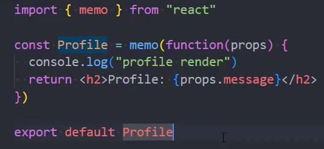
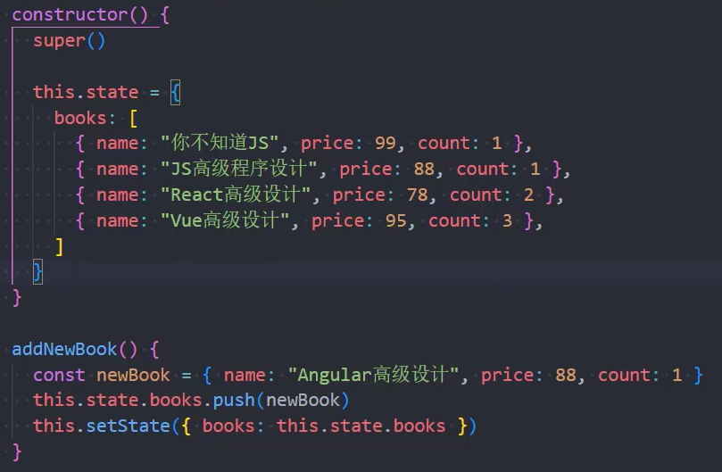
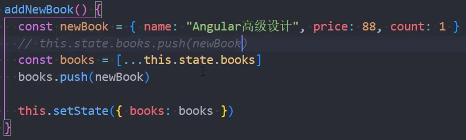
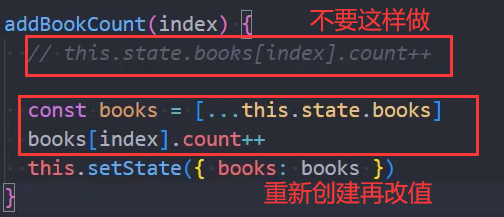

### 1.React渲染和更新机制

- 渲染流程
  - jsx 经 Babel 转化为 React.createElement 函数
  - 执行createElement函数，生成虚拟DOM
  - 将虚拟DOM渲染为真实DOM
- 更新流程
  - props或者state发生变化，重新执行Render函数，生成新的虚拟DOM
  - 新旧虚拟DOM进行diff算法的对比，计算出差异，更新变化的虚拟DOM，再渲染为真实DOM

### 2.key的优化

- React的diff算法
  - 同层节点之间相互比较，不会跨节点比较
  - 不同类型的节点，产生不同的树结构
  - 通过key来指定哪些节点在不同的渲染下保持稳定
- 在最后插入数据：这种情况，有无key意义不大

- 在前面插入数据：这种情况，在没有key的情况下，所有的元素都需要进行修改
- 拥有key后，会尽可能的复用旧的节点
- 注意：key是唯一的，key不要使用随机数，使用index作为key，对性能是没有优化的
- 跟Vue差不多

### 3.render函数的优化

- 如果我们的组件继承自React.Component，只要数据发生了变化，render函数就会重新执行
  - 假如当前组件还有子组件，子组件的render函数也会跟着执行
- 但是有一个问题，我的子组件并没有必要发生改变啊，因为你的这个数据变化，跟我没有任何关系
- 怎么优化呢？之前提到过，使用shouldComponentUdate生命周期函数做一些判断
  - 自身依赖的数据发生了变化，再执行自身的render函数
  - 但是在开发中，我们这样写代码，将是灾难级别的表现
  - 这个就需要使用React为我们提供的另一个东西来代替React.Component：PureComponent
  - 把Component换成PureComponent，性能就会得到优化
- 函数式组件怎么办呢？为函数式组件包裹一个memo：
  - memo主要是来判断props有没有发生改变
- 代码片段：rpce和rmc

### 4.不可变数据力量



- 我们直接为books追加数据，界面会发生变化吗？这种方式是不会的

  - 因为我们在使用PureComponent，它会对books进行浅层比较，发现引用一样，所以不会重新渲染数据

    - PureComponent内部是通过shallowEqual做的浅层比较

      ```js
      shouldComponentUpdate(nextProps, nextState) {
      	shallowEqual(nextProps, this.props)
      	shallowEqual(nextState, this.state)
      }
      
      // 只有shallowEqual(nextProps, this.props)发生了变化
      // 或者shallowEqual(nextState, this.state)发生了变化
      // 才会返回true, 否则返回false
      ```

      

  - 应该改成：

  - 这样引用就变了，数据就会重新进行渲染

  - 如果我们要改数组中某个对象中的某个属性，也需要进行浅拷贝：

