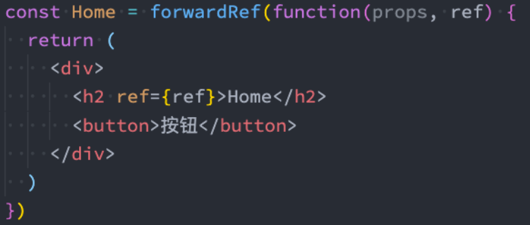
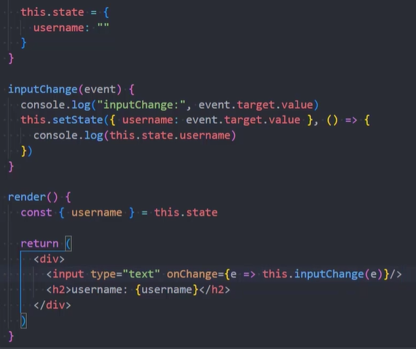
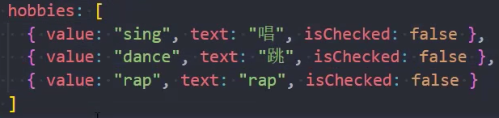
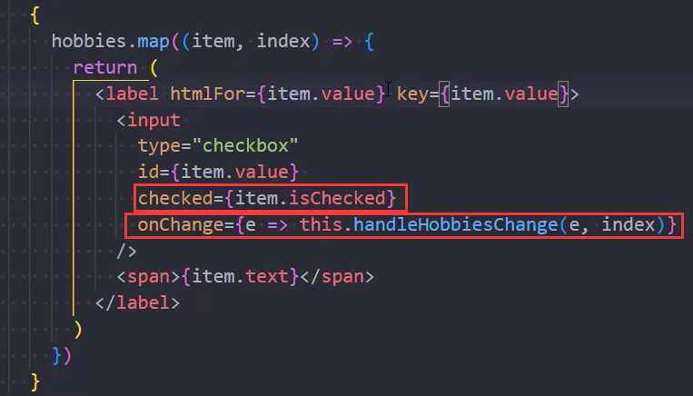
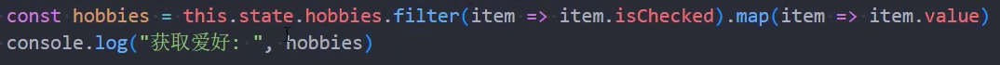
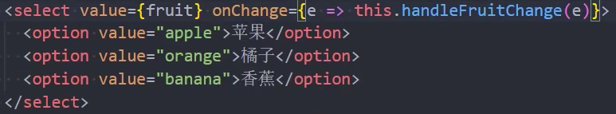
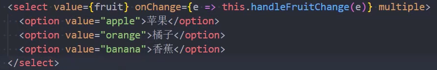
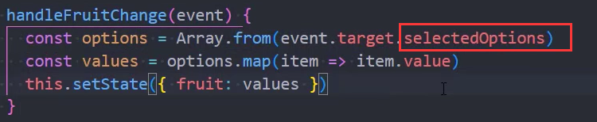
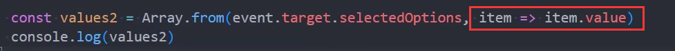

### 1.ref获取DOM

- 在React中拿到createRef，然后在constructor函数中调用这个createRef，再让一个变量接收返回值
- 为render中的元素绑定一个ref属性，`<h2 ref={this.titleRef}>Hello</h2>`
- 当我们点击某个按钮获取这个元素时，需要执行：this.titleRef.current

### 2.ref获取类组件实例

- 拿组件实例有啥用，假如这个组件中有一个方法，在当前组件拿到这个组件实例就可以调用其中的方法了
- 与ref获取DOM的方法一样，通过current获取组件实例

### 3.ref获取函数式组件

- 你还能通过current的方式拿到组件吗？不能，因为函数式组件压根没有实例

- 我们需要用React中的forwardRef函数把函数式组件进行包裹，对ref进行转发

  

  - 这样我们就能在父组件拿到子组件的h2元素

### 4.非受控组件



- 当变化输入框的内容时，界面也跟着变化，像这种没有交给React进行管理的表单元素，就是非受控组件

- 非受控组件有一个特点，假如username有初始值，h2是可以显示的
  - 但是input中是空的，初始值没有显示到input中

### 5.受控组件

- 你可能会想，我把上面的input绑定一个value属性不就行了

  ```jsx
  <input type="text" value={username}/>
  ```

  - 当你这么做时，你会发现这个input框再也不能输入值了
  - 当表单绑定了state中的值时，这个组件就变成了受控组件了
  - 受控组件中的值，不再由用户的键盘决定了，而是由你绑定的值决定

- 那咋办？受控组件必须绑定onChange事件，间接的拿到event.target.value

  - 拿到值再调用setState，把值设置回去

- 这么做就实现了Vue中的v-modal的效果

  - 整个流程就是，你一旦进行了输入操作，就会触发onChange事件，就会获取到值，再把值设置回去

- 绑定了value就是受控组件，没有绑定value就是非受控组件

### 6.受控组件的其他注意点

- 动态获取到受控组件的name属性：event.target.name

- label的for属性不能写for，要写htmlFor

- form元素想要监听submit需要使用onSubmit

- 如果你想把checkbox变成一个受控组件，不能绑定value，而是绑定checked

  - 当然只要是受控组件就需要绑定onChange事件，改变checked所绑定的那个值
  - 但是我们如何在event拿到数据呢？使用event.target.value行吗？不行，取出来的值是on或者off
  - 得使用event.target.checked去取值，这个值是true或false

- 对于checkbox的多选需要在state中定义数组：
  - 然后再绑定过去：

  - 在绑定的事件函数中获取到选中的信息：

    

- 关于select单选：

  - fruit初始值是一个字符串
  - 在handleFruitChange中通过event.target.value去获取值，然后再为fruit设置值

- 关于select多选：

  
  

  - 这种写法，第二个参数就是map的作用，两行代码变成了一行代码

### 7.非受控组件注意点

- 我们为表单元素设置了value属性后就变成了一个受控组件，不做onChange那些操作是无法改变值的
- 我们想要以前的那种value效果，怎么办呢？它有一个defaultValue可以实现这个需求
- 如果是checkbox或者radio要使用defaultChecked