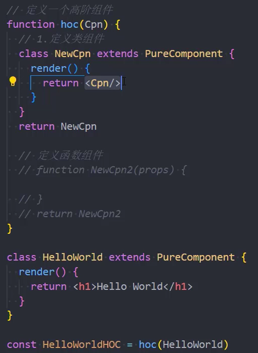
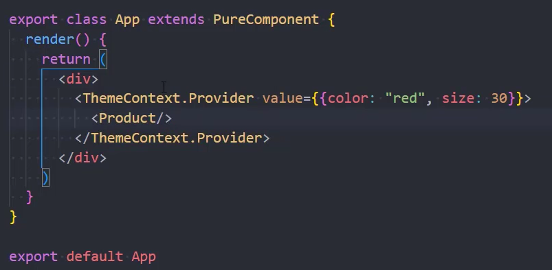
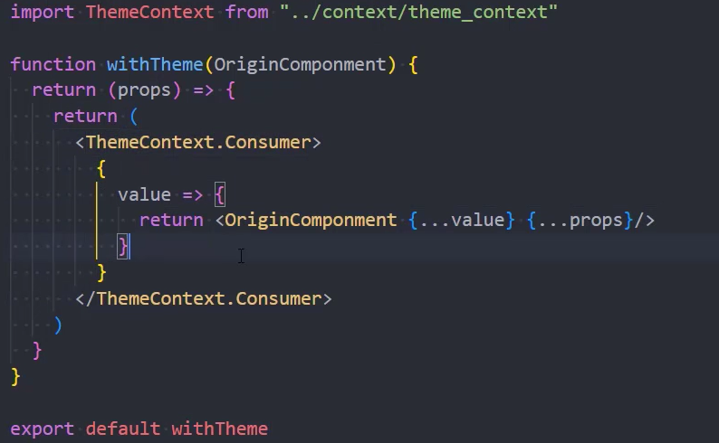
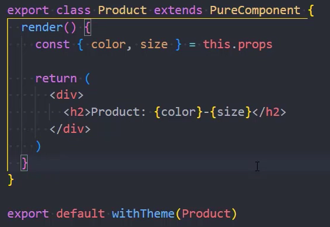
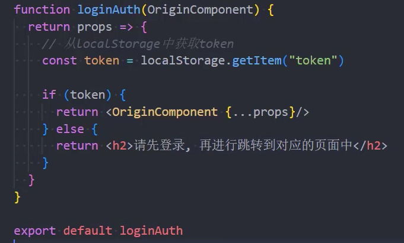
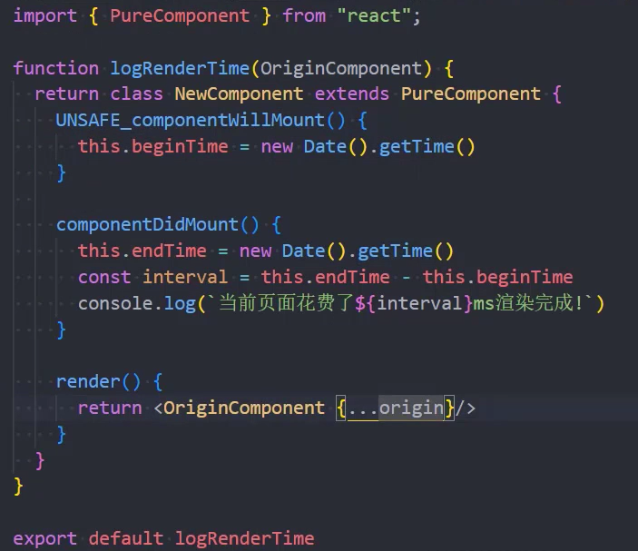
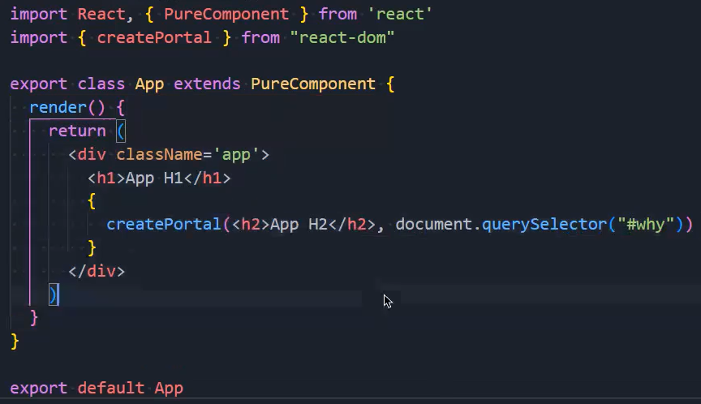
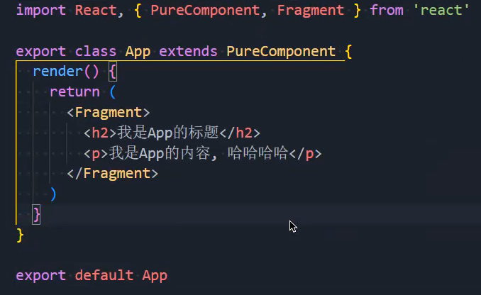

### 1.高阶组件

- 高阶组件本身是一个函数，本身不是组件
- 它接受一个组件作为参数，并返回一个组件

- 这样做可以对组件进行拦截，对拦截的组件进行增强
- redux中的connect函数，react-router中的withRouter，都是这么个原理

### 2.应用场景

- 对props进行增强

- conetxt共享增强

  

  

  - 这里要注意一点，withTheme的props来自哪里？来自`<Product/>`，如果它有传属性的话

- 登录鉴权的增强：

- 生命周期劫持：
  - 这里的origin写错了，应该写this.props
  - 可以把NewComponent省略掉，变成一个匿名的

### 3.Portals的使用

- 我们现在是不是把App渲染在id为root的div上，我们现在还有一些组件不想渲染在这个div上，怎么办？

  

  - 把h2这个元素放到id为why的div上

### 4.Fragment

- 可以理解为Vue中的template：
  - 语法糖的写法为：<></>
  - 如果有key的情况下Fragment是不能省略的

### 5.StrictMode

- StrictMode 是一个用来突出显示应用程序中潜在问题的工具
  - 与 Fragment 一样，StrictMode 不会渲染任何可见的 UI
  - 它为其后代元素触发额外的检查和警告
  - 严格模式检查仅在开发模式下运行；它不会影响生产构建

- 严格模式检查什么？
  1.  识别不安全的生命周期
  2. 使用过时的ref API
  3. 检查意外的副作用
     - 这个组件的constructor会被调用两次
     - 这是严格模式下故意进行的操作，让你来查看在这里写的一些逻辑代码被调用多次时，是否会产生一些副作用，在生产环境中，是不会被调用两次的
  4. 使用废弃的findDOMNode方法
     - 在之前的React API中，可以通过findDOMNode来获取DOM，已经不推荐使用了
  5. 检测过时的context API
     - 早期的Context是通过static属性声明Context对象属性，通过getChildContext返回Context对象等方式来使用Context的，目前这种方式已经不推荐使用了