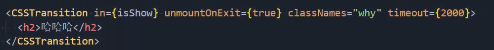
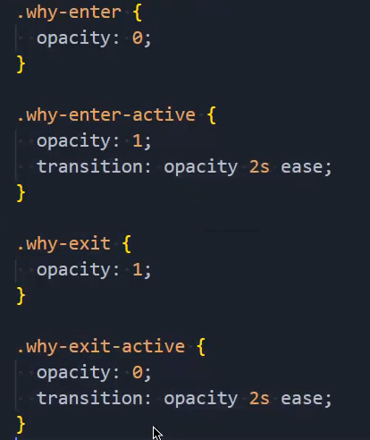
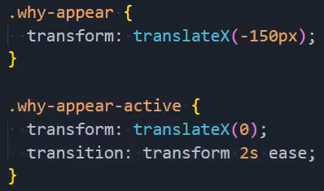
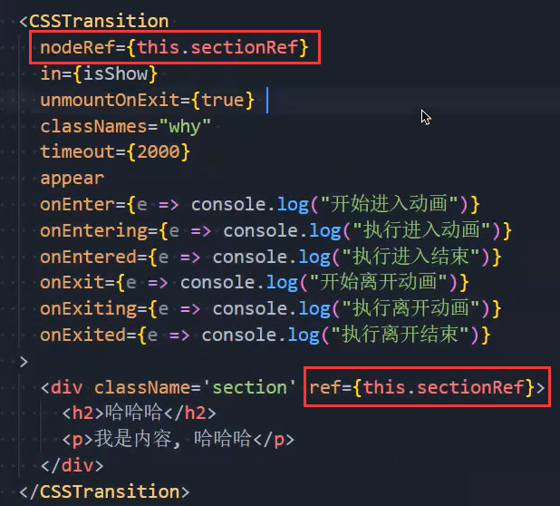
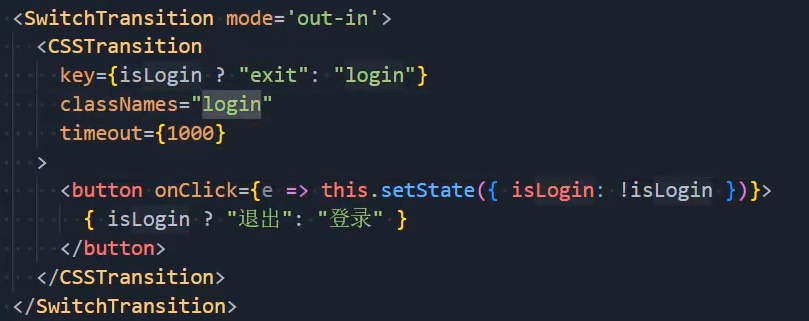
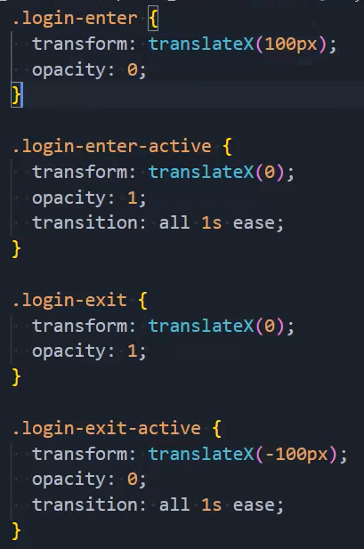
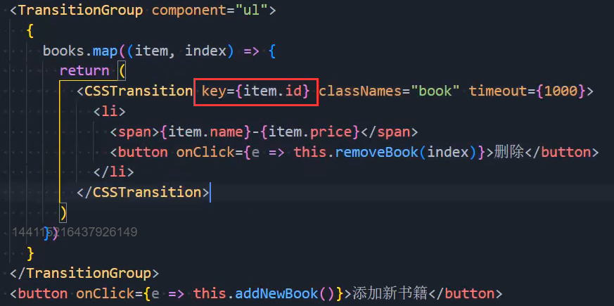
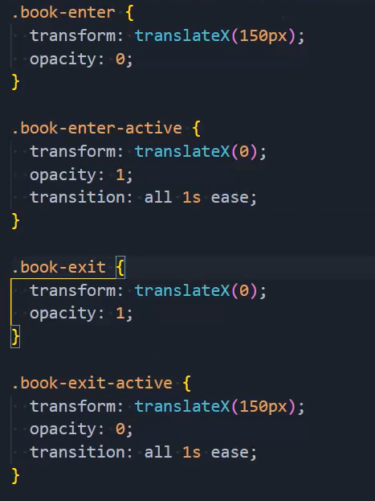

### 1.react-transition-group

- 安装：npm install react-transition-group
- 官方文档：https://reactcommunity.org/react-transition-group/
- 它的主要组件
  - Transition（不常用，想用它直接用CSSTransition）
    - 该组件是一个和平台无关的组件（不一定要结合CSS）
    - 在前端开发中，我们一般是结合CSS来完成样式，所以比较常用的是CSSTransition
  - CSSTransition（对一个组件施加动画）
    - 在前端开发中，通常使用CSSTransition来完成过渡动画效果
  - SwitchTransition（对两个组件的切换施加动画）
    - 两个组件显示和隐藏切换时，使用该组件
  - TransitionGroup（对多个组件施加动画）
    - 将多个动画组件包裹在其中，一般用于列表中元素的动画

### 2.CSSTransition的使用

- 引入：import { CSSTransition } from "react-transition-group"
- 使用：
  - in的isShow是true时显示哈哈哈，是false时让哈哈哈消失
  - unmountOnExit={true}必须写
  - classNames指定类名
  - timeout指定动画执行的时间
- 样式：
  - 这里的why就是我们刚才指定的classNames的那个why

- 三种状态，用来定义对应的CSS样式
  - 第一类，开始状态：对应的类是 -appear、-enter、-exit
  - 第二类：执行动画：对应的类是 -appear-active、-enter-active、-exit-active
  - 第三类：执行结束：对应的类是 -appear-done、-enter-done、-exit-done

### 3.CSSTransition常见属性

- in：触发进入或者退出状态
  - 如果添加了unmountOnExit={true}，那么该组件会在执行退出动画结束后被移除掉；
  - 当in为true时，触发进入状态，会对添加了 xx-enter、xx-enter-acitve 类的元素执行动画
    - 当动画执行结束后，移除这两个class
    - 并添加 xx-enter-done 的class
  - 当in为false时，触发退出状态，会对添加了 xx-exit、xx-exit-active 类的元素执行动画
    - 当动画执行结束后，会移除这两个class
    - 并添加 xx-exit-done 的class
- classNames：动画class的名称
  - 决定了在编写css时，对应的class名称：比如 card-enter、card-enter-active、card-enter-done
- timeout：过渡动画的时间
- appear：是否在初次进入时添加动画（需要和in同时为true） ：
- unmountOnExit：退出后卸载组件

- 除此之外还有一些钩子函数：主要为了检测动画的执行过程，来完成一些JavaScript的操作
  - onEnter：在进入动画之前被触发
  - onEntering：在进入动画的过程中被触发
  - onEntered：在进入动画结束后被触发
  - 当然还有onExit、onExiting、onExited等等
- 解决严格模式下的警告问题：

### 4.SwitchTransition

- 代码：
  - mode：先出后进（out-in）
  - 当key不一样才能进行切换，这里是不能使用in的

- 样式：

### 5.TransitionGroup

- 代码：
  - component是指定包裹的元素
  - 一定要保证key的唯一性，不然会发生错乱
- 样式：