### 1.普通CSS的问题

- 如果你在组件中引入了一个css文件，它是属于全局的css，样式之间会相互影响

### 2.CSS Modules

- 配置webpack.config.js中的modules: true，React脚手架默认帮你配置过了

- 在单独的css文件中写好样式，文件的命名为：xx.module.css
- 然后在组件中引入这个css文件：`import 随便一个名字 from "xx.module.css"`
- 使用：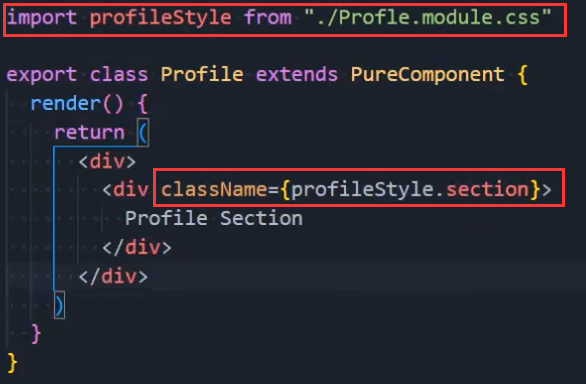

- 缺点
  - 引用的类名，不能使用连接符.home-title，连接符在JavaScript中是不识别的
  - 所有的className都必须使用{style.className} 的形式来编写
  - 不方便动态来修改某些样式，依然需要使用内联样式的方式

### 3.less

- 写完less文件，直接在组件中引入就行

- npm install @craco/craco

  - 但是当前脚手架较新，要安装它的alpha版本
  - npm install @craco/craco@alpha

- 创建craco.config.js文件

- 修改scripts

  ```json
  "scripts": {
  	"start": "craco start"
    "build": "craco build"
  }
  ```

- 还要安装craco-less，但是也有上面的问题，所以：npm install craco-less@alpha
  - 然后去antd的官网复制配置内容到craco.config.js文件中

    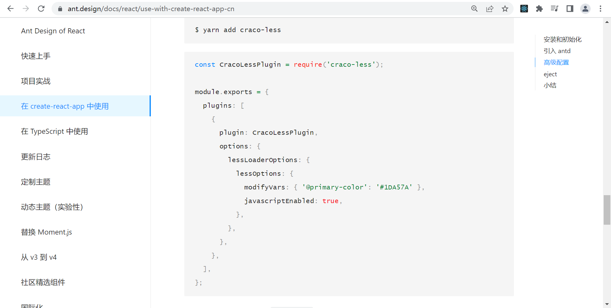

- 最后npm run start，此时就是通过craco启动项目，craco.config.js中的配置就可以被应用了
- 国外比较喜欢用：material ui，爱彼迎就是用它来设计的

### 4.styled-components

- CSS-in-JS的库，除此之外还有emotion和glamorous
- 安装：npm install styled-components
- 创建style.js文件
- 安装插件：vscode-styled-components
- 样式：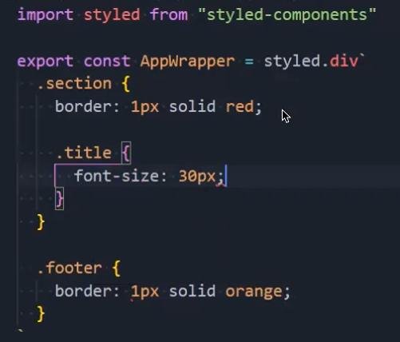

- 在组件中导入AppWrapper：`import { AppWrapper } from "./style"`
- 使用：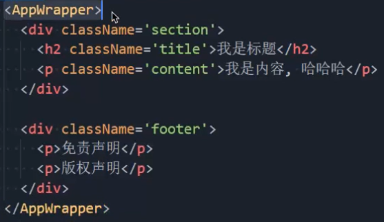

- 写法按照less的编写方式就可以

### 5.props

- 传递参数：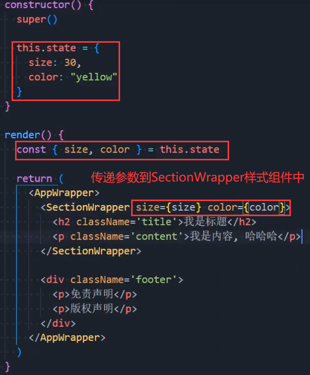

- 在组件中获取props：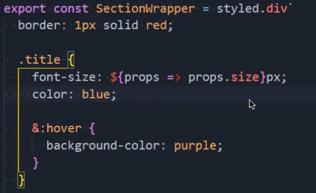
  - 这里写一个函数，是因为，当前组件会把props传给这个函数，然后函数再返回相应的值

### 6.attrs

- 假如我们没有传递color，那么可不可以设置默认值呢？可以使用attrs

  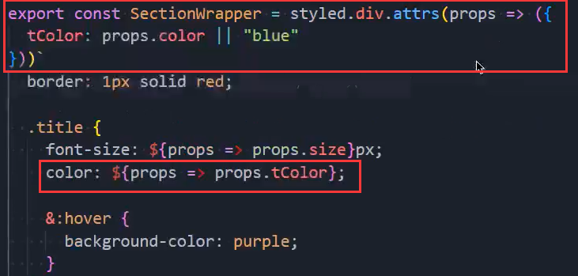

### 7.定义主题变量

- 在单独的js文件中定义主题相关的变量，导出，再在style.js文件中导入，并使用

  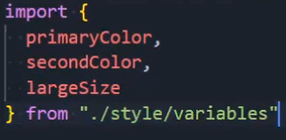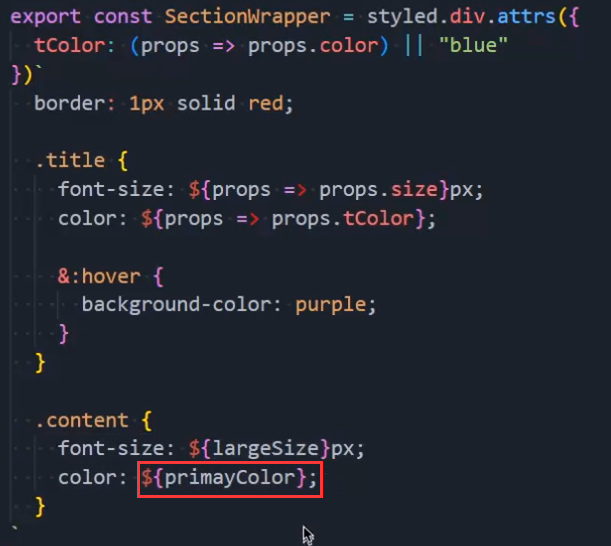

- 通过ThemeProvider，把样式共享过去：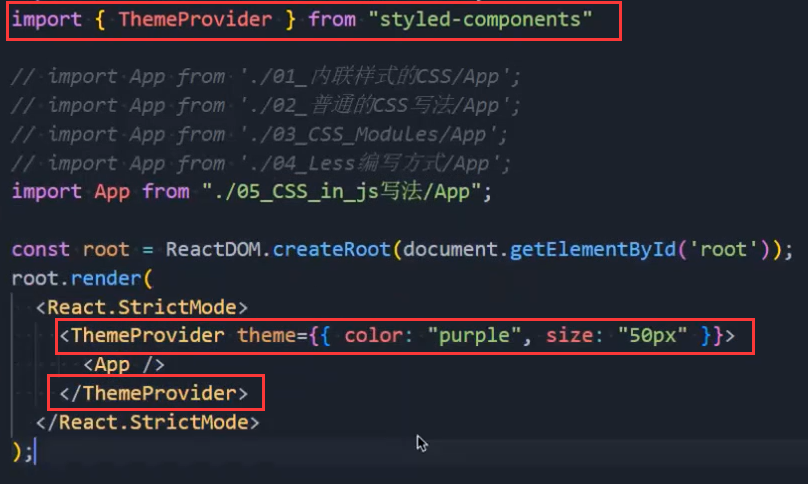

- 拿到共享的样式：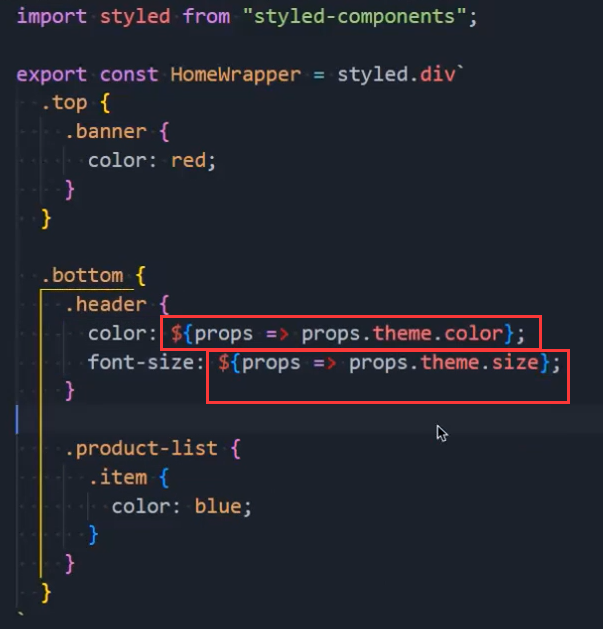

### 8.其他补充

- 样式的继承：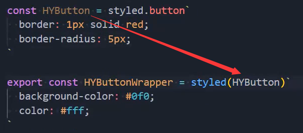

- 添加class的第三方库：classnames

  - 安装：npm install classnames

  - 使用举例：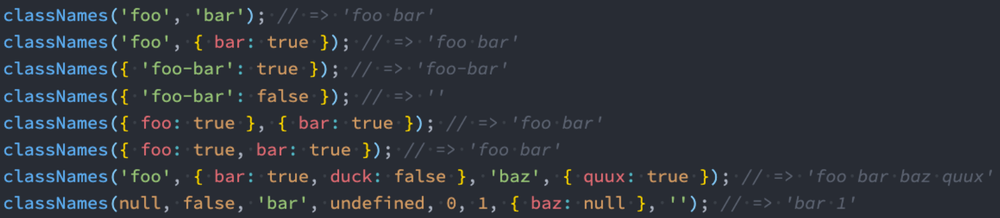

    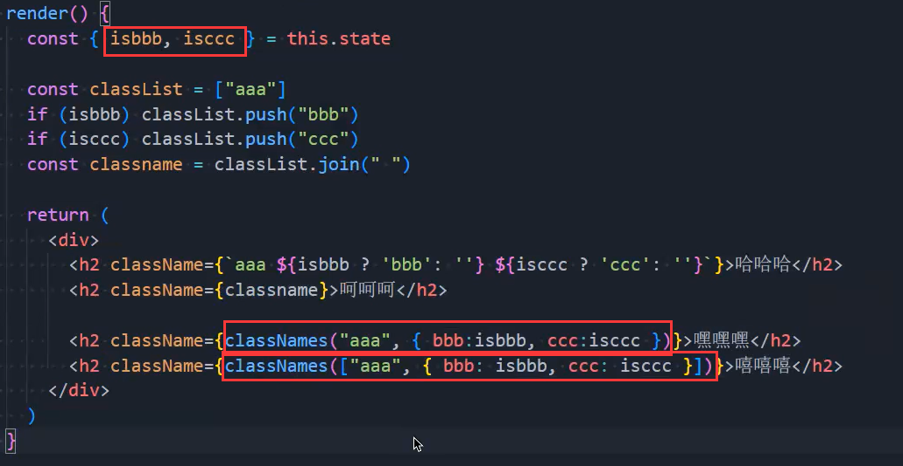


