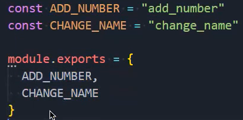

### 1.Redux介绍

- Redux是一个帮助我们管理State的容器：Redux是JavaScript的状态容器，提供了可预测的状态管理
- Redux除了和React一起使用之外，它也可以和其他界面库一起来使用（比如Vue），并且它非常小（包括依赖在内，只有2kb）

### 2.核心理念

- 核心理念一：store
  - 定义初始化数据，在通过reducer把数据传给store
  - 它不是直接创建store，在创建store的时候定义初始化数据，它不是这样的

- 核心理念二：action

  - 所有的数据变化，必须通过派发action来更新

  - action是一个普通的JavaScript对象，用来描述这次更新的type和content

    ```js
    store.dispatch({type: "ADD_NUMBER", count: 10})
    ```

  - 强制使用action的好处是：

    - 可以清晰的知道数据到底发生了什么样的变化
    - 所有数据的变化都是可追踪、可预测的

- 核心理念三：reducer

  - 如何将store和action联系在一起呢？
    - 通过reducer将store和action联系在一起
  - reducer是一个纯函数
    - reducer所做的事情就是将传入的state和action结合起来生成一个新的state
  - 永远只有一个state
  - store存储着我们所有的数据

### 3.redux基本使用

- 创建store

  ```js
  const { createStore } = require("redux")
  
  const initialState = {
    name: "yt",
    age: 22,
    friend: {
      name: "张三",
      age: 23
    }
  }
  
  function reducer() {
    return initialState
  }
  
  // createStore的第一个参数不是initialState，而是需要你传入一个reducer
  const store = createStore(reducer)
  
  module.exports = store
  ```

- 使用store，获取数据

  ```js
  const store = require("./store")
  
  console.log(store.getState())
  ```

  

### 4.修改store中的值

- reducer接收两个参数
  - 参数一（state）：store中目前保存的state
  - 参数二（action）：你派发过来的action
- 一旦你派发了一个action就会重新执行reducer这个函数：

- reducer的返回值会作为store之后存储的state

  

### 5.订阅store中的数据


### 6.reducer的优化


### 7.action的优化

- 优化一：使用函数对代码进行复用：

- 优化二：我们会把changeNameAction和addNumberAction这样的函数抽到actionCreators.js的独立文件中

  

- 优化三：将type抽到一个独立的constants.js文件中，作为常量进行共享

  - 因为reducer中的判断需要使用到常量，派发action也需要用到常量，并且这两个常量必须保持一致

    


### 8.reducer的再优化

- 由于reducer的代码会越写越多，对于index.js文件来说会变得越来越重

- 我们需要把reducer也抽取到一个独立的js文件中

  

- index.js就变得非常简单了：

### 9.文件梳理

- index.js：放store
- reducer.js：放reducer函数
- actionCreators.js：放action函数
- constants.js：放常量