### 1.redux的三大原则

- 单一数据源
  - 整个应用程序的state被存储在一颗object tree中，并且这个object tree只存储在一个 store 中
  - Redux并没有强制让我们不能创建多个Store，但是那样做并不利于数据的维护
  - 单一的数据源可以让整个应用程序的state变得方便维护、追踪、修改
- State是只读的
  - 修改State的唯一方法是触发action，不要试图在其他地方通过某种方式来直接修改State
  - 这样就确保了View或网络请求都不能直接修改state，它们只能通过action来描述自己想要如何修改state
  - 这样可以保证所有的修改都被集中化处理，并且按照严格的顺序来执行
    - 所以不需要担心race condition（竟态）的问题

- 使用纯函数来执行修改
  - 通过reducer将 旧state和 actions联系在一起，并且返回一个新的State
  - 随着应用程序的复杂度增加，我们可以将reducer拆分成多个小的reducers
    - 分别操作不同state tree的一部分
  - 但是所有的reducer都应该是纯函数，不能产生任何的副作用

### 2.redux的使用流程

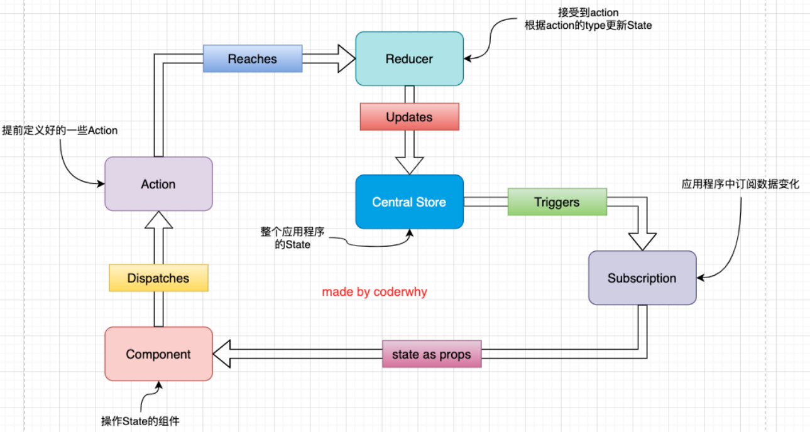

- 我们拥有一个store，如果我们想要在某个组件中使用store中的值，就必须订阅store中的数据变化
- 你可能要问，初始值怎么办？初识值是订阅不了的，可以通过store.getState()去拿，直接给state中元素赋值
- 当store中的数据发生变化时，在组件中就可以进行订阅，继而更新组件中的状态
- 如果组件想要修改store中的值，需要派发action，派发action后就会来到reducer中，更新store中的值
- store中的值发生了变化，就又来到了订阅阶段，以此形成一个循环
- 多提一嘴，一般都是在componentDidMount生命周期中进行订阅

### 3.react-redux

- 2中提到的逻辑是比较通顺的，但是比较麻烦，我们想要对其做一些抽取，需要使用react-redux
- 安装：npm install react-redux，这个库的目的就是帮助我们把react和redux结合在一起
- 使用：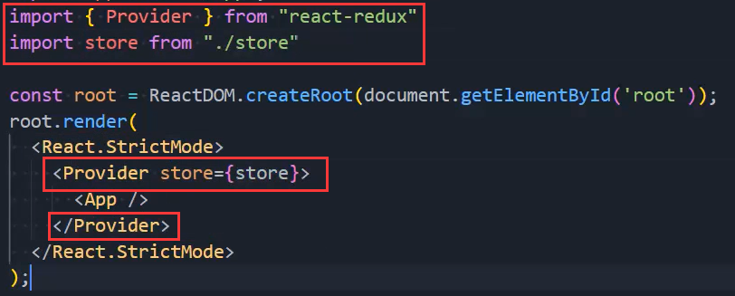
- 在组件中对数据进行映射：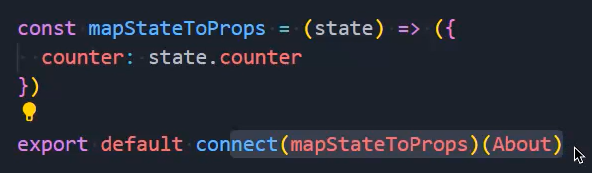
- 使用映射过来的数据：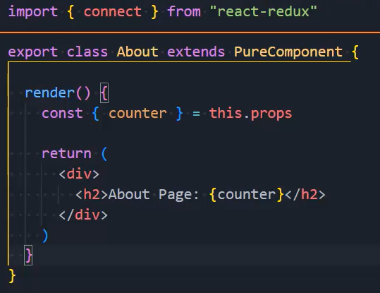
  - 通过props获取传过来的数据
- 在组件中对函数进行映射：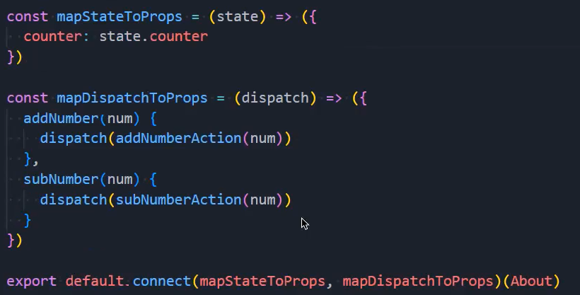
- 使用映射过来的函数：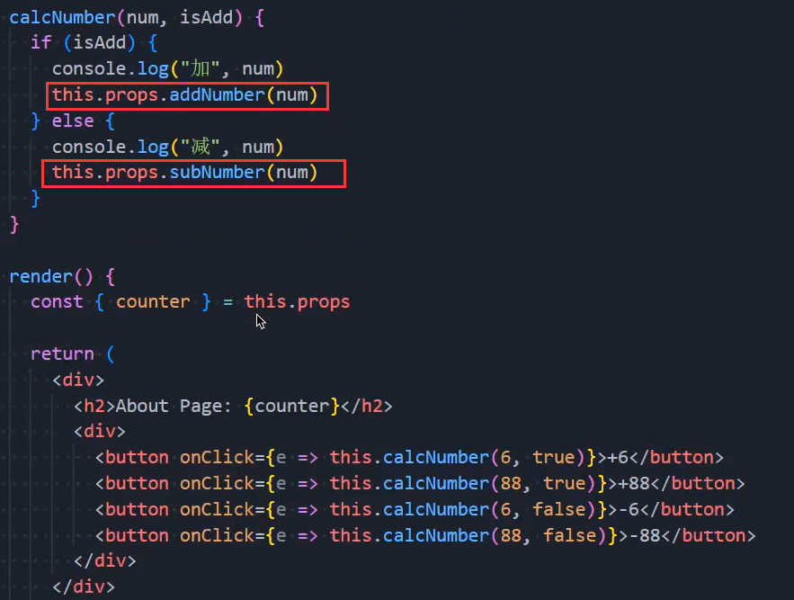

- connect是一个高阶函数，接收两个函数作为参数，返回一个新函数，新函数是一个高阶组件
  - 这个高阶组件虽然叫做组件，但不是一个组件，它是一个函数，接受一个组件作为参数，并返回一个组件

### 4.异步请求数据

- 数据的请求：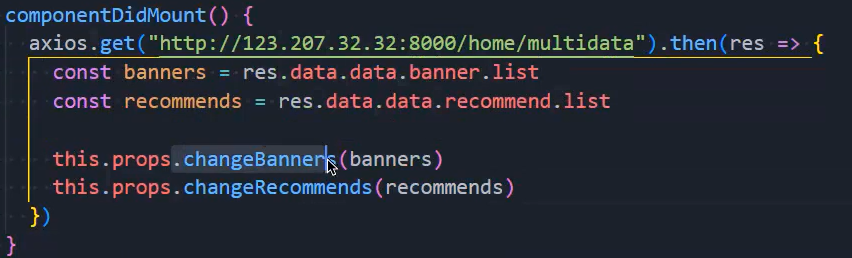
- 使用props中的函数就会来到这里：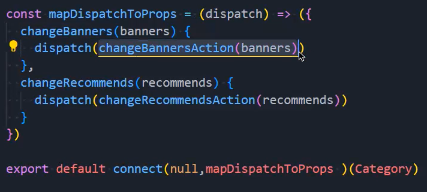
- 派发之后就会来到reducer里面：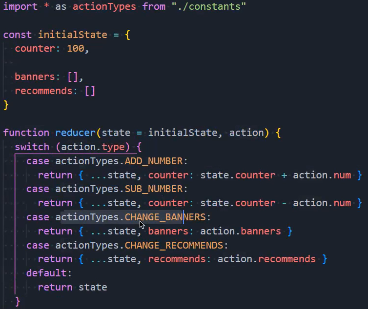
- 来到reducer之后就可以修改掉数据，重新为store赋一个新的state

### 5.异步请求数据优化

- 我们不想让网络请求发生在组件中，我们想让它发生在action中
- 我们知道在4中changeBanners和changRecommends中所派发的是这个函数返回的那个对象
- 我们想要在这个changeBannersAction和changRecommendsAction中发送网络请求
- 但是你会发现在这里面是做不到的，不过我们只要想办法派发函数就可以解决这个问题
- 因为如果我们派发的是一个函数，那么changeBannersAction被调用后就必须返回一个函数
- 但是redux不支持派发函数，我们要使用redux-thunk对store进行增强
- 安装：npm install redux-thunk
- 引入：`import thunk from "redux-thunk"`
- 应用thunk这个中间件：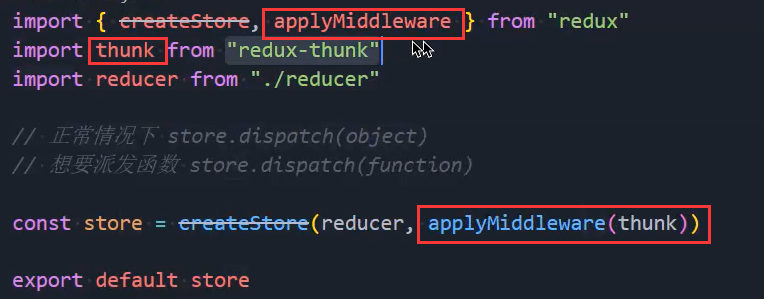
- 当你应用了中间件后，我们不是派发了一个函数吗？就可以在这个函数中拿到两个参数
  - 参数一：dispatch
  - 参数二：getState

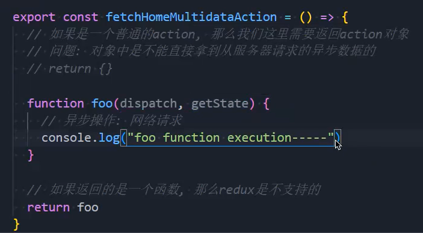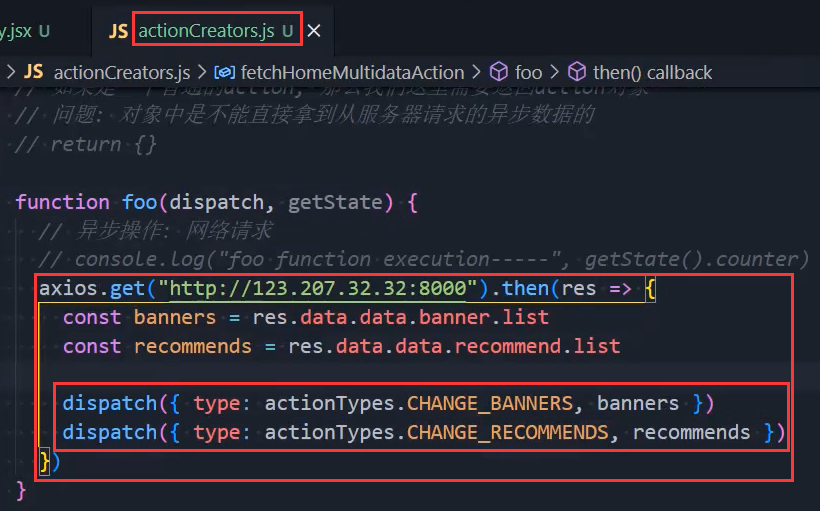

- 这样我们就能在这个函数中进行异步请求，和派发action对象了

- 整个步骤梳理
  - 在组件中调起网络请求：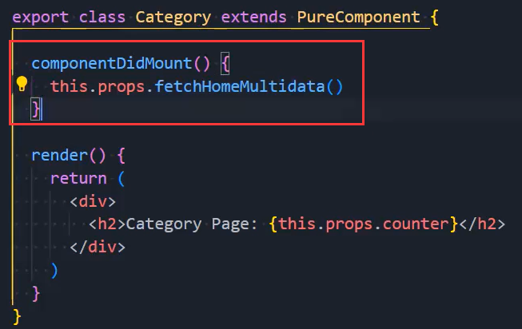
  - 派发：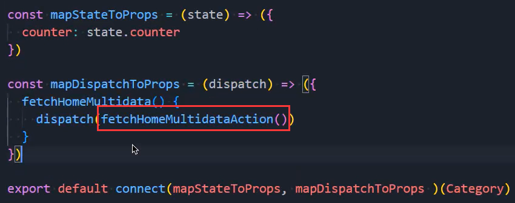
    - 派发fetchHomeMultidataAction返回的函数
    - 当然还要应用中间件，才能派发函数
    - 派发函数后，我们派发的那个函数就自动获得两个参数，分别是dispatch和getState
    - 然后再在这个函数中请求数据，得到结果后派发action对象即可