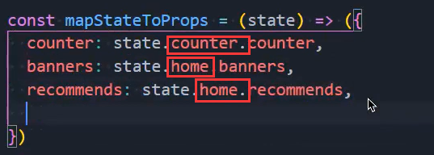
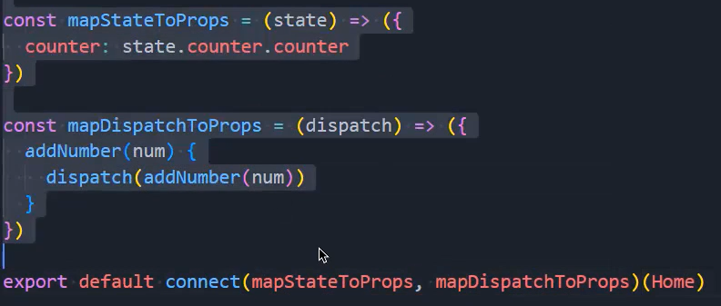

### 1.安装两个工具包

- 一个是react-devtools，另一个是redux-devtools
- 去老师那里拿资源
- 但是redux-devtools需要一个额外的操作：
  - 使用window这个我们就可以在浏览器看到redux-devtools的界面
  - 如果使用compose在浏览器就看不到redux-devtools的界面，所以生产环境要使用compose

### 2.合并reducer

- 拿数据的时候要注意，加上模块的名字：

### 3.redux toolkit

- 安装：npm install @reduxjs/toolkit
- 我们除了要安装这个工具包还要安装react-redux，这个之前安装过
  - 也是需要Provider共享store和connect
- Redux Toolkit的核心API
  - configureStore：包装createStore以提供简化的配置选项和良好的默认值
    - 它可以自动组合你的 slice reducer，添加你提供的任何 Redux 中间件
    - redux-thunk默认包含，并启用 Redux DevTools Extension
  - createSlice：接受reducer函数的对象、切片名称和初始状态值，
    - 并自动生成切片reducer，并带有相应的actions
  - createAsyncThunk：接受一个动作类型字符串和一个返回承诺的函数
    - 并生成一个pending/fulfilled/rejected基于该承诺分派动作类型的 thunk
- 创建初始化store：

### 4.创建片段

- name：用户标记slice的名字
  - 在之后的redux-devtool中会显示对应的名字
- initialState：初始化值，第一次初始化时的值
- reducers：相当于之前的reducer函数
  - 对象类型，并且可以添加很多的函数
  - 函数类似于redux原来reducer中的一个case语句
  - 函数的参数
    - 参数一：state
    - 参数二：调用这个action时，传递的action参数；
- createSlice返回值是一个对象，包含所有的actions

### 5.创建store

- store：

### 6.使用

- 共享store：
- 使用数据：
- 改变数据：
- 如何使用跟以前还是一样的

### 7.异步操作

- 异步请求：
  
- 这里的fetch/homemultidata是自己随便起的，主要用来给redux-devtools使用
  
- 我们在组件中派发时就派发这个fetchHomeMultidataAction就行了

  

- 当createAsyncThunk创建出来的action被dispatch时，会存在三种状态

  - pending：action被发出，但是还没有最终的结果
  - fulfilled：获取到最终的结果（有返回值的结果），就是return res.data时状态就变为fulfilled
  - rejected：执行过程中有错误或者抛出了异常

  

- 也可以这么写：

- 还可以这么写：

### 8.数据的不可变性

- 在React开发中，我们总是会强调数据的不可变性
  - 无论是类组件中的state，还是redux中管理的state
  - 事实上在整个JavaScript编码过程中，数据的不可变性都是非常重要的
- 所以在前面我们经常会进行浅拷贝来完成某些操作，但是浅拷贝事实上也是存在问题
  - 比如过大的对象，进行浅拷贝也会造成性能的浪费
  - 比如浅拷贝后的对象，在深层改变时，依然会对之前的对象产生影响
- 事实上Redux Toolkit底层使用了immerjs的一个库来保证数据的不可变性
- 在coderwhy老师的公众号上有一片文章中，专门讲解immutable-js库的底层原理和使用方法
  - https://mp.weixin.qq.com/s/hfeCDCcodBCGS5GpedxCGg
- 为了节约内存，出现了一个新的算法：Persistent Data Structure（持久化数据结构或一致性数据结构）
  - 用某种数据结构来保存数据
  - 当数据被修改时，返回一个对象，但是新的对象会尽可能的利用之前的数据而不会对内存造成浪费