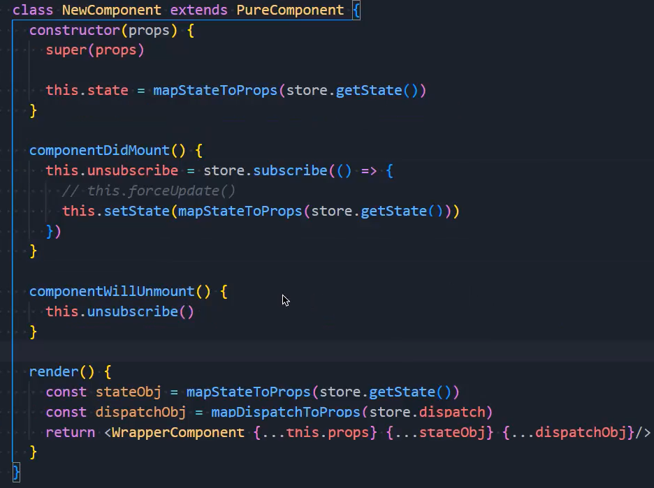

### 1.基本逻辑

- 传给connect两个函数，返回一个函数，这个函数是一个高阶组件
- 高阶组件接受一个组件，返回一个组件，使用返回的组件时，其实是在使用接收的那个组件

### 2.整体架构

### 3.数据发生变化

### 4.整体

### 5.问题

- 这里的store不能这么引入

- 创建context

  

- 共享store

  

- 使用共享的store

  

- context就是store本身

  

