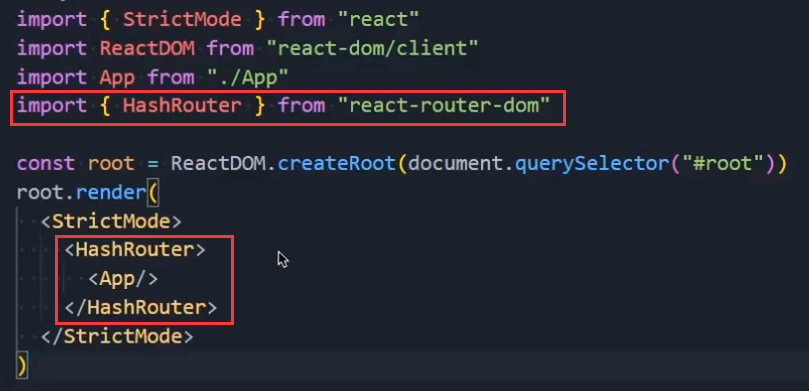
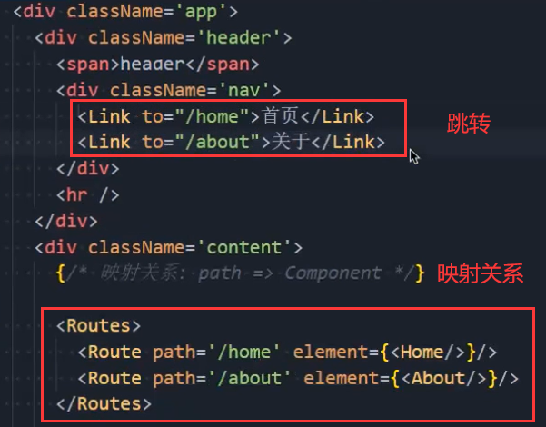
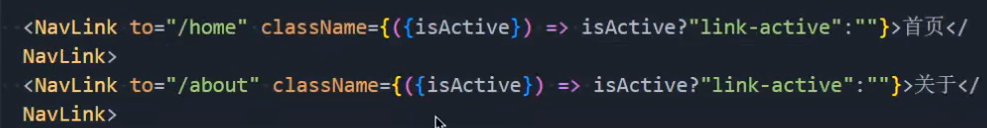
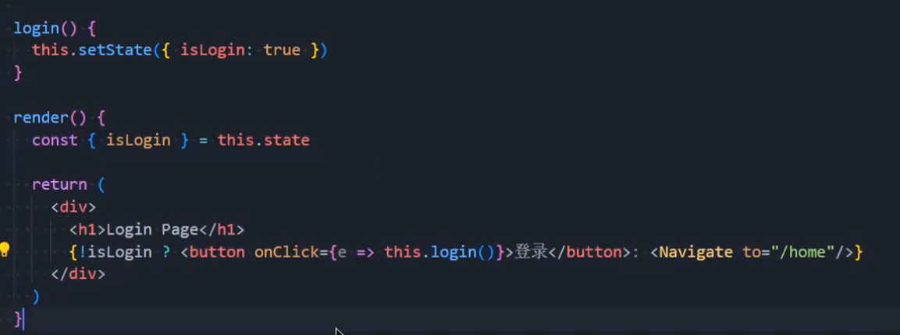
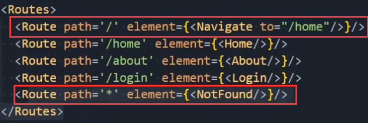
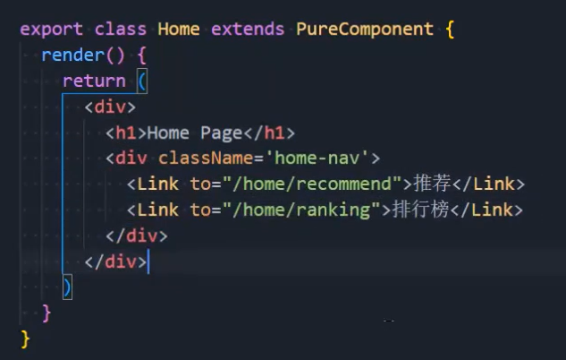
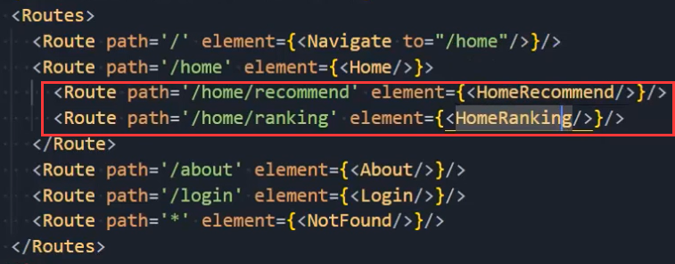
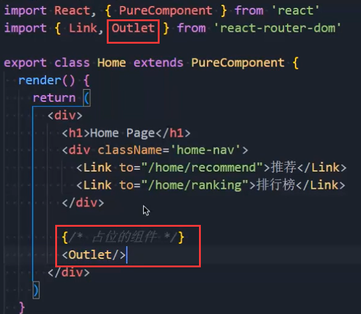
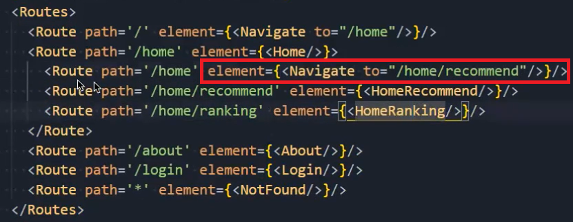

### 1.react-router

- 安装：npm install react-router-dom
- history模式：BrowserRouter
- hash模式：HashRouter：

- 路由的写法：

### 2.解析

- Routes：包裹所有的Route，在其中匹配一个路由
  - Router5.x使用的是Switch组件
- Route：Route用于路径的匹配
  - path属性：用于设置匹配到的路径
  - element属性：设置匹配到路径后，渲染的组件
    - Router5.x使用的是component属性
- Link
  - 通常路径的跳转是使用Link组件，最终会被渲染成a元素
  - to属性：Link中最重要的属性，用于设置跳转到的路径
- NavLink
  - 假如我们有这样的需求，刚才的首页或者关于被选中后，变成红色，怎么实现？
  - 把Link组件改为NavLink即可，当我们点击关于时，当前a元素就会多一个active类，点首页同理
  - 所以我们就可以给active添加一些样式，继而改变颜色
  - 可以使用style：
  - 可以使用className：
  - 这里的isActive是它自己传进去的

### 3.Navigate

- 点击登录按钮展示登录界面：
- 重定向和NotFound：

### 4.路由的嵌套（子路由）

- 在Home组件中写跳转的逻辑：
- 在App中写嵌套路由：
- 在Home组件中写占位的东西：

- 再重定向：
  - 我们为什么不在to="/home"那里一步到位呢？因为我们要显示Home组件，再在此基础上显示HomeRecommend组件

