### 1.手动路由跳转

- 假如我们有一个button，我们想点击这个按钮时跳转到指定的页面，怎么办？

- 它需要使用到useNavigate这个hook，但是hook只能在函数式组件中进行使用，类组件不行

  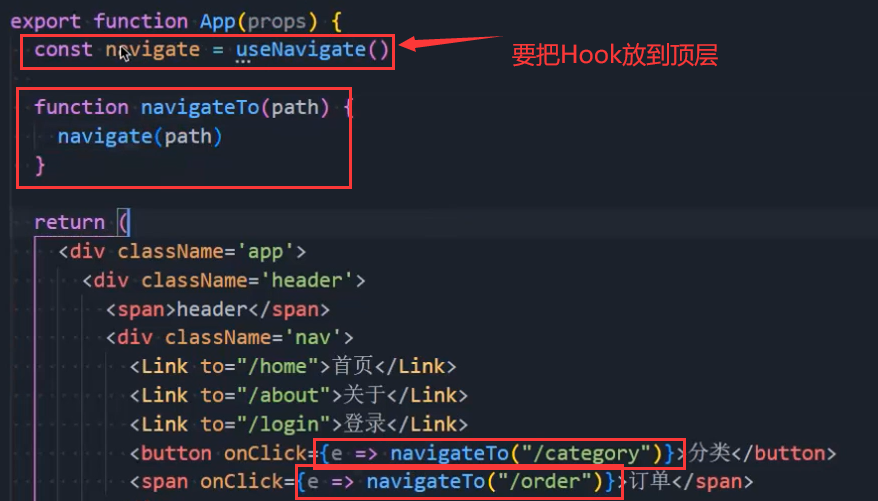

  - 函数式组件是可以这么使用的，但是类组件不行

- 怎么在类组件中使用呢？增强（使用高阶组件）
  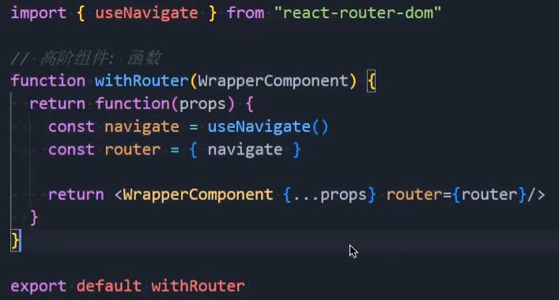

  - 然后引入，再把类组件进行包裹，就可以在props中拿到router了

    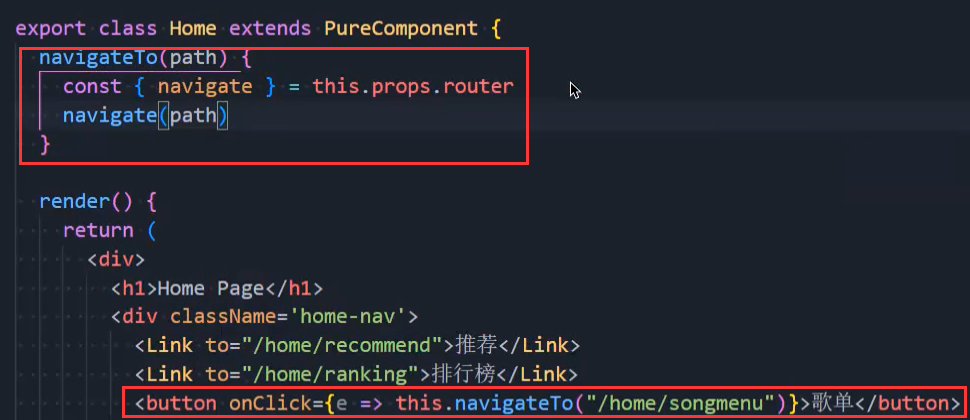

### 2.路由参数传递

- 动态路由：

  

  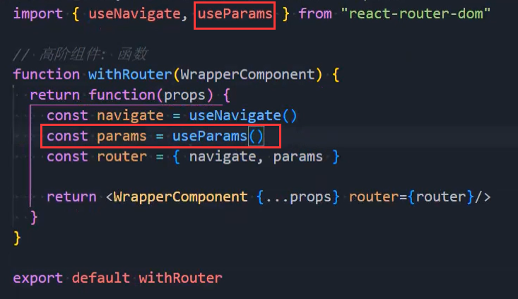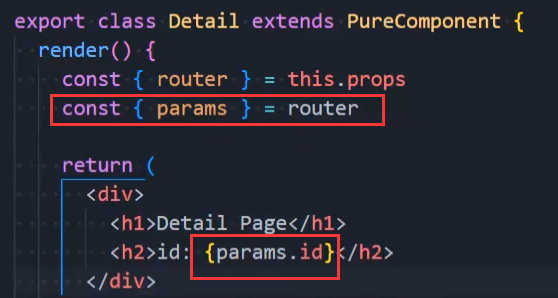

- 查询字符串的增强：

  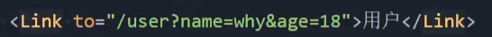

  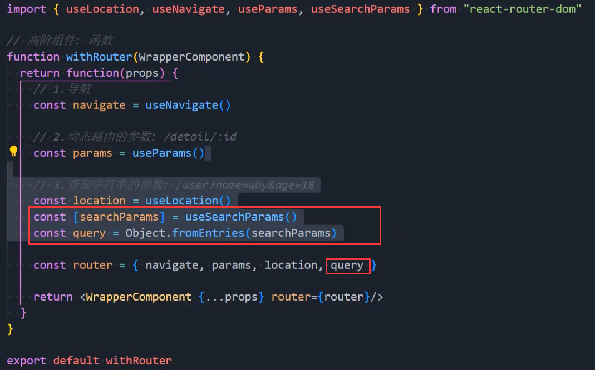

### 3.配置文件（映射关系）

- 我们想把映射关系单独写一个配置文件，可不可以？可以
- 不过我们需要一个hook：useRoutes 去根据配置生成之前的映射关系：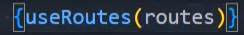
- 配置文件：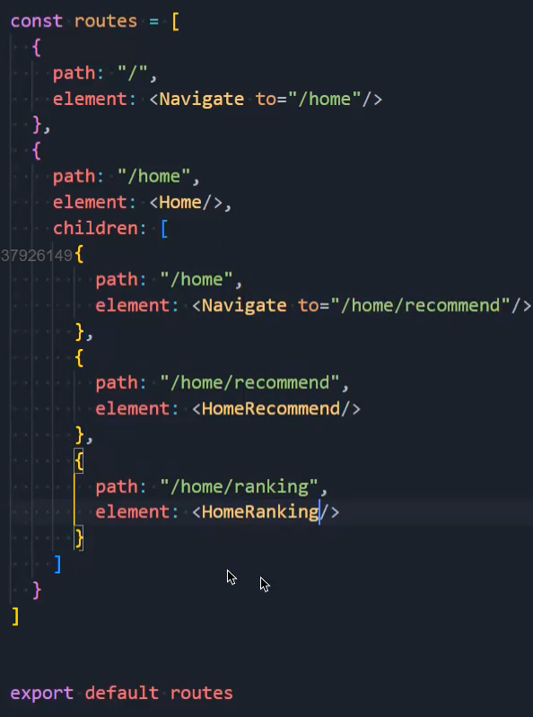

### 4.路由的懒加载

- 配置文件：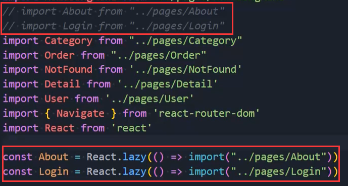

  - 为什么这个import会单独打包，这个是webpack的特性

- 这样还不行，还得使用Suspense，才不会报错

  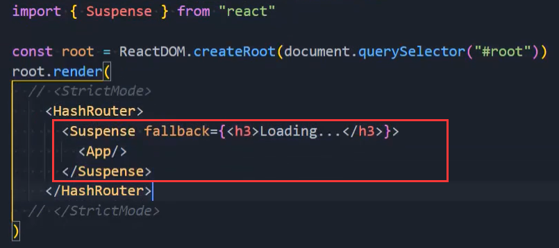

  - 这样当我们那些懒加载的东西在下载的过程中，就会显示fallback中的组件

