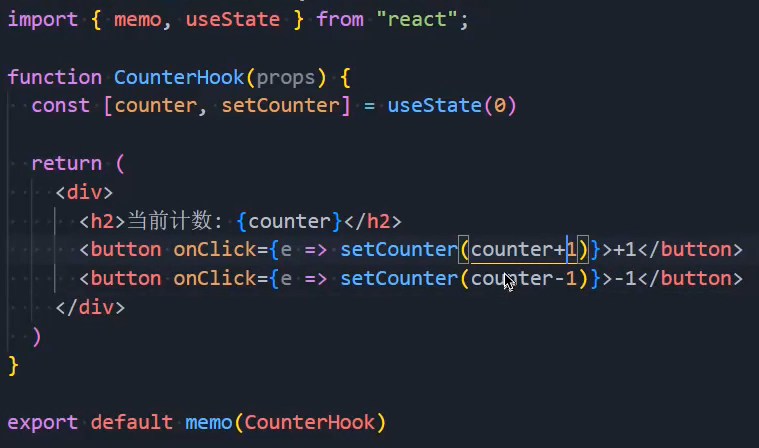

### 1.计数器案例



- counter是初始值，就是useState那里的那个0
- setCounter是操作的函数
- useState来自react，需要从react中导入，它是一个hook
  - 参数：初始化值，如果不设置, 为undefined
  - 返回值：数组，包含两个元素
    - 元素一：当前状态的值（第一次调用为初始化值）
    - 元素二：设置状态值的函数
  - 点击button按钮后，会完成两件事情：
    - 调用setCounter，设置一个新的值
    - 组件重新渲染，并且根据新的值返回DOM结构
- 使用它们会有两个额外的规则
  - 只能在函数的最外层调用 Hook函数，不要在循环、条件判断或者子函数中调用Hook
  - 只能在 React 的函数式组件中调用 Hook，不要在其他 JavaScript 函数中调用Hook
    - 但是如果其他的 JavaScript 函数的名字是use开头的，可以使用Hook，名字是小驼峰
    - 这属于自定义hook

### 2.useState

- useState会帮助我们定义一个 state变量，useState 是一种新方法
  - 它与 class 里面的 this.state 提供的功能完全相同
  - 一般来说，在函数退出后变量就会”消失”，而 state 中的变量会被 React 保留
- useState接受唯一一个参数，在第一次组件被调用时，使用这个唯一的参数作为初始化值
  - 如果没有传递参数，那么初始化值为undefined
- useState的返回值是一个数组，我们可以通过数组的解构，来完成赋值会非常方便

### 3.useEffect

- 我们现在已经实现了在函数式组件中通过hook定义状态，那生命周期怎么书写呢？

  - useEffect 可以完成一些类似于class中生命周期的功能
  - 类似于网络请求、手动更新DOM、事件的监听，都是React更新DOM的一些副作用（Side Effects）
  - 所以对于完成这些功能的Hook被称之为 Effect Hook

- 修改标题

  ```jsx
  import React, { memo, useState, useEffect } from 'react'
  
  const App = memo(() => {
    const [ counter, setCounter ] = useState(0)
  
    useEffect(() => document.title = counter)
  
    return (
      <div>
        <h2>{ counter }</h2>
        <button onClick={e => setCounter(counter + 1)}>+1</button>
      </div>
    )
  })
  
  export default App
  ```

  - useEffect的第一个参数要求是一个函数，默认情况下有两种调用时机
    - DOM第一次渲染完成后会回调这个函数
    - DOM每次更新完成后，都会执行这个函数

- 清除机制

  - 在redux中通过store.subscribe手动订阅数据变化，都需要在componentWillUnmount中取消订阅

  - useEffect的第一个参数是函数，这个函数有一个返回值，返回值也是一个函数

    - 取消订阅就是在这个函数中进行的
    - 这个函数的执行时机是：1.组件卸载会回调此函数，2.组件更新之前会回调此函数
    - 作用：1.避免有过多的重复订阅，2.添加和移除逻辑放在一起，内聚性更强

    ```jsx
    useEffect(() => {
      console.log("监听redux中的数据变化");
    
      return () => {
        console.log("取消监听redux中的数据变化");
      }
    })
    ```

- 逻辑分离（多个useEffect）

  - 使用Hook的其中一个目的就是解决class中，一个生命周期种放置很多的逻辑

  - 比如订阅redux数据变化、添加事件监听、手动修改DOM，这些都会放在componentDidMount中

  - 我们可以将逻辑放到多个useEffect中

    ```js
    useEffect(() => console.log("手动更新DOM"))
    useEffect(() => console.log("订阅redux数据变化"))
    useEffect(() => console.log("添加事件监听"))
    ```

    - React 将按照 useEffect 的声明顺序依次调用组件中的每一个effect

- 执行时机

  - 默认情况下只要DOM被渲染了，就会执行回调函数

  - useEffect的第二个参数是一个空数组

    - 只会在第一次渲染时回调第一个参数，当卸载时，回调第一个参数的返回值
    - 更新时不会有任何回调，类似于componentDidMount和componentWillUnmount

  - useEffect的第二个参数的数组中依赖一个值，这个值可以发生改变

    - 第一个参数除了在第一次渲染后会被回调，在依赖的值发生变化，DOM重新渲染后会被回调，在DOM重新渲染前会回调返回值

    ```js
    const [ counter, setCounter ] = useState(0)
    
    useEffect(() => {
      console.log(456);
    
      return () => {
        console.log(789);
      }
    }, [counter])
    ```

    - 第一次DOM渲染完成，打印456
    - counter发生变化，开始重新执行整个组件，在DOM渲染完成之前会打印789
    - 在DOM渲染完成之后打印456
    - 如果你对整个组件进行了卸载，在卸载完成后会打印789