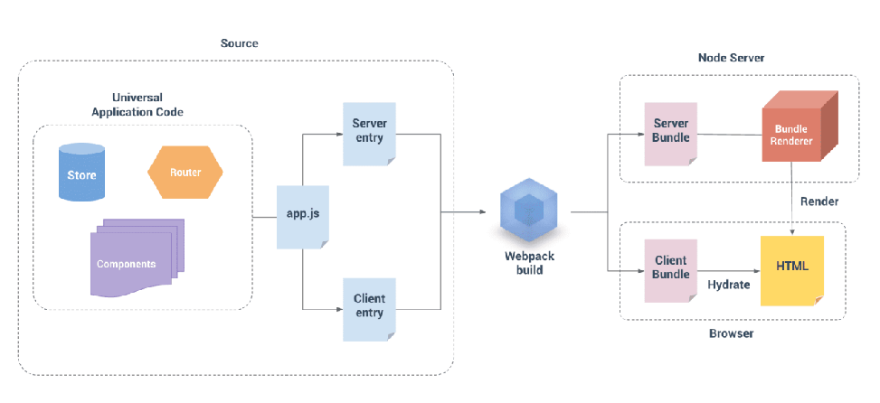

### 1.如何学好SSR

要想学好SSR必须先学好Node，因为你需要通过Node把它渲染出来，然后再通过Vue/React为我们提供的服务器端渲染API，自己再一点点手动搭建整个服务器渲染相关的内容，手动搭建可能会比较麻烦，所以对应的有两个框架，Vue => nuxt框架，React => next框架

如果直接学这两个框架会感觉云里雾里的，我们最好自己手动搭建一下，再去学比较好，但是都得先学好Node

### 2.单页面富应用（SPA）的缺点

- 不利于SEO优化
- 首屏渲染速度慢

### 3.不利于SEO优化

- 百度的爬虫会去我们的服务器请求一个文件：index.html文件
- 但是我们如果是一个SPA页面，那么它里面基本上只有一个div id=app这一个主要内容，当然还有meta，不够
- 百度的爬虫在它们的数据库中收入的关于我们网站的关键字就非常少
- 百度为什么不把js也下载下来，执行js，除非百度疯了，太耗费性能了，成本太高了
- 当用户搜索关键字时，我们网站的排名就会很低

### 4.SSR如何利于SEO优化？

- 早期的SSR页面是通过JSP、PHP、ASP等技术实现的，它会把整个网站的所有内容，在后端渲染好，当用户请求的时候是把整个网页给请求下来的，那么爬虫也可以爬我们这个网页，内容更加丰富

### 5.SSR首屏的渲染速度更快

- SPA页面渲染完整个HTML页面后，也就是只渲染了div id=app这一个标签后，此标签基本上啥也没有
- 渲染完，开始下载js代码，比如bundle.js，下载完之后，浏览器会执行bundle.js这个js文件中的代码
- 执行完js代码后，会生成虚拟DOM，然后再把虚拟DOM渲染成真实DOM
- 而SSR已经把这些东西在服务器端渲染好了，浏览器不需要执行js代码来创建我们的页面结构
- 相比较来说，SSR首屏渲染速度更快
- 如果不面向百度，类似于后台管理系统，就不需要SSR进行开发
- CSR是客户端渲染的意思，就是SSR

### 6.我们如何实现SSR

- 一个SPA页面展示在用户面前的整个过程，就是，下载index.html页面，渲染页面
- 然后下载js文件，执行js文件，生成HTML结构
- 从下载js文件开始，我们其实就可以交给Node来做了，这样我们就可以实现SSR

### 7.SSR的同构应用

- 一套代码既可以在服务端运行又可以在客户端运行，这就是一个同构应用
- 我们通过Vue或者React开发了一套代码，这套代码可以在Node运行，在Node运行之后可以生成HTML结构
- 同时这套代码还可以在浏览器上运行，也是生成HTML结构
- 啊？我为啥既要在Node中运行，又要在浏览器中运行呢？
- 我用Node都生成了HTML结构了，在浏览器再生成一遍干嘛呢？
- 因为在Node中生成的HTML结构相当于是一串字符串，它只是一串字符串
- 如果你只是一串字符串，你里面是没有绑定任何JS的东西
- 比如Node生成的HTML结构当中有一个button按钮，绑定了一个事件，事件对应着一个函数，我们本来想，点击按钮就执行这个函数，但是你一个字符串怎么可能做到呢，Node这里输出的HTML结构是绑定不了事件的，它的最主要的目的是做展示，为了我们的网站之后还可以交互，把这套代码交给浏览器再运行一遍，然后把那些交互的东西注入到原来的网站中，这个注入的过程就叫hydrate
- 同构应用是现代SSR的一种表现形式

### 8.Hydration

- 在进行 SSR 时，我们的页面会呈现为 HTML
  - 但是此 HTML 不足以使页面具有交互性，例如单击按钮
  - 为了使我们的页面具有交互性，除了在 Node.js 中将整个 HTML 结构生成之外，我们的 UI 框架（Vue/React/...）还需要在浏览器中加载和呈现页面，注入交互性
- 这个注入的过程称之为hydration
- Hydration是整个同构应用的其中一个步骤