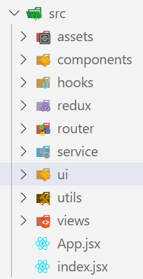
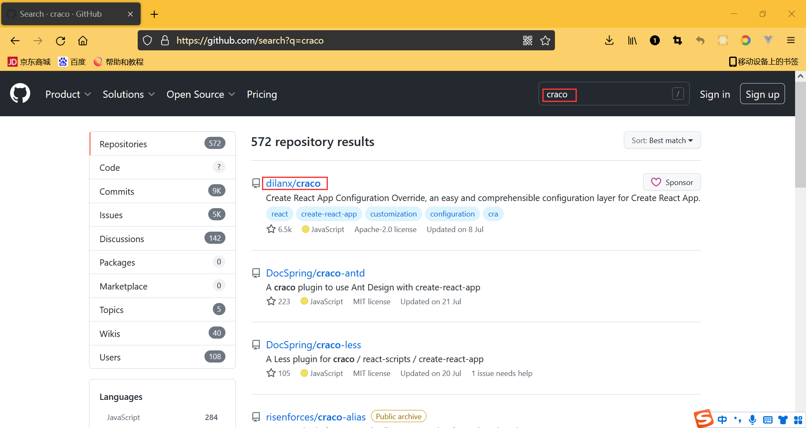
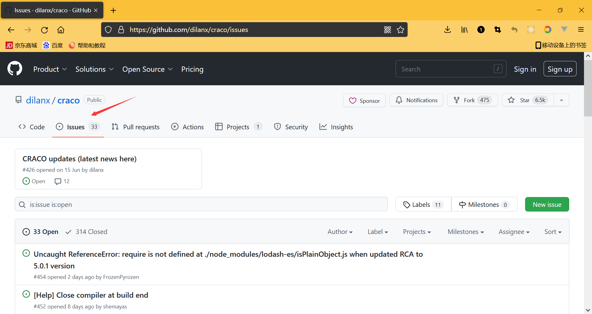
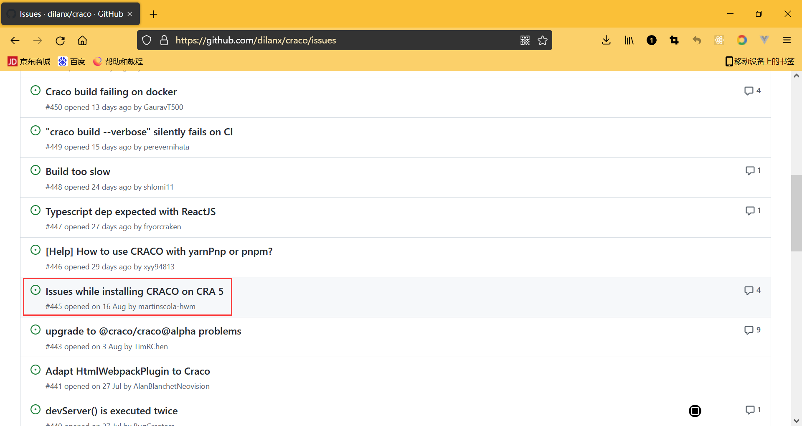
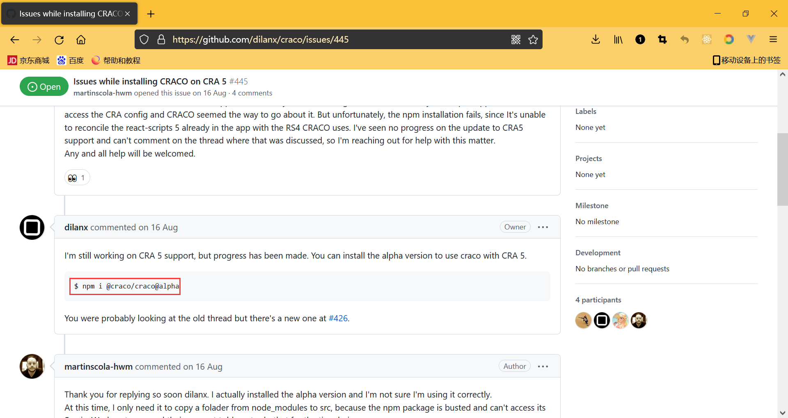

### 1.搭建

- create-react-app 项目名称

### 2.初始化项目

- 删除掉无用的文件
- 修改站点图标
- 添加和修改mate信息
- 启动项目

### 3.目录结构



### 4.craco配置

- antd官网 => 文档 => 在 create-react-app 中使用 => 高级配置
- npm install @craco/craco
  - 由于我们的React脚手架是最新的，5.0.1，还没有做相应的适配
  
  - 进入github，搜索craco
    
    
    
  - 点击issue
  
    
  
  - open里
  
    
  
  - 找到了
  
    

- 配置别名

  ```js
  const path = require('path')
  const resolve = pathname => path.resolve(__dirname, pathname)
  
  module.exports = {
    webpack: {
      alias: {
        "@": resolve("src"),
        "components": resolve("src/components"),
        "utils": resolve("src/utils")
      }
    }
  }
  ```

- 配置less

  - 安装：npm install craco-less
  - 出现问题，去它的issue中查找解决方案
    - npm i craco-less@2.1.0-alpha.0

  ```js
  const CracoLessPlugin = require('craco-less');
  
  module.exports = {
    plugins: [{ plugin: CracoLessPlugin }]
  };
  ```

- 在主目录创建craco.config.js文件，将以上配置内容写到里面

  ```js
  const path = require('path')
  const CracoLessPlugin = require('craco-less');
  const resolve = pathname => path.resolve(__dirname, pathname)
  
  module.exports = {
    plugins: [{ plugin: CracoLessPlugin }],
    webpack: {
      alias: {
        "@": resolve("src"),
        "components": resolve("src/components"),
        "utils": resolve("src/utils")
      }
    }
  }
  ```

- 修改脚本

  ```json
  "scripts": {
    "start": "craco start",
    "build": "craco build",
    "test": "craco test",
    "eject": "react-scripts eject"
  }
  ```

- 启动项目

### 5.添加jsconfig.json文件

- 当我们使用@时，没有提示，加入这个我们之前添加过的文件就可以了，它里面有配置
- 这样之后提示会好一些