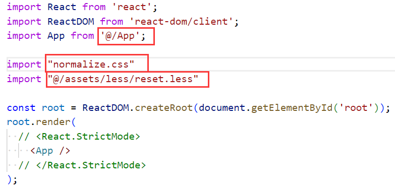
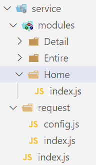

### 1.样式重置

- npm install normalize.css

- 自己写重置css文件（reset.less）

  

### 2.路由的配置

- 安装：npm install react-router-dom

- 选择history模式

  ```jsx
  import { BrowserRouter } from "react-router-dom"
  
  const root = ReactDOM.createRoot(document.getElementById('root'));
  root.render(
    <BrowserRouter>
      <App />
    </BrowserRouter>
  )
  ```

- 配置映射关系，并使用懒加载

  ```js
  import { lazy } from "react"
  import { Navigate } from "react-router-dom"
  
  const Home = lazy(() => import("@/views/Home"))
  const Entire = lazy(() => import("@/views/Entire"))
  const Detail = lazy(() => import("@/views/Detail"))
  
  const routes = [
    {
      path: "/",
      element: <Navigate to="/home" />
    },
    {
      path: "/home",
      element: <Home />
    },
    {
      path: "/entire",
      element: <Entire />
    },
    {
      path: "/detail",
      element: <Detail />
    }
  ]
  
  export default routes
  ```

- 使用映射关系

  ```jsx
  import { Link, useRoutes } from "react-router-dom"
  import routes from "@/router"
  
  const App = memo(() => {
    return (
      <div>
        <div>
          <Link to="/home">Home</Link>
          <Link to="/entire">Entire</Link>
          <Link to="/detail">detail</Link>
        </div>
        <div>
          {useRoutes(routes)}
        </div>
      </div>
    )
  })
  ```

- 添加Suspense

  ```jsx
  import { Suspense } from 'react';
  
  <BrowserRouter>
    <Suspense fallback={<h2>Loading...</h2>}>
      <App />
    </Suspense>
  </BrowserRouter>
  ```

### 3.axios封装

- 目录结构：

- request下config.js

  ```js
  export const BASE_URL = "http://codercba.com:1888/airbnb/api"
  export const TIMEOUT = 10000
  ```

- request下index.js

  ```js
  import axios from "axios"
  
  import { BASE_URL, TIMEOUT } from "./config"
  
  class YTRequest {
    constructor() {
      this.instance = axios.create({
        baseURL: BASE_URL,
        timeout: TIMEOUT
      })
  
      this.instance.interceptors.response.use(res => res.data)
    }
  
    get(config) { return this.instance.request(config) }
    post(config) { return this.get({ ...config, method: "POST" }) }
  }
  
  export default new YTRequest()
  ```

- modules下Home下index.js

  ```js
  import YTRequest from "../../request"
  
  export const getHighScore = () => YTRequest.get("/home/highscore")
  ```

- service下index.js

  ```js
  export * from "./modules/Home"
  ```

- 发送网络请求并使用数据

  ```jsx
  import React, { memo, useEffect, useState } from 'react'
  
  import { getHighScore } from "@/service"
  
  const Home = memo(() => {
    const [highScore, setHighScore] = useState([])
  
    useEffect(() => {
      getHighScore().then(res => setHighScore(res.list))
    }, [])
  
    return (
      <div>
        <h2>HighScore</h2>
        {
          highScore.map(item => <div key={item.id}>{item.name}</div>)
        }
      </div>
    )
  })
  
  export default Home
  ```

  