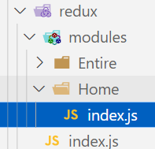

### 1.安装

- npm install @reduxjs/toolkit react-redux

### 2.目录结构



### 3.片段和异步

- modules下Home下index.js

  ```js
  import { createSlice, createAsyncThunk } from "@reduxjs/toolkit"
  
  import { getHighScore } from "@/service"
  
  export const fecthHighScoreList = createAsyncThunk("fecth/highScoreList",async () => {
    const res = await getHighScore()
    return res.list
  })
  
  const homeSlice = createSlice({
    name: "home",
    initialState: {
      counter: 0,
      highScoreList: []
    },
    reducers: {
      addNumberAction(state, { payload }) {
        state.counter += payload.list
      }
    },
    extraReducers: {
      [fecthHighScoreList.fulfilled](state, { payload }) {
        state.highScoreList = payload
      }
    }
  })
  
  export const { addNumberAction } = homeSlice.actions
  
  export default homeSlice.reducer
  ```

### 4.配置store

- redux下index.js

  ```js
  import { configureStore } from "@reduxjs/toolkit"
  
  import homeReducer from "./modules/Home"
  
  const store = configureStore({
    reducer: {
      homeReducer
    }
  })
  
  export default store
  ```

### 5.共享store

```jsx
import { Provider } from "react-redux"
import store from "@/redux"

const root = ReactDOM.createRoot(document.getElementById('root'));
root.render(
  <BrowserRouter>
    <Suspense fallback={<h2>Loading...</h2>}>
      <Provider store={store}>
        <App />
      </Provider>
    </Suspense>
  </BrowserRouter>
);
```

### 6.使用数据

```jsx
import React, { memo, useEffect } from 'react'
import { useSelector, useDispatch, shallowEqual } from "react-redux"

import { fecthHighScoreList } from "@/redux/modules/Home"

const Home = memo(() => {
  const { highScoreList } = useSelector((state) => ({
    highScoreList: state.homeReducer.highScoreList
  }), shallowEqual)

  const dispatch = useDispatch()
  useEffect(() => {
    dispatch(fecthHighScoreList())
  }, [dispatch])

  return (
    <div>
      <h2>HighScore</h2>
      {
        highScoreList.map(item => <div key={item.id}>{item.name}</div>)
      }
    </div>
  )
})

export default Home
```

